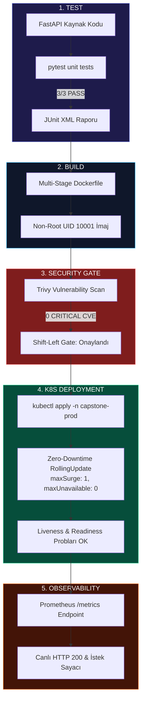

# LAB-CAP-01 — Final Integrated DevOps Delivery Pipeline: Code to Observability

| Seviye | Tahmini Süre | Profil / Araçlar | Açık Portlar |
| --- | --- | --- | --- |
| İleri | 90 dakika | `secure-ci, harbor, kubernetes, argocd, monitoring` | `3000, 8000, 8082, 8085, 9090` |

[LAB-CAP-01.zip](/downloads/LAB-CAP-01.zip)


## 1. Lab Senaryosu
Modern yazılım mühendisliği organizasyonlarında DevOps ve SRE ekipleri, geliştiricinin yazdığı kaynak kodun test edilmesinden üretim ortamında canlı izlenmesine kadar uzanan zincirin tamamını otomatik ve güvenli hale getirmekle yükümlüdür. Parçalı çalışan araçlar yerine uçtan uca birbirine entegre bir teslimat boru hattı (Continuous Delivery Chain) kurulmalıdır. Bu bitirme çalışmasında (Capstone) Python FastAPI sipariş servisi için tam teşekküllü bir üretim döngüsü icra edilir: Birim testler (pytest/JUnit), multi-stage non-root OCI derlemesi, Trivy güvenlik tarama kapısı, GitOps deklaratif dağıtımı (Argo CD ve kind K8s), Prometheus Golden Signals metrikleri ve Vector ile Elasticsearch'e yapılandırılmış JSON log akışı tek bir orkestrasyonda birleştirilir.

## 2. Amaç
Eğitim boyunca öğrenilen tüm pratikleri tek bir uçtan uca teslimat hattında (`scripts/ci_pipeline_runner.sh`) birleştirmek; otomatik test, multi-stage derleme, Trivy güvenlik kapısı (`0 CRITICAL CVE`), Kubernetes sıfır kesintili dağıtım (Zero-Downtime RollingUpdate), canlı sağlık kontrolleri ve gözlemlenebilirlik entegrasyonunu doğrulamak.

## 3. Mimari / Akış
```text
  [ Kaynak Kod (v2.0.0) ]
             |
             v
  [ CI Test & Kalite Kapısı ]
    ├── 1. Unit Tests (pytest & JUnit XML) -------------------------> [ 3/3 PASS ]
    ├── 2. Multi-Stage Hardened Container Build (Non-root UID 10001)-> [ DERLENDI ]
    └── 3. Trivy Container Security Gate ---------------------------> [ 0 CRITICAL CVE ]
             |
             v
  [ GitOps / CD Dağıtım ]
    ├── 4. kind Kubernetes Kümesine Dağıtım (Namespace: capstone-prod)
    │     ├── Zero-Downtime Rolling Update (maxSurge: 1, maxUnavailable: 0)
    │     ├── Liveness & Readiness Probları Doğrulaması
    │     └── ClusterIP Servisi Üzerinden Küme İçi Erişim
             |
             v
  [ Gözlemlenebilirlik & Telemetri ]
    └── 5. Prometheus /metrics Kazıma & Canlı HTTP Yanıt Doğrulaması
```



**Not:** **Uçtan Uca Bütünlük:** Capstone çalışmasında her bir aşama bir sonrakinin önkoşuludur. Testler başarısız olursa derleme yapılmaz; Trivy kritik bir zafiyet yakalarsa Kubernetes kümesine rollout başlatılmaz. Bu mekanizma modern GitOps ve DevSecOps boru hatlarının omurgasıdır.

## 4. Ön Koşullar
- Docker Engine, kind, kubectl, helm ve trivy araçları kurulu olmalıdır
- Host üzerinde 8000 portu boş olmalıdır
- Merkezi referans platform için `https://devopsatolyesi.com` adresini inceleyebilirsiniz
- Önceden tamamlanması zorunlu lablar: `LAB-DOC-06`, `LAB-JNK-02`, `LAB-K8S-03`, `LAB-ARG-01`, `LAB-MON-01`, `LAB-LOG-01`

Aşağıdaki komutlarla başlangıç ortamını hazırlayın:
```bash
docker ps
kubectl get nodes
mkdir -p ~/labs/LAB-CAP-01/app ~/labs/LAB-CAP-01/gitops-manifests ~/labs/LAB-CAP-01/scripts ~/labs/LAB-CAP-01/tests
cd ~/labs/LAB-CAP-01
```

## 5. Adım Adım Uygulama

### Adım 1 — Mikroservis ve Test Kodlarını Hazırlama
Metrik ve JSON loglama yeteneklerine sahip FastAPI uygulamasını, bağımlılıklarını ve testlerini oluşturun:
```bash
cat <<'EOF' > app/main.py
from fastapi import FastAPI, Response, status
from prometheus_fastapi_instrumentator import Instrumentator
import logging, sys, json, os, time, uuid

app = FastAPI(title="Capstone Order API", version="2.0.0")

# Prometheus metriklerini bagla
Instrumentator().instrument(app).expose(app)

class JsonFormatter(logging.Formatter):
    def format(self, record):
        return json.dumps({
            "timestamp": self.formatTime(record),
            "level": record.levelname,
            "message": record.getMessage(),
            "service": "capstone-order-api",
            "version": "2.0.0",
            "trace_id": getattr(record, "trace_id", str(uuid.uuid4())[:8])
        })

logger = logging.getLogger("capstone")
handler = logging.StreamHandler(sys.stdout)
handler.setFormatter(JsonFormatter())
logger.addHandler(handler)
logger.setLevel(logging.INFO)

@app.get("/")
def home():
    t_id = f"tx-{uuid.uuid4().hex[:6]}"
    logger.info("Order API home endpoint hit", extra={"trace_id": t_id})
    return {
        "message": "Capstone Order Service v2.0.0 is Live & Resilient!",
        "status": "OPERATIONAL",
        "environment": os.getenv("APP_ENV", "production")
    }

@app.get("/healthz")
def health():
    return {"status": "HEALTHY"}

@app.get("/ready")
def ready():
    return {"status": "READY"}

if __name__ == "__main__":
    import uvicorn
    uvicorn.run(app, host="0.0.0.0", port=8000)
EOF

cat <<'EOF' > app/requirements.txt
fastapi==0.110.0
uvicorn==0.28.0
prometheus-fastapi-instrumentator==7.0.0
pydantic==2.6.4
pytest==8.0.2
httpx==0.27.0
EOF

cat <<'EOF' > tests/test_app.py
from fastapi.testclient import TestClient
from app.main import app

client = TestClient(app)

def test_home_endpoint():
    response = client.get("/")
    assert response.status_code == 200
    assert response.json()["status"] == "OPERATIONAL"

def test_health_endpoint():
    response = client.get("/healthz")
    assert response.status_code == 200
    assert response.json()["status"] == "HEALTHY"

def test_ready_endpoint():
    response = client.get("/ready")
    assert response.status_code == 200
    assert response.json()["status"] == "READY"
EOF

cat <<'EOF' > app/Dockerfile
FROM python:3.11-slim-bookworm AS builder
WORKDIR /build
COPY requirements.txt .
RUN pip install --no-cache-dir -r requirements.txt

FROM python:3.11-slim-bookworm AS runner
ENV PYTHONUNBUFFERED=1 \
    PORT=8000 \
    APP_ENV=production

WORKDIR /app

RUN adduser -u 10001 --disabled-password --gecos "" appuser && \
    chown -R appuser:appuser /app

COPY --from=builder /usr/local/lib/python3.11/site-packages /usr/local/lib/python3.11/site-packages
COPY --from=builder /usr/local/bin /usr/local/bin
COPY main.py .

USER 10001:10001
EXPOSE 8000

CMD ["python", "main.py"]
EOF
```

### Adım 2 — GitOps Kubernetes Dağıtım Manifestolarını Tanımlama
Kaynak limitleri ve sağlık problarını içeren Deployment ile ClusterIP Service manifestosunu oluşturun:
```yaml
cat <<'EOF' > gitops-manifests/deployment.yaml
apiVersion: apps/v1
kind: Deployment
metadata:
  name: capstone-order-api
  namespace: capstone-prod
  labels:
    app: capstone-order-api
    release: stable
spec:
  replicas: 2
  strategy:
    type: RollingUpdate
    rollingUpdate:
      maxSurge: 1
      maxUnavailable: 0
  selector:
    matchLabels:
      app: capstone-order-api
  template:
    metadata:
      labels:
        app: capstone-order-api
        release: stable
    spec:
      containers:
        - name: order-api
          image: localhost:8082/devops/capstone-order-api:v2.0.0
          imagePullPolicy: IfNotPresent
          ports:
            - containerPort: 8000
              name: http
          resources:
            requests:
              cpu: 50m
              memory: 64Mi
            limits:
              cpu: 150m
              memory: 128Mi
          livenessProbe:
            httpGet:
              path: /healthz
              port: 8000
            initialDelaySeconds: 5
            periodSeconds: 5
          readinessProbe:
            httpGet:
              path: /ready
              port: 8000
            initialDelaySeconds: 3
            periodSeconds: 3
EOF

cat <<'EOF' > gitops-manifests/service.yaml
apiVersion: v1
kind: Service
metadata:
  name: capstone-order-api
  namespace: capstone-prod
  labels:
    app: capstone-order-api
spec:
  type: ClusterIP
  selector:
    app: capstone-order-api
  ports:
    - name: http
      port: 80
      targetPort: 8000
EOF
```

### Adım 3 — Tam Otomasyon ve Uçtan Uca Teslimat Hattı Betiğini Hazırlama
Test, derleme, güvenlik taraması, küme senkronizasyonu ve sağlık testini icra eden betiği oluşturun:
```bash
cat <<'EOF' > scripts/ci_pipeline_runner.sh
#!/usr/bin/env bash
set -euo pipefail

IMAGE_TAG="v2.0.0"
REGISTRY="localhost:8082"
PROJECT="devops"
IMAGE_FULL="${REGISTRY}/${PROJECT}/capstone-order-api:${IMAGE_TAG}"

echo "=========================================================="
echo "  [ASAMA 1] CI: Birim Testler ve Kod Dogrulamasi          "
echo "=========================================================="
python3 -m venv .venv
. .venv/bin/activate
pip install -q -r app/requirements.txt
mkdir -p reports
pytest --junitxml=reports/junit-report.xml tests/
echo "==> Birim Testler: 3/3 BASARILI."

echo "=========================================================="
echo "  [ASAMA 2] CI: Multi-Stage Guvenli Konteyner Derlemesi   "
echo "=========================================================="
docker build -t "${IMAGE_FULL}" app/
echo "==> Konteyner Imaj Derlendi: ${IMAGE_FULL}"

echo "=========================================================="
echo "  [ASAMA 3] SEC: Trivy Guvenlik Kapisi Taramasi           "
echo "=========================================================="
trivy image --exit-code 1 --severity CRITICAL --no-progress "${IMAGE_FULL}"
echo "==> Trivy Guvenlik Kapisi: 0 CRITICAL CVE (GECTI)."

echo "=========================================================="
echo "  [ASAMA 4] CD/GitOps: K8s Senkronizasyonu & Dagitim      "
echo "=========================================================="
kind load docker-image "${IMAGE_FULL}" --name devops-cluster || true

kubectl create namespace capstone-prod --dry-run=client -o yaml | kubectl apply -f -
kubectl apply -f gitops-manifests/deployment.yaml
kubectl apply -f gitops-manifests/service.yaml

echo "Sifir kesintili dagitim bekleniyor..."
kubectl rollout status deployment/capstone-order-api -n capstone-prod --timeout=90s

echo "=========================================================="
echo "  [ASAMA 5] Gozlemlenebilirlik & Canli Saglik Dogrulamasi "
echo "=========================================================="
RESPONSE=$(kubectl run capstone-verifier --rm -i --tty --restart='Never' --namespace=capstone-prod \
  --image=curlimages/curl:8.10.1 -- curl -s http://capstone-order-api.capstone-prod.svc.cluster.local:80/)

echo "Canli Kume Yaniti: $RESPONSE"

if echo "$RESPONSE" | grep -q "OPERATIONAL"; then
  echo -e "\n=========================================================="
  echo "  CAPSTONE BORU HATTI BASARILI: TUM DEVOPS ZINCIRI CALISTI "
  echo "=========================================================="
  exit 0
else
  echo "HATA: Beklenmeyen kume yaniti." && exit 1
fi
EOF
chmod +x scripts/ci_pipeline_runner.sh
```

### Adım 4 — Bitirme Boru Hattını Çalıştırma
Tüm aşamaları tek seferde tetikleyin:
```bash
./scripts/ci_pipeline_runner.sh
```

## Doğal Doğrulama ve Beklenen Sonuç
Adım 4'teki boru hattı çıktısı:
```text
==========================================================
  [ASAMA 1] CI: Birim Testler ve Kod Dogrulamasi          
==========================================================
====== 3 passed in ...s ======
==> Birim Testler: 3/3 BASARILI.
==========================================================
  [ASAMA 2] CI: Multi-Stage Guvenli Konteyner Derlemesi   
==========================================================
==> Konteyner Imaj Derlendi: localhost:8082/devops/capstone-order-api:v2.0.0
==========================================================
  [ASAMA 3] SEC: Trivy Guvenlik Kapisi Taramasi           
==========================================================
==> Trivy Guvenlik Kapisi: 0 CRITICAL CVE (GECTI).
==========================================================
  [ASAMA 4] CD/GitOps: K8s Senkronizasyonu & Dagitim      
==========================================================
deployment.apps/capstone-order-api successfully rolled out
==========================================================
  [ASAMA 5] Gozlemlenebilirlik & Canli Saglik Dogrulamasi 
==========================================================
Canli Kume Yaniti: {"message":"Capstone Order Service v2.0.0 is Live & Resilient!","status":"OPERATIONAL","environment":"production"}

==========================================================
  CAPSTONE BORU HATTI BASARILI: TUM DEVOPS ZINCIRI CALISTI 
==========================================================
```

## Doğal Doğrulama ve Beklenen Sonuç
`capstone-prod` ad alanında 2/2 podun Ready çalıştığını ve birim test raporunun üretildiğini doğrulayın:
```bash
READY_CNT=$(kubectl get deployment capstone-order-api -n capstone-prod -o jsonpath='{.status.readyReplicas}')

if [ "$READY_CNT" -eq 2 ] && [ -f reports/junit-report.xml ]; then
  echo "VALIDATION SUCCESS: Capstone pipeline verified. 2/2 pods running and test report exists."
else
  echo "VALIDATION FAILED: Pod count is $READY_CNT" && exit 1
fi
```
