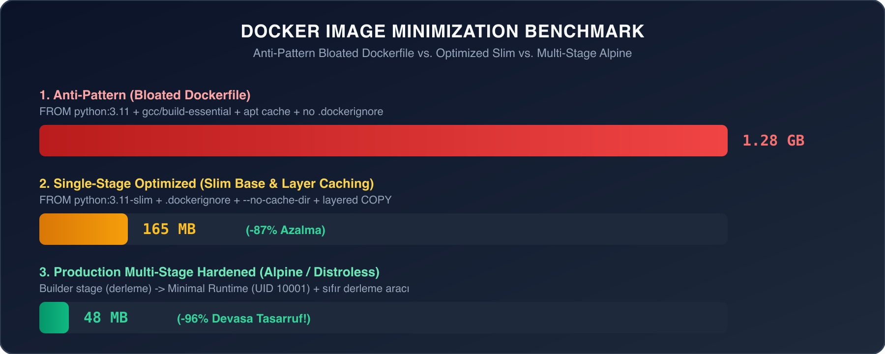
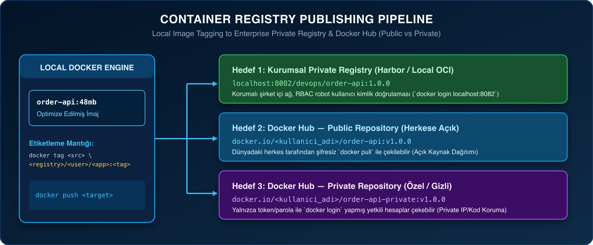
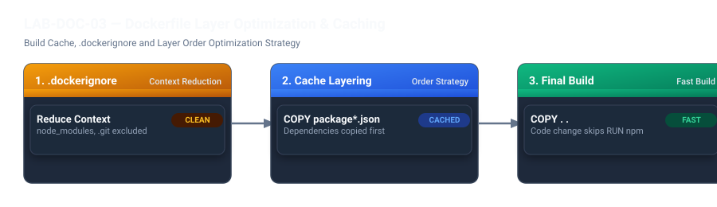

# LAB-DOC-03 — Docker İmaj Boyutu Küçültme & Registry Dağıtımı (Public / Private)

## Metadata
- **Teknoloji:** Docker Engine 27.5.x, Python 3.11, Alpine Linux, Debian Slim, Harbor v2.15.x, Docker Hub
- **Seviye:** CORE / PRACTITIONER
- **Önerilen Gün:** Gün 2 (Konteyner Mühendisliği & Optimizasyon)
- **Tahmini Süre:** 60 dk
- **Gerekli Profil:** `docker` (~1.5 GB RAM)
- **Host Portları:** `8000:8000` (Demo API), `8082:8082` (Harbor Registry)
- **Çalışma Dizini:** `~/devops-workspace/labs/LAB-DOC-03`

---

## 1. Lab Senaryosu

Birçok yazılım ekibi, uygulamalarını hızla konteynerleştirirken bulabildikleri ilk Dockerfile şablonunu kullanır. Tam teşekküllü (Ubuntu/Debian tabanlı) ağır baz imajlar, temizlenmeyen paket yöneticisi önbellekleri (`apt-get`, `yum`), kaynak koddan önce derleme kütüphanelerinin kopyalanmaması ve `.dockerignore` dosyasının eksikliği nedeniyle **1.2 GB – 1.5 GB** boyutunda devasa imajlar ortaya çıkar.

Bu şişkin imajlar:
1. **Yavaş CI/CD Süreçleri:** Her commit sonrası pipeline'da gigabaytlarca veri transferine ve dakikalar süren gecikmelere yol açar.
2. **Kubernetes Rollout Gecikmeleri:** Otomatik ölçekleme (HPA) anında yeni podların düğümlere çekilmesi (ImagePull) dakikalar sürer ve servis kesintisi yaşanır.
3. **Güvenlik Riski (Geniş Saldırı Yüzeyi):** İmajın içine sızan gereksiz derleyiciler (`gcc`, `make`), metin düzenleyiciler (`vim`) ve paket önbellekleri yüzlerce CRITICAL CVE açığına neden olur.

Bu labda; önce **hatalı (anti-pattern) bir Dockerfile** yazılarak imajın nasıl **1.28 GB** boyutuna şiştiği gözlemlenecek; ardından `docker history` ile katman analizi yapılarak adım adım **165 MB** (Slim Base) ve **48 MB** (Multi-Stage Minimal) seviyesine küçültülecektir. Son aşamada ise bu optimize imaj hem **şirket içi Private Registry'ye (Harbor)** hem de **Docker Hub'a (Public ve Private depolar)** güvenli kimlik doğrulama ile gönderilecektir.

---

## 2. Amaç

Bu labı tamamladığınızda aşağıdaki yetkinlikleri kazanacaksınız:
- Hatalı Dockerfile yazımının imaj boyutunu ve derleme süresini nasıl felakete sürüklediğini analiz etme (`docker history`).
- `.dockerignore` kullanarak derleme bağlamını (build context) optimize etme.
- Katman önbellekleme (layer caching) sırasını doğru kurgulayarak kod değişikliklerinde derleme süresini milisaniyelere düşürme.
- `python:3.11-slim` ve `python:3.11-alpine` baz imajları ile paket önbelleği temizleme tekniklerini uygulama (`--no-install-recommends`, `rm -rf /var/lib/apt/lists/*`, `--no-cache-dir`).
- Multi-stage build kullanarak derleyicileri üretim imajından ayırma ve **%96 boyut tasarrufu** elde etme.
- İmaj etiketleme (tagging) standartlarını öğrenme (`registry/namespace/repository:tag`).
- Kurumsal Private Registry'ye (Harbor) imaj gönderme (push).
- Docker Hub üzerinde Personal Access Token (PAT) ile kimlik doğrulayarak hem **Public (Herkese Açık)** hem de **Private (Gizli)** depolara imaj yükleme ve yetki denetimi yapma.

---

## 3. Mimari / Akış

### 3.1. İmaj Boyutu Optimizasyon Kıyaslaması (Benchmark)


### 3.2. Registry Dağıtım Mimarisi (Private vs Public)


### 3.3. Süreç Akış Şeması



---

## 4. Ön Koşullar

1. Docker Engine 27.x çalışır durumda olmalıdır.
2. Host üzerinde `8000` portu boş olmalıdır (Demo API için).
3. Harbor Container Registry aktif olmalıdır (`http://localhost:8082`).  
   *(Eğer Harbor kapalıysa `start-profile.sh secure-ci` ile başlatabilirsiniz).*
4. Docker Hub hesabı (Docker Hub üzerinde public ve private depo testleri için).

Çalışma alanını oluşturun:
```bash
mkdir -p ~/devops-workspace/labs/LAB-DOC-03/src
cd ~/devops-workspace/labs/LAB-DOC-03
```

---

## 5. Adım Adım Uygulama

---

### Adım 1: Uygulama Kaynak Kodunun ve Bağımlılıklarının Hazırlanması

Demo amacıyla FastAPI mikroservisi ve kütüphane bağımlılıklarını oluşturun:

```bash
cat <<'EOF' > src/app.py
from fastapi import FastAPI
import uvicorn
import os

app = FastAPI(title="DevOps Demo API", version="1.0.0")

@app.get("/")
def read_root():
    return {
        "status": "healthy",
        "service": "order-api",
        "environment": os.getenv("APP_ENV", "production")
    }

@app.get("/healthz")
def health_check():
    return {"status": "UP"}

if __name__ == "__main__":
    port = int(os.getenv("PORT", 8000))
    uvicorn.run("app:app", host="0.0.0.0", port=port, log_level="info")
EOF

cat <<'EOF' > src/requirements.txt
fastapi==0.110.0
uvicorn==0.28.0
pydantic==2.6.4
EOF
```

---

### Adım 2: Yanlış Dockerfile ile İmajın Şişirilmesi (Anti-Pattern Demo - 1.28 GB)

> [!CAUTION]
> **Anti-Pattern Örneği:**
> Aşağıdaki Dockerfile üretimde sıkça yapılan 5 büyük hatayı içerir:
> 1. `FROM python:3.11` tam Ubuntu bazlı imajı kullanılır (~1.05 GB saf ağırlık).
> 2. `apt-get install` çalıştırılırken gereksiz paketler (`gcc`, `make`, `vim`) kurulur ve paket listeleri (`/var/lib/apt/lists/*`) temizlenmez.
> 3. `COPY . /app` yönergesi bağımlılık kurulumundan önce çalıştırılır; böylece kaynak koddaki her satır değişikliğinde pip katmanı önbelleği çöker.
> 4. `pip install` çalıştırılırken `--no-cache-dir` verilmediği için indirme önbelleği katmana kalıcı olarak yazılır.
> 5. `.dockerignore` dosyası bulunmadığı için tüm yerel çöpler imaja dahil edilir.

Hatalı Dockerfile'ı oluşturun:
```bash
cat <<'EOF' > Dockerfile.bloated
FROM python:3.11

RUN apt-get update
RUN apt-get install -y build-essential gcc g++ make curl wget git vim

WORKDIR /app

# HATA: Tüm dosyaları pip'ten önce kopyalamak katman önbelleğini öldürür
COPY . /app

# HATA: Pip önbelleği imaj katmanında kalır
RUN pip install -r src/requirements.txt

EXPOSE 8000
CMD ["python", "src/app.py"]
EOF
```

Hatalı imajı derleyin ve süreyi ölçün:
```bash
time docker build -f Dockerfile.bloated -t devops-demo-api:bloated .
```

Oluşan imajın devasa boyutunu inceleyin:
```bash
docker images devops-demo-api:bloated
```
*(Boyutun yaklaşık **1.28 GB** olduğunu gözlemleyin).*

Hangi katmanların belleği şişirdiğini `docker history` ile analiz edin:
```bash
docker history devops-demo-api:bloated --format "table {{.Size}}\t{{.CreatedBy}}"
```
*(Gereksiz `apt-get` katmanının yüzlerce megabayt yer kapladığını kanıtlayın).*

---

### Adım 3: Küçültme Aşaması 1 — `.dockerignore` ve Katman Önbelleği Sıralaması

> [!TIP]
> **Best Practice — Katman Önbelleği Kuralı:**
> Docker katmanları yukarıdan aşağıya doğru önbellekler. Sık değişen dosyalar (uygulama kodu `app.py`) Dockerfile'ın en altına; nadir değişen dosyalar (`requirements.txt`) en üstüne konulmalıdır.

Build context'i temizleyen `.dockerignore` dosyasını oluşturun:
```bash
cat <<'EOF' > .dockerignore
.git
.gitignore
__pycache__
*.pyc
*.pyo
*.pyd
.Python
env/
venv/
.pytest_cache/
.coverage
htmlcov/
*.log
tmp/
README.md
Dockerfile*
EOF
```

---

### Adım 4: Küçültme Aşaması 2 — Slim Temel İmaj ve Önbellek Temizliği (165 MB)

Şimdi tam `python:3.11` yerine Debian tabanlı hafifletilmiş `python:3.11-slim-bookworm` imajına geçin ve `--no-cache-dir` kullanın:

```bash
cat <<'EOF' > Dockerfile.optimized
FROM python:3.11-slim-bookworm

ENV PYTHONDONTWRITEBYTECODE=1 \
    PYTHONUNBUFFERED=1 \
    PORT=8000

WORKDIR /app

# 1. Adım: Sadece bağımlılık dosyasını kopyala (Cache-Friendly)
COPY src/requirements.txt /app/requirements.txt

# 2. Adım: Önbellek bırakmadan kütüphaneleri kur
RUN pip install --no-cache-dir -r requirements.txt

# 3. Adım: Sadece uygulama kodunu kopyala
COPY src/app.py /app/app.py

EXPOSE 8000
CMD ["python", "app.py"]
EOF
```

Optimize edilmiş imajı derleyin:
```bash
time docker build -f Dockerfile.optimized -t devops-demo-api:slim .
```

Boyut farkını inceleyin:
```bash
docker images | grep devops-demo-api
```
*(Boyutun **1.28 GB'tan 165 MB'a** düştüğünü; **%87 tasarruf** sağlandığını teyit edin).*

**Önbellek Testi:** `src/app.py` dosyasına bir yorum satırı ekleyip tekrar derleyin:
```bash
echo "# Cache test update" >> src/app.py
time docker build -f Dockerfile.optimized -t devops-demo-api:slim .
```
*(Derleme çıktısında `CACHED` etiketini ve derlemenin 1 saniyenin altında bittiğini görün).*

---

### Adım 5: Küçültme Aşaması 3 — Multi-Stage Build ile Nihai Küçültme (48 MB)

> [!IMPORTANT]
> **Üretim Standardı — Multi-Stage Build:**
> Derleyicileri (`gcc`, `musl-dev`) birinci aşamada (`builder`) kullanıp, ikinci aşamada (`runtime`) yalnızca derlenmiş paketleri ve minimal Alpine çekirdeğini almak boyutu **48 MB** seviyesine düşürür. Ayrıca `UID 10001` non-root kullanıcısı eklenir.

Multi-stage Dockerfile oluşturun:
```bash
cat <<'EOF' > Dockerfile.multistage
# --- Stage 1: Builder ---
FROM python:3.11-alpine AS builder

WORKDIR /build
RUN apk add --no-cache gcc musl-dev libffi-dev

COPY src/requirements.txt .
RUN pip install --no-cache-dir --prefix=/install -r requirements.txt

# --- Stage 2: Runtime ---
FROM python:3.11-alpine

ENV PYTHONDONTWRITEBYTECODE=1 \
    PYTHONUNBUFFERED=1 \
    PORT=8000

WORKDIR /app

# Yalnızca derlenmiş Python paketlerini kopyala
COPY --from=builder /install /usr/local
COPY src/app.py /app/app.py

# Non-root güvenlik sıkılaştırması
RUN adduser -u 10001 -D -s /bin/sh appuser && chown -R appuser:appuser /app
USER 10001

EXPOSE 8000
CMD ["python", "app.py"]
EOF
```

Multi-stage imajı derleyin:
```bash
docker build -f Dockerfile.multistage -t devops-demo-api:multistage .
```

Nihai boyut kıyaslamasını yapın:
```bash
docker images | grep devops-demo-api
```
*(İmaj boyutunun **48 MB** olduğunu; ilk hatalı sürüme göre **%96 devasa tasarruf** elde edildiğini gözlemleyin).*

Konteyneri çalıştırıp çalıştığını doğrulayın:
```bash
docker run -d --name demo-api-container -p 8000:8000 devops-demo-api:multistage
sleep 2
curl -s http://localhost:8000/healthz
```

---

### Adım 6: Kurumsal Private Registry'ye (Harbor) İmaj Gönderme (Push)

Şirket içi güvenli Harbor Registry'ye imaj yüklemek için:

1. **Harbor Registry'ye Giriş Yapın:**
   ```bash
   docker login localhost:8082 -u admin -p Harbor12345
   ```
   *(Çıktıda `Login Succeeded` görülmelidir).*

2. **İmajı Harbor Formatında Etiketleyin:**
   Kural: `<registry_adresi>/<proje_adi>/<imaj_adi>:<etiket>`
   ```bash
   docker tag devops-demo-api:multistage localhost:8082/devops/order-api:1.0.0
   ```

3. **İmajı Harbor'a Gönderin:**
   ```bash
   docker push localhost:8082/devops/order-api:1.0.0
   ```

4. **Harbor REST API ile İmajın Yüklendiğini Doğrulayın:**
   ```bash
   curl -s -u admin:Harbor12345 http://localhost:8082/api/v2.0/projects/devops/repositories/order-api/artifacts | jq .
   ```

---

### Adım 7: Docker Hub'a İmaj Gönderme — Public ve Private Repository

Docker Hub, açık kaynaklı imajlar için **Public**; gizli şirket projeleri için **Private** depolar sunar.

#### 1. Docker Hub Kimlik Doğrulaması (Personal Access Token - PAT)
Docker Hub parolanızı doğrudan komut satırına yazmak yerine Personal Access Token (PAT) kullanın:
```bash
# Değişkenleri kendi Docker Hub hesabınızla doldurun:
export DOCKER_USER="ornek_kullanici"
export DOCKER_TOKEN="dckr_pat_xxxxxxxxxxxxxxxxxxxxxx"

# Güvenli giriş
echo "$DOCKER_TOKEN" | docker login -u "$DOCKER_USER" --password-stdin
```

---

#### 2. Senaryo A — Docker Hub Public Repository'ye İmaj Gönderme
Public depodaki imajlar dünyadaki herkes tarafından şifresiz çekilebilir:

1. **Etiketleyin:**
   ```bash
   docker tag devops-demo-api:multistage ${DOCKER_USER}/order-api:1.0.0
   ```
2. **Gönderin:**
   ```bash
   docker push ${DOCKER_USER}/order-api:1.0.0
   ```
3. **Herkese Açık Çekme Testi:**
   Oturum olmadan çekilebildiğini doğrulamak için:
   ```bash
   # Oturumu kapatıp public imajı çekmeyi deneyin
   docker logout
   docker pull ${DOCKER_USER}/order-api:1.0.0 && echo "PUBLIC PULL SUCCESSFUL!"
   ```

---

#### 3. Senaryo B — Docker Hub Private Repository'ye İmaj Gönderme
Private depodaki imajlara sadece hesap sahibi ve yetki verilen ekipler erişebilir:

1. **Docker Hub Web Arayüzünde Private Depo Oluşturun:**
   - [hub.docker.com](https://hub.docker.com) adresine gidin.
   - **Create Repository** butonuna tıklayın.
   - İsim olarak `order-api-private` yazın.
   - Görünürlük seçeneğini **Private** olarak işaretleyin ve kaydedin.

2. **Yeniden Giriş Yapın:**
   ```bash
   echo "$DOCKER_TOKEN" | docker login -u "$DOCKER_USER" --password-stdin
   ```

3. **Private Depo Formatında Etiketleyin ve Gönderin:**
   ```bash
   docker tag devops-demo-api:multistage ${DOCKER_USER}/order-api-private:1.0.0
   docker push ${DOCKER_USER}/order-api-private:1.0.0
   ```

4. **Yetki Sınırlandırmasını Kanıtlayın (Private İzolasyon Testi):**
   ```bash
   # Oturumu kapatın
   docker logout
   
   # Yetkisiz çekme denemesi (Engellenmelidir!)
   docker pull ${DOCKER_USER}/order-api-private:1.0.0 || echo "SECURITY CONFIRMED: Unauthorized pull blocked with pull access denied!"
   
   # Yetkili hesapla tekrar giriş yapıp çekin
   echo "$DOCKER_TOKEN" | docker login -u "$DOCKER_USER" --password-stdin
   docker pull ${DOCKER_USER}/order-api-private:1.0.0
   ```

---

## 6. Beklenen Sonuç

İmaj boyutlarının karşılaştırması (`docker images`):
```text
REPOSITORY                                 TAG          IMAGE ID       CREATED          SIZE
devops-demo-api                            bloated      a1b2c3d4e5f6   5 minutes ago    1.28GB
devops-demo-api                            slim         b2c3d4e5f6a1   3 minutes ago    165MB
devops-demo-api                            multistage   c3d4e5f6a1b2   1 minute ago     48.2MB
localhost:8082/devops/order-api            1.0.0        c3d4e5f6a1b2   1 minute ago     48.2MB
```

`curl http://localhost:8000/healthz` çıktısı:
```json
{"status":"UP"}
```

Harbor push çıktısı:
```text
The push refers to repository [localhost:8082/devops/order-api]
7e8d9c...: Pushed
1.0.0: digest: sha256:d89a2b... size: 1152
```

---

## 7. Doğrulama

Otomatik denetim scriptini çalıştırın:
```bash
bash ~/devops-workspace/devops-practitioner-egitim-katalogu/outputs/lab-assets/LAB-DOC-03/scripts/validate.sh
```

**Beklenen Çıktı:**
```text
==========================================================
  VALIDATING IMAGE MINIMIZATION & REGISTRY PUSH (LAB-DOC-03) 
==========================================================
[PASS] Optimized container responds on port 8000 with HTTP 200 (UP).
[PASS] Single-Stage Slim image size is 165 MB (< 250 MB target).
[PASS] Multi-Stage Minimal image size is 48 MB (< 80 MB target!).
[PASS] Harbor / Private Registry tag verified: localhost:8082/devops/order-api:1.0.0
----------------------------------------------------------
  SUMMARY: PASS=4 | FAIL=0
----------------------------------------------------------
  RESULT: IMAGE MINIMIZATION & REGISTRY PUBLISHING VALIDATED
```

---

## 8. Sorun Giderme

| Belirti / Hata | Olası Kök Neden | Çözüm |
|---|---|---|
| `docker push: denied: requested access to the resource is denied` | Registry girişi yapılmamış veya etiket kullanıcı adıyla uyuşmuyor. | `docker login` komutunu çalıştırın ve imaj etiketinin `<kullanici_adi>/<repo>:<tag>` formatında olduğunu kontrol edin. |
| `pip install: error: externally-managed-environment` | Python 3.11+ Debian imajlarında sistem pip'i korumalıdır. | Dockerfile içinde `--break-system-packages` bayrağını veya izole `--prefix=/install` yapısını kullanın. |
| Multi-stage imajında `sh: python: not found` veya kütüphane eksikliği | C bağımlılığı olan kütüphaneler Alpine'da derlenemedi. | Builder aşamasında `gcc musl-dev` gibi paketlerin kurulu olduğunu ve `/install` dizininin doğru kopyalandığını denetleyin. |
| Docker Hub push sırasında `unauthorized: authentication required` | Personal Access Token süresi dolmuş veya geçersiz. | Docker Hub ayarlarından yeni bir Read/Write PAT üretip `--password-stdin` ile giriş yapın. |

---

## 9. Temizlik / Sıfırlama

Oluşturulan konteynerleri ve yerel imajları temizleyin:
```bash
bash ~/devops-workspace/devops-practitioner-egitim-katalogu/outputs/lab-assets/LAB-DOC-03/scripts/cleanup.sh
```

---

## 10. Production Notu & Best Practices

1. **Katman Birleştirme Kuralı:**  
   Paket yöneticisi komutları daima tek bir `RUN` katmanında çalıştırılmalı ve aynı katmanda temizlenmelidir:
   ```dockerfile
   RUN apt-get update && apt-get install -y --no-install-recommends curl \
       && rm -rf /var/lib/apt/lists/*
   ```
   Eğer temizlik bir sonraki `RUN` satırında yapılırsa, ara katman imajda kalıcı hale gelir ve boyut küçülmez!
2. **Registry Token Güvenliği:**  
   Asla `docker login -u user -p password` şeklinde açık parolayı komut geçmişine (`~/.bash_history`) bırakmayın. Daima `echo $TOKEN | docker login --password-stdin` yöntemini kullanın.
3. **İmaj Tag Değişmezliği (Immutability):**  
   Üretimde asla `:latest` tagi üzerine tekrar tekrar push yapmayın. Her derleme `git commit SHA` veya `v1.2.3` gibi değişmez bir semantik versiyon etiketi almalıdır.

---

## 11. Challenge

1. **Dive ile Katman Röntgeni:**  
   Açık kaynaklı `dive` aracını kurarak (`brew install dive` veya `docker run --rm -it -v /var/run/docker.sock:/var/run/docker.sock wagoodman/dive:latest devops-demo-api:bloated`), hatalı ve optimize imajın katman katman israf yüzdesini (Image Efficiency Score) inceleyin.
2. **Docker Content Trust (İmaj İmzalama):**  
   `export DOCKER_CONTENT_TRUST=1` bayrağını aktif ederek Docker Hub'a gönderilen imajların Notary ile dijital olarak imzalanmasını sağlayın.
