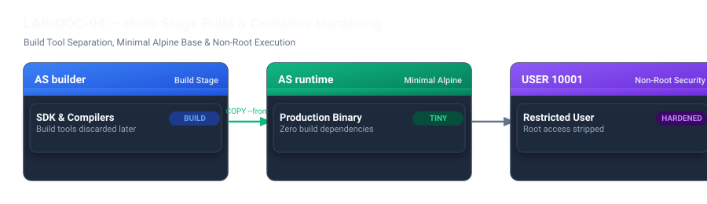

# LAB-DOC-04 — Multi-Stage Build, Non-Root Users & Image Hardening

## Metadata
- **Seviye:** PRACTITIONER
- **Önerilen Gün:** Gün 2
- **Tahmini Süre:** 60 dk
- **Gerekli Profil:** `docker`
- **Host Portları:** `3000:3000`
- **Çalışma Dizini:** `~/devops-workspace/labs/LAB-DOC-04`

---

## 1. Lab Senaryosu
Geliştirilen Node.js TypeScript mikroservisi derlenirken TypeScript derleyicisi (`tsc`), tip tanımları (`@types/*`) ve SDK araçlarına ihtiyaç duymaktadır. Ancak tek aşamalı (single-stage) klasik bir derlemede bu geliştirme araçları üretim imajına taşınmakta, imaj boyutu 1 GB seviyesine çıkmakta ve saldırı yüzeyi genişlemektedir. Ayrıca konteynerin varsayılan olarak `root` kullanıcısı ile çalışması güvenlik açıklarında host sistemine sızma riskini artırmaktadır. Bu çalışmada Multi-Stage Build tekniği ile derleme araçları üretim imajından izole edilir; sayısal UID 10001 ile non-root bir kullanıcı tanımlanarak imaj güvenliği sıkılaştırılır.

## 2. Amaç
Multi-Stage Build kullanarak derleme bağımlılıklarını üretim imajından ayırmak, imaj boyutunu %80+ oranında düşürmek, sayısal non-root kullanıcı (`UID 10001`) tanımlayarak güvenli çalışma ortamı oluşturmak ve API üzerinden kullanıcı kimliğini doğrulamak.

## 3. Mimari / Akış
```text
  +----------------------------------------------------------------+
  | Stage 1: BUILDER (node:20-alpine)                             |
  |  - Tam Node.js SDK + TypeScript Derleyicisi                    |
  |  - npm ci (Tüm bağımlılıklar)                                  |
  |  - npm run build ---> /build/dist/server.js üretilir           |
  +----------------------------------------------------------------+
                                  |
                  Yalnızca Derlenmiş JS Dosyaları
                                  |
                                  v
  +----------------------------------------------------------------+
  | Aşama 2: PRODUCTION RUNTIME (node:20-alpine)                  |
  |  - Derleyici, tip kütüphaneleri ve build araçları bulunmaz      |
  |  - Non-Root Kullanıcı: appuser (UID: 10001, GID: 10001)        |
  |  - Sadece üretim bağımlılıkları (dist/ ve node_modules/)       |
  |  - CMD ["node", "dist/server.js"]                              |
  +----------------------------------------------------------------+
```



> [!NOTE]
> Multi-stage mimaride `builder` aşamasında kullanılan derleyiciler, paket önbellekleri ve kaynak TypeScript kodları son imaja dahil edilmez. İkinci aşama sıfır bir alpine imajından başlar ve `COPY --from=builder` yönergesiyle yalnızca çalışabilir JavaScript çıktıları kopyalanır. Böylece hem imaj boyutu ~160 MB seviyesine iner hem de potansiyel derleyici zafiyetleri ortadan kalkar.


## 4. Ön Koşullar
- Docker Engine çalışır durumda olmalıdır
- Host üzerinde 3000 portu boş olmalıdır
- Önceden tamamlanması önerilen lab: `LAB-DOC-03`

Aşağıdaki komutla çalışma dizinini hazırlayın:
```bash
mkdir -p ~/devops-workspace/labs/LAB-DOC-04/src
cd ~/devops-workspace/labs/LAB-DOC-04
```

## 5. Adım Adım Uygulama

### Adım 1 — Uygulama Yapılandırması ve Kaynak Kodu Oluşturma
TypeScript projesi için `package.json`, `tsconfig.json` ve API kaynak kodunu oluşturun:
```bash
cat <<'EOF' > package.json
{
  "name": "devops-node-secure-api",
  "version": "1.0.0",
  "main": "dist/server.js",
  "scripts": {
    "build": "tsc",
    "start": "node dist/server.js"
  },
  "dependencies": {
    "express": "^4.19.2"
  },
  "devDependencies": {
    "@types/express": "^4.17.21",
    "@types/node": "^20.11.24",
    "typescript": "^5.3.3"
  }
}
EOF

cat <<'EOF' > tsconfig.json
{
  "compilerOptions": {
    "target": "ES2022",
    "module": "commonjs",
    "outDir": "./dist",
    "rootDir": "./src",
    "strict": true,
    "esModuleInterop": true,
    "skipLibCheck": true,
    "forceConsistentCasingInFileNames": true
  },
  "include": ["src/**/*"]
}
EOF

cat <<'EOF' > src/server.ts
import express, { Request, Response } from 'express';
import os from 'os';

const app = express();
const PORT = process.env.PORT || 3000;

app.get('/', (req: Request, res: Response) => {
  res.json({
    message: "Secure Multi-Stage Node.js API",
    user: process.getuid ? process.getuid() : "unknown",
    hostname: os.hostname(),
    status: "healthy"
  });
});

app.get('/healthz', (req: Request, res: Response) => {
  res.status(200).send("OK");
});

app.listen(PORT, () => {
  console.log(`Server running securely on port ${PORT}`);
});
EOF
```

### Adım 2 — Güvenli Multi-Stage Dockerfile Dosyasını Yazma
Builder ve Runner aşamalarını içeren Dockerfile'ı oluşturun:
```bash
cat <<'EOF' > Dockerfile
# ==========================================
# Stage 1: BUILDER (Derleme ve Bağımlılıklar)
# ==========================================
FROM node:20-alpine AS builder

WORKDIR /build
COPY package.json tsconfig.json ./
RUN npm ci

COPY src ./src
RUN npm run build
RUN npm prune --production

# ==========================================
# AŞAMA 2: PRODUCTION RUNTIME (Minimal & Hardened)
# ==========================================
FROM node:20-alpine AS runner

ENV NODE_ENV=production \
    PORT=3000

WORKDIR /app

# Non-root kullanıcı ve grup tanımla (UID 10001)
RUN addgroup -g 10001 -S appgroup && \
    adduser -u 10001 -S appuser -G appgroup

# Sadece derlenmiş dosyaları kopyala ve mülkiyeti ata
COPY --from=builder --chown=appuser:appgroup /build/dist ./dist
COPY --from=builder --chown=appuser:appgroup /build/node_modules ./node_modules
COPY --from=builder --chown=appuser:appgroup /build/package.json ./package.json

USER 10001:10001
EXPOSE 3000
CMD ["node", "dist/server.js"]
EOF
```

### Adım 3 — İmajı Derleme ve Boyutu İnceleme
İmajı derleyin ve oluşan boyutu kontrol edin:
```bash
docker build -t node-hardened-api:v1.0.0 .
docker images node-hardened-api:v1.0.0
```

### Adım 4 — Konteyneri Başlatma ve Kullanıcı Kimliğini Doğrulama
Konteyneri çalıştırın ve HTTP API üzerinden çalışan UID değerini sorgulayın:
```bash
docker run -d --name secure-node-app -p 3000:3000 node-hardened-api:v1.0.0
sleep 3

# API yanıtını kontrol et
curl -s http://localhost:3000/

# Konteyner içindeki aktif UID değerini sorgula
docker exec secure-node-app id
```

## 6. Beklenen Sonuç
Adım 3'teki imaj boyutu çıktısı:
```text
REPOSITORY           TAG       IMAGE ID       SIZE
node-hardened-api    v1.0.0    ...            ~150-180MB
```

Adım 4'teki API JSON yanıtı ve `id` komutu çıktısı:
```json
{"message":"Secure Multi-Stage Node.js API","user":10001,"hostname":"...","status":"healthy"}
```
```text
uid=10001(appuser) gid=10001(appgroup) groups=10001(appgroup)
```

## 7. Doğrulama
Konteynerin root yetkisi olmadan (UID 10001) çalıştığını ve HTTP 200 verdiğini doğrulayın:
```bash
UID_VAL=$(docker exec secure-node-app id -u)
if [ "$UID_VAL" -ne 10001 ]; then
  echo "SECURITY FAILED: Container is running as root (UID: $UID_VAL)!" && exit 1
fi

if curl -sf http://localhost:3000/healthz | grep -q "OK"; then
  echo "VALIDATION SUCCESS: Multi-stage hardened image is running securely under UID 10001."
else
  echo "VALIDATION FAILED: Healthcheck did not return OK." && exit 1
fi
```

## 8. Sorun Giderme

### Belirti
Konteyner başlatılırken `Error: EACCES: permission denied, open '/app/dist/server.js'` hatası alınır.

### Kanıt
`docker logs secure-node-app` çıktısında dosya erişim izni reddi görülür.

### Kontrol Komutu
```bash
docker run --rm --entrypoint ls node-hardened-api:v1.0.0 -la /app/dist
```

### Muhtemel Neden
Builder aşamasından dosyalar kopyalanırken `--chown=appuser:appgroup` parametresi unutulmuştur; dosyalar `root` mülkiyetinde kaldığı için `USER 10001` tarafından çalıştırılamaz.

### Çözüm
Dockerfile içindeki `COPY` satırlarına mülkiyet bayrağını ekleyin:
```dockerfile
COPY --from=builder --chown=appuser:appgroup /build/dist ./dist
```

### Tekrar Doğrulama
```bash
docker build -t node-hardened-api:v1.0.0 .
docker run --rm node-hardened-api:v1.0.0 node -v
```

## 9. Temizlik / Sıfırlama
Konteyneri ve derlenen imajı silin:
```bash
docker rm -f secure-node-app 2>/dev/null || true
docker rmi node-hardened-api:v1.0.0 2>/dev/null || true
rm -rf ~/devops-workspace/labs/LAB-DOC-04
```

## 10. Production Notu
Üretim ortamlarında ve Kubernetes Pod Güvenlik Standartlarında (Pod Security Standards - Restricted) `runAsNonRoot: true` kuralı zorunludur. Konteyner içinde kullanıcı adı (`USER appuser`) yerine kesinlikle sayısal UID (`USER 10001:10001`) tanımlanmalıdır; aksi takdirde admission controller'lar imajı reddedebilir.

## 11. Challenge
Aynı mikroservisi Google tarafından sunulan `gcr.io/distroless/nodejs20-debian12:nonroot` taban imajına taşıyarak içinde shell (sh/bash) ve paket yöneticisi bulunmayan minimal bir imaj derleyin.
