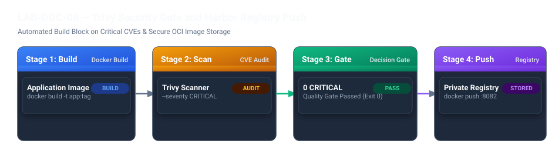

# LAB-DOC-06 — Container Security: Trivy Scanning & Harbor Registry Integration

## Metadata
- **Seviye:** PRACTITIONER
- **Önerilen Gün:** Gün 2
- **Tahmini Süre:** 60 dk
- **Gerekli Profil:** `docker` + `secure-ci`
- **Host Portları:** `8082:8082` (Harbor Registry Portal)
- **Çalışma Dizini:** `~/devops-workspace/labs/LAB-DOC-06`

---

## 1. Lab Senaryosu
Yazılım tedarik zinciri güvenliğinde (Software Supply Chain Security), savunmasız ve güvenlik açığı barındıran temel imajların üretim kümesine kontrolsüzce girmesi ciddi güvenlik zafiyetlerine yol açar. Eski kütüphaneler ve yamalanmamış işletim sistemi paketleri, bilinen zafiyetler (CVE) üzerinden sistemlerin ele geçirilmesine zemin hazırlar. Bu çalışmada açık kaynak zafiyet tarama aracı Trivy v0.74 ile konteyner imajları taranır; kritik açık tespit edildiğinde derleme sürecini durduran bir güvenlik kapısı (`--exit-code 1`) kurgulanır. Onaylanan güvenli imajlar Harbor Private Registry'ye yüklenmek üzere etiketlenir.

## 2. Amaç
Trivy v0.74 ile konteyner imajlarındaki işletim sistemi ve kütüphane seviyesi zafiyetleri taramak, kritik (CRITICAL) açık tespit edildiğinde derlemeyi engelleyen güvenlik kapısı oluşturmak, yamalanmış imajı doğrulamak ve Harbor Private Container Registry için etiketlemek.

## 3. Mimari / Akış
```text
  [ Kaynak Kod ] 
         |
         v
  [ Docker Build ] ---> [ Yerel İmaj: sample-app:vulnerable ] 
                               |
                               v
                       [ Trivy v0.74 Güvenlik Taraması ]
                               |
                +--------------+--------------+
                |                             |
      (CRITICAL CVE >= 1)            (0 CRITICAL CVE)
                |                             |
                v                             v
       [ Derleme Engellenir! ]       [ Docker Tag & Onay ]
                                              |
                                              v
                                  [ Harbor v2.15.2 Registry ]
                                  (localhost:8082/devops/sample-app:1.0.0)
```



> [!NOTE]
> **Shift-Left Güvenlik İlkesi:** İmajı uzak depoya göndermeden (push) önce yerel build aşamasında taramak, zafiyetli imajların üretim kümesine veya merkezi registry'ye sızmasını en erken aşamada engeller.


## 4. Ön Koşullar
- Docker Engine çalışır durumda olmalıdır
- `trivy` CLI (v0.74+) kurulu olmalıdır (`trivy --version`)
- Harbor Registry servisi aktif olmalıdır (`http://localhost:8082`)
- Merkezi referans platform için `https://devopsatolyesi.com/harbor` adresini inceleyebilirsiniz
- Önceden tamamlanması önerilen lab: `LAB-DOC-04`

Aşağıdaki komutlarla ön hazırlıkları kontrol edin:
```bash
trivy --version
docker --version
mkdir -p ~/devops-workspace/labs/LAB-DOC-06
cd ~/devops-workspace/labs/LAB-DOC-06
```

## 5. Adım Adım Uygulama

### Adım 1 — Zafiyetli ve Güvenli Dockerfile Dosyalarını Oluşturma
Zafiyet simülasyonu için eski bir temel imaj ile yamalanmış güncel imaj tanımlarını hazırlayın:
```bash
cat <<'EOF' > Dockerfile.vulnerable
FROM node:14.17.0-alpine
WORKDIR /app
RUN echo "console.log('Legacy App Running');" > server.js
CMD ["node", "server.js"]
EOF

cat <<'EOF' > Dockerfile.hardened
FROM node:20-alpine
WORKDIR /app
RUN adduser -u 10001 -D appuser && \
    echo "console.log('Secure App Running');" > server.js && \
    chown -R appuser:appuser /app
USER 10001
CMD ["node", "server.js"]
EOF
```

### Adım 2 — Zafiyetli İmajı Derleme ve Trivy ile Tarama
Eski imajı derleyin ve HIGH ile CRITICAL açıklarını tarayın:
```bash
docker build -f Dockerfile.vulnerable -t sample-app:vulnerable .

# Trivy ile güvenlik taraması yap
trivy image --severity HIGH,CRITICAL sample-app:vulnerable
```

### Adım 3 — CI/CD Pipeline Güvenlik Kapısını Test Etme
İmajda kritik açık olduğunda derlemenin durdurulmasını (`--exit-code 1`) simüle edin:
```bash
trivy image --exit-code 1 --severity CRITICAL sample-app:vulnerable || echo "GÜVENLİK KAPISI: Kritik zafiyetler nedeniyle süreç durduruldu."
```

### Adım 4 — Sıkılaştırılmış İmajı Derleme ve Güvenlik Kapısını Aşma
Yamalanmış imajı derleyin ve aynı güvenlik kapısından geçirin:
```bash
docker build -f Dockerfile.hardened -t sample-app:hardened .

# Çıkış kodunun 0 olduğunu doğrula
trivy image --exit-code 1 --severity CRITICAL sample-app:hardened
```

### Adım 5 — Harbor Registry İçin İmajı Etiketleme ve Hazırlama
Güvenlik testinden geçen imajı Harbor projesine uygun şekilde etiketleyen otomasyon scriptini oluşturun ve çalıştırın:
```bash
cat <<'EOF' > scan_and_push.sh
#!/usr/bin/env bash
set -euo pipefail

IMAGE_NAME="sample-app"
IMAGE_TAG="1.0.0-secure"
REGISTRY_URL="localhost:8082"
PROJECT_NAME="devops"

FULL_IMAGE="${REGISTRY_URL}/${PROJECT_NAME}/${IMAGE_NAME}:${IMAGE_TAG}"

echo "--> [1] Guvenli Docker imaji derleniyor..."
docker build -f Dockerfile.hardened -t "${IMAGE_NAME}:${IMAGE_TAG}" .

echo "--> [2] Trivy guvenlik kapisi calistiriliyor (v0.74)..."
trivy image --exit-code 1 --severity CRITICAL "${IMAGE_NAME}:${IMAGE_TAG}"

echo "--> [3] Harbor registry icin etiketleniyor..."
docker tag "${IMAGE_NAME}:${IMAGE_TAG}" "${FULL_IMAGE}"

echo "--> [4] Imaj guvenlik onayini gecti ve dagitim icin hazir:"
echo "    Hedef: ${FULL_IMAGE}"
EOF
chmod +x scan_and_push.sh

./scan_and_push.sh
```

## 6. Beklenen Sonuç
Adım 2'deki zafiyet tarama çıktısında tespit edilen CVE'ler listelenmelidir:
```text
sample-app:vulnerable (alpine 3.11.13)
=====================================
Total: >= 1 (HIGH: >= 1, CRITICAL: >= 1)
CVE-... detected!
```

Adım 4'te sıkılaştırılmış imajın tarama çıktısı (0 CRITICAL açık):
```text
sample-app:hardened (alpine 3.19.x)
==================================
Total: 0 (HIGH: 0, CRITICAL: 0)
```

Adım 5'te script çıktısı:
```text
--> [1] Guvenli Docker imaji derleniyor...
--> [2] Trivy guvenlik kapisi calistiriliyor (v0.74)...
--> [3] Harbor registry icin etiketleniyor...
--> [4] Imaj guvenlik onayini gecti ve dagitim icin hazir:
    Hedef: localhost:8082/devops/sample-app:1.0.0-secure
```

## 7. Doğrulama
Otomasyon scriptinin hata almadan tamamlandığını ve imajın yerel registry etiketi aldığını doğrulayın:
```bash
if docker images localhost:8082/devops/sample-app:1.0.0-secure | grep -q "sample-app"; then
  echo "VALIDATION SUCCESS: Hardened image passed Trivy vulnerability gate and tagged for Harbor."
else
  echo "VALIDATION FAILED: Target image not found in local registry cache." && exit 1
fi
```

## 8. Sorun Giderme

### Belirti
Harbor registry'ye push veya login yapılırken `http: server gave HTTP response to HTTPS client` hatası alınır.

### Kanıt
Docker daemon yerel HTTP portunu (8082) varsayılan olarak güvensiz kabul etmektedir.

### Kontrol Komutu
```bash
docker info | grep -A 3 "Insecure Registries"
```

### Muhtemel Neden
`/etc/docker/daemon.json` dosyasında yerel Harbor IP ve portu insecure registry olarak tanımlanmamıştır.

### Çözüm
Docker daemon yapılandırmasını güncelleyip servisi yeniden başlatın:
```bash
sudo mkdir -p /etc/docker
sudo tee /etc/docker/daemon.json <<EOF
{
  "insecure-registries" : ["localhost:8082", "127.0.0.1:8082"]
}
EOF
sudo systemctl restart docker
```

### Tekrar Doğrulama
```bash
docker login localhost:8082
```

## 9. Temizlik / Sıfırlama
Oluşturulan yerel test imajlarını ve çalışma dizinini temizleyin:
```bash
docker rmi sample-app:vulnerable sample-app:hardened localhost:8082/devops/sample-app:1.0.0-secure 2>/dev/null || true
rm -rf ~/devops-workspace/labs/LAB-DOC-06
```

## 10. Production Notu
Kurumsal üretim ortamlarında "Zero Critical Vulnerability" politikası esnetilemez bir kuraldır. Hiçbir imaj taramadan geçirilmeden üretim cluster'ına dağıtılmamalıdır. Ayrıca üretimde `:latest` tagi kesinlikle kullanılmamalı; her build için Git commit SHA veya semantik versiyon (`v1.2.3`) kullanılmalıdır.

## 11. Challenge
Trivy CLI kullanarak uygulamanın bağımlılık ağacını (`trivy fs --format spdx-json -o sbom.json .`) tarayın ve yazılım malzeme listesini (Software Bill of Materials - SBOM) oluşturun.
