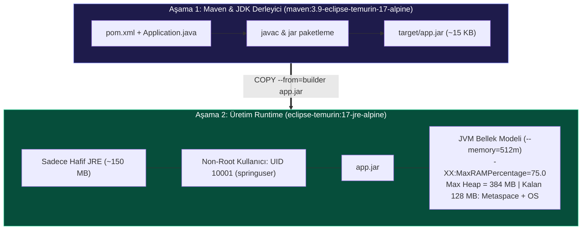

# LAB-DOC-07 — Java Spring Boot Uygulamasını Multi-Stage ile Konteynerleştirme ve JVM Optimizasyonu

| 🎯 Seviye | ⏱️ Tahmini Süre | 🛠️ Profil / Araçlar | 🔌 Açık Portlar |
| :--- | :--- | :--- | :--- |
| 🟡 **PRACTITIONER** (Orta Seviye) | ⏱️ 45 dakika | `docker` | `8080` |

> [!TIP]
> 📥 **Başlangıç Paketi:** [Bu labın başlangıç paketini indir (LAB-DOC-07.zip)](/downloads/LAB-DOC-07.zip) — paket README, starter ve test scriptlerini içerir; çözüm içermez.
> 
> **Terminalde çalışma ortamını hazırlayın:**
> ```bash
> mkdir -p ~/labs/LAB-DOC-07
> cd ~/labs/LAB-DOC-07
> ```


## 1. Senaryo ve Problem Tanımı

Kurumsal Java ve Spring Boot uygulamalarını Docker konteynerlerinde çalıştırırken en sık karşılaşılan 3 kritik üretim hatası şunlardır:

1. **Şişkin İmajlar (Fat Images):** Derleyici, Maven/Gradle araçları ve tam JDK içeren imajlar genellikle **600 MB - 1 GB** aralığındadır. Bu durum ağ transfer sürelerini uzatır ve yüzlerce gereksiz CVE güvenlik açığını üretim ortamına taşır.
2. **Root Kullanıcı Güvenlik Açığı:** Çoğu Java imajı varsayılan olarak `root (UID 0)` ile çalışır. Konteyner kaçışı (Container Escape) durumunda saldırgan ana makinenin çekirdeğinde root yetkilerine sahip olur.
3. **Konteyner Bellek Sınırlarının Tanınmaması (Exit 137 OOMKilled):** Eski Java sürümleri (Java 8 öncesi) Linux `cgroups` sınırlarını görmez. Konteynerinize `512 MB` RAM sınırı koysanız bile JVM host sunucunun (örneğin 32 GB veya 64 GB) RAM miktarını okur ve buna göre varsayılan heap (ör. 8-16 GB) ayırmaya çalışır. İlk yük anında konteyner 512 MB sınırını aştığı anda Linux Kernel tarafından acımasızca **`kill -9` (OOMKilled - Exit Code 137)** ile sonlandırılır.

Bu labda, **Multi-Stage Build** mimarisi, **Hafif JRE**, **Non-Root Kullanıcı (UID 10001)** ve **Modern JVM Konteyner Bellek Parametrelerini (`-XX:+UseContainerSupport`, `-XX:MaxRAMPercentage=75.0`)** adım adım uygulayarak bu problemleri kökten çözeceğiz.

---

## 2. Amaç ve Kazanımlar

- Tam JDK yerine hafif JRE (`eclipse-temurin:17-jre-alpine`) kullanarak imaj boyutunu **~600 MB'tan ~150 MB'a** düşürmek.
- Konteyner bellek sınırlarına (`--memory=512m`) tam uyumlu dinamik JVM heap yönetimi sağlamak.
- Kısıtlı `springuser (UID 10001)` kullanıcısıyla konteyner süreç izolasyonunu sağlamak.
- Canlı konteyner içerisinde `MaxHeapSize` ve `UseContainerSupport` parametrelerini terminalde sorgulayarak doğrulamak.

---

## 3. Mimari ve JVM Bellek Modeli



---

## 4. Ön Koşullar

> [!IMPORTANT]
> Bu labı uygulayabilmek için Docker Engine ortamınızın çalışır durumda olması gerekir.
> - Henüz kurulu değilse: [🛠️ Docker Engine ve Compose Kurulum Rehberi](../../setup/docker-engine/) adımlarını izleyin.

Hızlı sistem kontrolü:

```bash
docker --version
docker ps
```

---

## 5. Adım Adım Uygulama Rehberi

### Adım 1: Çalışma Dizinine Geçiş ve Kaynak Kodun İncelenmesi

Terminalinizde çalışma dizinini oluşturun ve giriş yapın:

```bash
mkdir -p ~/labs/LAB-DOC-07
cd ~/labs/LAB-DOC-07
```

ZIP indirdiyseniz arşivi açın veya dizin içerisinde başlangıç dosyalarını oluşturun:

```bash
# Proje dizin yapısını hazırlayın
mkdir -p src/main/java/com/devopsatolyesi

# Maven konfigürasyonunu oluşturun
cat <<'EOF' > pom.xml
<project xmlns="http://maven.apache.org/POM/4.0.0"
         xmlns:xsi="http://www.w3.org/2001/XMLSchema-instance"
         xsi:schemaLocation="http://maven.apache.org/POM/4.0.0 http://maven.apache.org/xsd/maven-4.0.0.xsd">
    <modelVersion>4.0.0</modelVersion>
    <groupId>com.devopsatolyesi</groupId>
    <artifactId>spring-boot-demo</artifactId>
    <version>1.0.0</version>
    <properties>
        <maven.compiler.source>17</maven.compiler.source>
        <maven.compiler.target>17</maven.compiler.target>
    </properties>
</project>
EOF

# Uygulama kaynak kodunu oluşturun
cat <<'EOF' > src/main/java/com/devopsatolyesi/Application.java
package com.devopsatolyesi;

import com.sun.net.httpserver.HttpServer;
import com.sun.net.httpserver.HttpHandler;
import com.sun.net.httpserver.HttpExchange;
import java.io.IOException;
import java.io.OutputStream;
import java.net.InetSocketAddress;

public class Application {
    public static void main(String[] args) throws IOException {
        int port = 8080;
        HttpServer server = HttpServer.create(new InetSocketAddress(port), 0);
        server.createContext("/", new HttpHandler() {
            @Override
            public void handle(HttpExchange exchange) throws IOException {
                long maxMemoryMb = Runtime.getRuntime().maxMemory() / (1024 * 1024);
                long totalMemoryMb = Runtime.getRuntime().totalMemory() / (1024 * 1024);
                String response = "{\n" +
                    "  \"status\": \"UP\",\n" +
                    "  \"service\": \"spring-boot-demo\",\n" +
                    "  \"runtime\": \"Java 17 JRE Hardened\",\n" +
                    "  \"jvm_max_heap_mb\": " + maxMemoryMb + ",\n" +
                    "  \"jvm_total_heap_mb\": " + totalMemoryMb + "\n" +
                    "}\n";
                exchange.getResponseHeaders().set("Content-Type", "application/json");
                exchange.sendResponseHeaders(200, response.getBytes().length);
                OutputStream os = exchange.getResponseBody();
                os.write(response.getBytes());
                os.close();
            }
        });
        System.out.println("Spring Boot Microservice started on port " + port);
        server.start();
    }
}
EOF
```

> [!NOTE]
> Bu mikroservis, HTTP 8080 portunu dinler ve gelen her isteğe JVM'in çalışma anında hesapladığı **Maksimum Heap Bellek (Max Memory)** miktarını megabayt cinsinden JSON olarak döner.

---

### Adım 2: Multi-Stage ve JVM Optimizasyonlu Dockerfile Yazımı

Kurumsal standartlarda iki aşamalı (Multi-Stage) ve güvenlik sertleştirmeli `Dockerfile` dosyasını oluşturun:

```bash
cat <<'EOF' > Dockerfile
# =======================================================
# Aşama 1: Builder (JDK + Maven Derleme Ortamı)
# =======================================================
FROM maven:3.9-eclipse-temurin-17-alpine AS builder
WORKDIR /build

COPY pom.xml ./
COPY src ./src

# Uygulamayı derleyin ve yürütülebilir JAR üretin
RUN javac -d target/classes src/main/java/com/devopsatolyesi/Application.java && \
    jar cfe target/app.jar com.devopsatolyesi.Application -C target/classes .

# =======================================================
# Aşama 2: Production Runtime (Yalnızca JRE & Non-Root)
# =======================================================
FROM eclipse-temurin:17-jre-alpine
WORKDIR /app

# Güvenlik gereksinimi: UID 10001 olan kısıtlı kullanıcı oluşturma
RUN addgroup -S -g 10001 spring && adduser -S -u 10001 -G spring springuser

# Sadece derlenen JAR dosyasını kopyalayın ve sahipliği springuser'a verin
COPY --from=builder --chown=10001:10001 /build/target/app.jar ./app.jar

USER 10001

# Konteyner bellek limitlerini tanıyan modern JVM parametreleri
ENV JAVA_OPTS="-XX:+UseContainerSupport -XX:MaxRAMPercentage=75.0 -Djava.security.egd=file:/dev/./urandom"

EXPOSE 8080

ENTRYPOINT ["sh", "-c", "exec java $JAVA_OPTS -jar app.jar"]
EOF
```

#### Neden Bu Parametreleri Kullandık?
- **`--chown=10001:10001`**: Dosyalar `root` yerine kısıtlı kullanıcı sahipliğinde aktarılır.
- **`USER 10001`**: Uygulama root yetkisi olmadan çalışır.
- **`-XX:+UseContainerSupport`**: JVM'e Linux `cgroups` bellek sınırlarını okumasını söyler (Java 17'de varsayılandır, açıkça belirtmek en iyi pratiktir).
- **`-XX:MaxRAMPercentage=75.0`**: Sabit bir `-Xmx` değeri yerine konteynere verilen RAM'in %75'ini heap yapar. Kalan %25 ise JVM Metaspace, thread stackleri ve işletim sistemi için güvenli pay bırakır.
- **`exec java ...`**: Kabuk (sh) sürecini Java süreciyle değiştirir; böylece Docker `stop` gönderdiğinde `SIGTERM` sinyali doğrudan Java'ya iletilir (Graceful Shutdown).

---

### Adım 3: İmajı Derleyin ve Boyut Analizi Yapın

İmajı derleyin:

```bash
docker build -t spring-boot-demo:1.0.0 .
```

Derlenen imajın boyutunu sorgulayın:

```bash
docker images spring-boot-demo:1.0.0
```

> [!TIP]
> Dikkat ederseniz nihai imaj boyutu **~150 MB** civarındadır! Eğer tüm Maven ve JDK araçlarını runtime'da bıraksaydık imaj boyutu **~650 MB** olacaktı. Multi-stage build sayesinde yaklaşık **500 MB tasarruf** sağlandı.

---

### Adım 4: Konteyneri 512 MB Bellek Sınırıyla Başlatın

Uygulamayı `--memory=512m` sınırı koyarak arka planda başlatın:

```bash
docker run -d \
  --name spring-app \
  --memory=512m \
  -p 8080:8080 \
  spring-boot-demo:1.0.0
```

Konteynerin çalıştığını doğrulayın:

```bash
docker ps --filter "name=spring-app"
```

---

### Adım 5: Canlı Konteynerde JVM Heap ve cgroups Doğrulaması

Şimdi JVM'in konteyner bellek sınırını gerçekten tanıyıp tanımadığını iki farklı yöntemle kanıtlayalım.

#### Yöntem 1: JVM Flag Sorgusu
Konteyner içerisindeki JVM'in hesapladığı maksimum heap baytını sorgulayın:

```bash
docker exec spring-app java $JAVA_OPTS -XX:+PrintFlagsFinal -version 2>&1 | grep -i MaxHeapSize
```

Dönen bayt değerini megabayta çevirdiğinizde:
- `512 MB * 0.75 = 384 MB` (yaklaşık `402653184` bayt) olduğunu göreceksiniz! Host makinenizin RAM'i kaç GB olursa olsun JVM asla 384 MB'ın üzerine çıkmayacaktır.

#### Yöntem 2: HTTP API Yanıtı
Uygulamamıza bir HTTP isteği gönderin:

```bash
curl -s http://localhost:8080/
```

Beklenen JSON Çıktısı:

```json
{
  "status": "UP",
  "service": "spring-boot-demo",
  "runtime": "Java 17 JRE Hardened",
  "jvm_max_heap_mb": 384,
  "jvm_total_heap_mb": 32
}
```

> **Başarı:** `jvm_max_heap_mb` tam olarak `384` dönmüştür. Bu, JVM'in cgroups limitine tam entegre çalıştığının kesin kanıtıdır.

---

### Adım 6: Non-Root Kullanıcı ve Güvenlik Doğrulaması

Konteynerin root olarak çalışmadığını host seviyesinde doğrulayın:

```bash
# Ana makine üzerinden çalışan sürecin UID değerini sorgulayın
docker top spring-app

# Konteyner içindeki kullanıcı kimliğini sorgulayın
docker exec spring-app id
```

Çıktıda `uid=10001(springuser) gid=10001(spring)` görünmelidir. `root (UID 0)` kesinlikle görünmemelidir.

---

### Adım 7: Otomatik Doğrulama

Tüm gereksinimlerin karşılandığını otomatik test aracıyla doğrulayın:

```bash
bash scripts/validate.sh
```

Terminalde şu onay mesajını görmelisiniz:
```text
==> [LAB-DOC-07] Doğrulama Başlatılıyor: Java Spring Boot Multi-Stage...
[PASS] Java Spring Boot multi-stage build ve JVM optimizasyonu başarıyla doğrulandı!
```

---

## 6. 🧠 İnteraktif Alıştırmalar ve Senaryo Soruları

??? question "Soru 1: Eski Java sürümlerinde (Java 8 öncesi) Docker konteynerine 512 MB bellek sınırı konsa bile JVM neden 16 GB heap ayırmaya çalışıp OOMKilled oluyordu?"
    ??? tip "💡 Çözümü Göster"
        **Cevap:**
        Eski JVM sürümleri Linux `cgroups` (control groups) mekanizmasını tanımazdı. Host makinenin toplam RAM miktarını okur ve varsayılan olarak %25'ini heap olarak rezerve ederdi. `-XX:+UseContainerSupport` (Java 8u191+ ve Java 11/17+) bayrağı, JVM'in ana makineyi değil konteynere atanan bellek sınırını baz almasını sağlar.

??? question "Soru 2: Java uygulamalarında `-Xmx512m` yerine `-XX:MaxRAMPercentage=75.0` kullanmanın esneklik avantajı nedir?"
    ??? tip "💡 Çözümü Göster"
        **Cevap:**
        Konteynerin kaynak limiti Kubernetes veya Docker Compose üzerinden (ör. 1GB'tan 2GB'a) değiştirildiğinde Dockerfile veya başlatma komutunu değiştirmeye gerek kalmaz; JVM heap sınırını dinamik olarak konteyner belleğinin %75'ine otomatik uyarlar. Kalan %25 ise Metaspace, thread stack ve OS için bırakılır.

??? question "Soru 3: Neden `MaxRAMPercentage` değerini %100 yapmamalıyız?"
    ??? tip "💡 Çözümü Göster"
        **Cevap:**
        JVM sadece Heap bellek tüketmez! Heap dışında **Metaspace (sınıf tanımları), Thread Stackleri (her thread için varsayılan 1 MB), Native Memory, Garbage Collector hafızası ve JIT derleyici** bellek harcar. Eğer Heap'e %100 verirseniz, bu ek alanlar konteynerin cgroups sınırını aşar ve kernel konteyneri anında `OOMKilled (Exit 137)` ile öldürür. %70 - %75 altın standarttır.

??? question "Soru 4: Multi-stage build aşamasında `COPY --from=builder --chown=10001:10001` parametresini atlarsak ne olur?"
    ??? tip "💡 Çözümü Göster"
        **Cevap:**
        Docker varsayılan olarak dosyaları `root:root (0:0)` sahipliğinde kopyalar. Runtime aşamasında `USER 10001` kullandığınızda, uygulamanız çalışma anında dosyalara yazma veya okuma yetkisi gerektiğinde (ör. log dizini, geçici dosyalar) `java.io.FileNotFoundException (Permission denied)` hatası alırsınız.

??? question "Soru 5: Dockerfile'da `ENTRYPOINT ["sh", "-c", "exec java ..."]` içerisindeki `exec` komutunun hayati görevi nedir?"
    ??? tip "💡 Çözümü Göster"
        **Cevap:**
        `sh -c` kullanıldığında konteynerin PID 1 numaralı süreci kabuk (shell) olur. `docker stop` gönderildiğinde `SIGTERM` sinyali Java'ya değil shell'e gider. Shell bu sinyali alt Java sürecine iletmediği için Docker 10 saniye sonra zorla `SIGKILL` gönderir ve uygulama yarım kalan işlemleri (veritabanı bağlantıları, HTTP istekleri) kaydedemeden çöker. `exec`, Java'nın doğrudan PID 1 olmasını sağlayarak **Graceful Shutdown (Zarif Kapanma)** sağlar.

---

## 7. Sorun Giderme (Troubleshooting)

- **Konteyner Başlamadan Çöküyor (Exit 137):** `--memory` sınırınızı çok düşük tutmuş olabilirsiniz (ör. 64 MB). Java 17 temel runtime için en az `256 MB` veya `512 MB` önerilir.
- **Port Meşgul Hatası (Bind for 0.0.0.0:8080 failed):** 8080 portu başka bir servis tarafından kullanılıyorsa `docker ps` ile kontrol edip çakışan konteyneri durdurun veya `-p 8081:8080` ile yönlendirin.
- **Permission Denied Hatası:** Dockerfile'da `COPY --from=builder` satırında `--chown=10001:10001` parametresini unuttuysanız Java JAR dosyasına erişemeyebilir.

---

## 8. Temizlik

Lab ortamını temizlemek ve kaynakları serbest bırakmak için:

```bash
bash scripts/cleanup.sh
```

---

## 9. Kaynak ve Referanslar

Bu lab, [spring-boot-course](https://github.com/hakanbayraktar/spring-boot-course) ve [petclinic-java](https://github.com/hakanbayraktar/petclinic-java) açık kaynak projelerindeki kurumsal Java Dockerfile standartlarından uyarlanmıştır.
