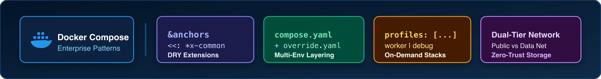
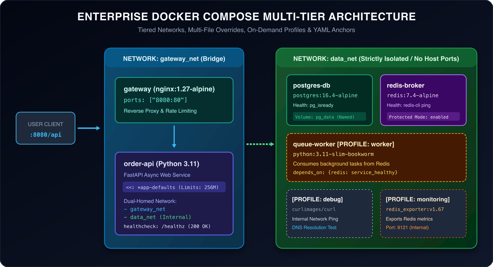

# LAB-DOC-13 — Kurumsal Docker Compose Desenleri (Production-Ready Compose Patterns)

## Metadata
- **Teknoloji:** Docker Engine 27.5.x, Docker Compose v2.32.x, NGINX 1.27-alpine, Python 3.11-slim, PostgreSQL 16.4-alpine, Redis 7.4-alpine
- **Seviye:** PRACTITIONER / ADVANCED
- **Önerilen Gün:** Gün 2 (İleri Seviye Konteyner Mimarisi)
- **Tahmini Süre:** 60 dk
- **Gerekli Profil:** `docker` (~1.5 GB RAM)
- **Host Portları:** `8080:80` (Gateway NGINX), `5432` (Sadece Dev Override'da), `6379` (Sadece Dev Override'da)
- **Çalışma Dizini:** `~/devops-workspace/labs/LAB-DOC-13`

---

## 1. Lab Senaryosu

Birçok mühendislik ekibi, `docker-compose.yml` dosyası yüzlerce satıra ulaşıp, geliştirici ile üretim ortamları birbirine karıştığında aceleyle *"Artık Kubernetes'e geçmeliyiz"* kararı alır. Ancak bu durum genellikle Docker Compose'un yetersizliğinden değil; kurumsal mimari desenlerinin (Enterprise Patterns) uygulanmamasından kaynaklanır.

Küçük ve orta ölçekli üretim altyapılarında (tek veya birkaç sunucu, CI/CD test yığınları, uç nokta cihazları), iyi yapılandırılmış bir Docker Compose mimarisi; Kubernetes'in getirdiği 2–3 GB'lık kontrol düzlemi (Control Plane: etcd, apiserver, kubelet, coredns) ek yükü olmadan, çok daha az kaynakla, deterministik ve yıldırım hızında çalışır.

Bu labda, **KotaiCode** kurumsal mimari desenleri temel alınarak; gerçek üretim imajları (NGINX ters vekil, FastAPI sipariş servisi, PostgreSQL 16 veritabanı, Redis 7.4 önbellek ve kuyruk yöneticisi, asenkron kuyruk işçisi, Redis metrik toplayıcısı ve ağ analiz konteyneri) ile donatılmış, sıfır-güven (zero-trust) ağ izolasyonuna ve çok dosyalı kalıtım yapısına sahip üretim kalitesinde bir Compose ekosistemi inşa edilecektir.

---

## 2. Kapsamlı Konu Anlatımı & Kurumsal Desenler Teorisi

### 2.1. Anti-Patterns vs. Kurumsal En İyi Pratikler (Best Practices)

| Karşılaştırma Kriteri | Amatör / Spagetti Yaklaşım (Anti-Pattern) | Kurumsal Yaklaşım (Production-Ready Pattern) |
|---|---|---|
| **Dosya Mimarisi** | Tek bir 800 satırlık dev `docker-compose.yml` (Monolithic God File). Dev ve Prod birbirine karışmıştır. | **Multi-File Overrides:** `compose.yaml` (temel mimari), `compose.override.yaml` (dev), `compose.prod.yaml` (prod). |
| **Ağ Güvenliği** | Varsayılan köprü ağı (`default bridge`) veya tüm DB/Cache portlarının host'un `0.0.0.0` portuna açılması. | **Dual-Tier Network:** Dışa açık `gateway_net` ve internete/hosta kapalı `data_net` (`internal: true`). Veritabanının host portu yoktur. |
| **Konfigürasyon Tekrarı** | Her servis altına aynı `logging`, `restart` ve `resources` bloklarının kopyala-yapıştır yapılması. | **YAML Anchors & Extensions:** `x-logging: &default-logging` ve `<<: *app-defaults` ile DRY (Don't Repeat Yourself) şablonlama. |
| **Servis Seçimi** | Test veya izleme araçlarının ana yığını şişirmesi veya ayrı ayrı compose dosyalarında unutulması. | **Compose Profiles:** `profiles: ["worker"]`, `profiles: ["monitoring"]` ile isteğe bağlı (on-demand) servis aktivasyonu. |
| **Başlatma Sıralaması** | `depends_on: [db]` kullanarak DB ayağa kalkmadan uygulamanın çökmesi (Start Race Condition). | **Deterministik Bağımlılık:** `depends_on: { db: { condition: service_healthy } }` ile soket ve sorgu doğrulaması. |
| **Ortam Değişkenleri** | Boş bırakılan değişkenler yüzünden konteynerin sessizce hatalı başlaması. | **Strict Interpolation:** `${DB_PASSWORD:?Error: DB_PASSWORD tanımlanmalıdır}` ile katı doğrulama. |

---

### 2.2. YAML Uzantı Alanları (Extension Fields & Anchors) Nasıl Çalışır?

YAML 1.2 spesifikasyonunda tanımlanan **Anchor (`&`)**, **Alias (`*`)** ve **Merge Key (`<<:`)** özellikleri, Compose dosyalarındaki devasa kod tekrarlarını ortadan kaldırır:

1. **`x-` ile Başlayan Alanlar (Extension Fields):**  
   Docker Compose spesifikasyonu, kök dizinde `x-` ile başlayan tüm alanları kullanıcı tanımlı meta veri olarak kabul eder ve servis olarak başlatmaya çalışmaz.
2. **Anchor (`&name`):**  
   Bir YAML haritasını veya bloğunu bellekte yeniden kullanılabilir bir referans olarak etiketler.
3. **Merge Key (`<<: *name`):**  
   Tanımlanan referanstaki tüm anahtar-değer ikililerini hedef bloğa kopyalar. Hedef blokta aynı isimde bir anahtar tanımlanırsa, ezme (override) gerçekleşir.

```yaml
# 1. Ortak Şablon Tanımı
x-app-defaults: &app-defaults
  restart: unless-stopped
  deploy:
    resources:
      limits:
        cpus: "0.50"
        memory: 256M

services:
  order-api:
    image: enterprise-order-api:1.0.0
    <<: *app-defaults # Yukarıdaki tüm kuralları devralır
    environment:
      - PORT=8000
```

---

### 2.3. Çok Dosyalı Miras Alma (Multi-File Overrides) Mekanizması

Docker Compose, ortamlar arasındaki farkları yönetmek için katmanlı dosya birleştirme mimarisi sunar:

```text
       [ compose.yaml ] (Temel Mimari: İmajlar, Ağlar, Sağlık Kontrolleri)
              |
              +-------------------------------+
              |                               |
              v                               v
  (Yerel Geliştirici Ortamı)         (Üretim Dağıtım Ortamı)
  [ compose.override.yaml ]          [ compose.prod.yaml ]
  - Yerel kod mount (/app:/app)      - Host DB portlarını kaldır
  - uvicorn --reload aktif           - Sıkı CPU/RAM limitleri uygula
  - 127.0.0.1:5432 portu açık        - Salt okunur dosya sistemi
```

- **Geliştirici Çalışırken:**  
  `docker compose up` komutu çalıştırıldığında Docker Compose **otomatik olarak** önce `compose.yaml` dosyasını, ardından varsa `compose.override.yaml` dosyasını okuyup birleştirir.
- **Üretimde Dağıtım Yapılırken:**  
  `docker compose -f compose.yaml -f compose.prod.yaml up -d` komutu ile geliştirici override dosyası devre dışı bırakılır; yalnızca üretim sıkılaştırmaları uygulanır.

---

### 2.4. Kademeli Sıfır Güven (Dual-Tier Zero-Trust) Ağ Mimarisi

Geleneksel amatör Compose dosyalarında `ports: ["5432:5432"]` kullanılarak veritabanı hostun `0.0.0.0` IP adresine bağlanır. Bu durum, sunucunun güvenlik duvarında bir açık olduğunda veritabanının tüm internete ifşa olmasına yol açar.

Kurumsal mimaride **çift köprü ağı (Dual Bridge Network)** kuralı uygulanır:
1. **`gateway_net` (Dış Katman):**  
   Yalnızca `gateway` (NGINX) ve `order-api` servisleri bu ağa bağlıdır. İstemci trafiği 8080 portundan NGINX'e gelir ve API'ye aktarılır.
2. **`data_net` (`internal: true` - İç Veri Katmanı):**  
   `order-api`, `postgres-db`, `redis-broker` ve arka plan `queue-worker` servisleri bu ağa bağlıdır. Bu ağın host üzerinde yayınlanan **hiçbir portu yoktur**. `internal: true` bayrağı sayesinde bu ağdaki konteynerlerin dış internete kontrolsüz paket göndermesi de engellenir.

---

## 3. Mimari / Akış

### 3.1. Teknoloji Yığını Banner'ı


### 3.2. Ayrıntılı Sistem Mimarisi Şeması


---

## 4. Ön Koşullar

1. Docker Engine 27.x ve Docker Compose v2.30+ kurulu olmalıdır.
2. Host üzerinde `8080` portu boş olmalıdır (Nginx gateway bu portu dinleyecektir).
3. `curl` ve `jq` araçları sistemde hazır bulunmalıdır.

Docker ortamını doğrulayın:
```bash
docker --version
docker compose version
```

---

## 5. Adım Adım Uygulama

---

### Adım 1: Çalışma Alanının ve Dizin Yapısının Kurulması

Lab için izole çalışma dizini oluşturun:
```bash
mkdir -p ~/devops-workspace/labs/LAB-DOC-13/app
cd ~/devops-workspace/labs/LAB-DOC-13
```

---

### Adım 2: Gerçek Mikroservis ve Worker Kaynak Kodlarının Hazırlanması

> [!TIP]
> **Neden Gerçek İmaj ve Kod Kullanıyoruz?**
> Mock veya sahte `sleep 3600` konteynerleri; bağlantı havuzlarını (Connection Pooling), veritabanı kilitlerini, TCP soket gecikmelerini ve gerçek Linux bellek tüketimini simüle edemez. Burada gerçek bir FastAPI servisi ve Redis kuyruğu tüketen worker çalıştırılacaktır.

Python bağımlılık dosyasını oluşturun:
```bash
cat <<'EOF' > app/requirements.txt
fastapi==0.110.0
uvicorn==0.28.0
psycopg2-binary==2.9.9
redis==5.0.3
EOF
```

API servis kodunu (`app/main.py`) oluşturun:
```bash
cat <<'EOF' > app/main.py
import os
import psycopg2
import redis
from fastapi import FastAPI, HTTPException

app = FastAPI(title="Enterprise Order API", version="1.0.0")

DB_HOST = os.getenv("DB_HOST", "postgres-db")
DB_NAME = os.getenv("DB_NAME", "order_db")
DB_USER = os.getenv("DB_USER", "order_user")
DB_PASS = os.getenv("DB_PASS", "order_secret_pass")
REDIS_HOST = os.getenv("REDIS_HOST", "redis-broker")

def get_db_connection():
    return psycopg2.connect(
        host=DB_HOST,
        database=DB_NAME,
        user=DB_USER,
        password=DB_PASS,
        connect_timeout=3
    )

def get_redis_connection():
    return redis.Redis(host=REDIS_HOST, port=6379, socket_timeout=3)

@app.on_event("startup")
def init_tables():
    try:
        conn = get_db_connection()
        cur = conn.cursor()
        cur.execute("""
            CREATE TABLE IF NOT EXISTS orders (
                id SERIAL PRIMARY KEY,
                item_name VARCHAR(100) NOT NULL,
                quantity INT NOT NULL,
                created_at TIMESTAMP DEFAULT CURRENT_TIMESTAMP
            );
        """)
        conn.commit()
        cur.close()
        conn.close()
    except Exception as e:
        print(f"Startup DB init error: {e}")

@app.get("/healthz")
def healthz():
    db_ok = False
    redis_ok = False
    try:
        conn = get_db_connection()
        conn.close()
        db_ok = True
    except Exception:
        pass

    try:
        r = get_redis_connection()
        r.ping()
        redis_ok = True
    except Exception:
        pass

    if db_ok and redis_ok:
        return {"status": "HEALTHY", "database": "CONNECTED", "cache": "CONNECTED"}
    raise HTTPException(status_code=503, detail={"status": "UNHEALTHY", "database": db_ok, "cache": redis_ok})

@app.get("/")
def read_root():
    return {"service": "order-api", "version": "1.0.0", "status": "active"}

@app.post("/orders")
def create_order(item: str = "Enterprise-License", qty: int = 1):
    conn = get_db_connection()
    cur = conn.cursor()
    cur.execute("INSERT INTO orders (item_name, quantity) VALUES (%s, %s) RETURNING id;", (item, qty))
    order_id = cur.fetchone()[0]
    conn.commit()
    cur.close()
    conn.close()

    r = get_redis_connection()
    r.incr("order_count")
    r.lpush("task_queue", f"OrderCreated:{order_id}")

    return {"order_id": order_id, "item": item, "quantity": qty, "status": "queued"}

@app.get("/stats")
def read_stats():
    r = get_redis_connection()
    count = r.get("order_count")
    return {"total_orders": int(count) if count else 0}
EOF
```

Arka plan asenkron kuyruk tüketicisini (`app/worker.py`) oluşturun:
```bash
cat <<'EOF' > app/worker.py
import os
import time
import redis

REDIS_HOST = os.getenv("REDIS_HOST", "redis-broker")

def run_worker():
    print(f"[Worker] Starting Async Task Consumer connected to {REDIS_HOST}...")
    r = redis.Redis(host=REDIS_HOST, port=6379, socket_timeout=5)
    
    while True:
        try:
            task = r.brpop("task_queue", timeout=2)
            if task:
                task_data = task[1].decode("utf-8")
                print(f"[Worker] Processing background task: {task_data}")
                time.sleep(0.5)
                print(f"[Worker] Task completed successfully: {task_data}")
        except Exception as e:
            print(f"[Worker] Error polling task queue: {e}")
            time.sleep(2)

if __name__ == "__main__":
    run_worker()
EOF
```

> [!IMPORTANT]
> **Best Practice — Konteyner İçi Non-Root Güvenliği:**
> Üretim imajları kesinlikle `root` (UID 0) kullanıcısı ile çalışmamalıdır. Aşağıdaki `Dockerfile` içinde özel bir `appuser` (`UID 10001`) oluşturularak yetki sınırlandırılmıştır.

```bash
cat <<'EOF' > app/Dockerfile
FROM python:3.11-slim-bookworm

ENV PYTHONDONTWRITEBYTECODE=1 \
    PYTHONUNBUFFERED=1

WORKDIR /app

RUN apt-get update && \
    apt-get install -y --no-install-recommends libpq-dev curl && \
    rm -rf /var/lib/apt/lists/*

COPY requirements.txt .
RUN pip install --no-cache-dir -r requirements.txt

COPY . .

RUN useradd -u 10001 appuser && chown -R appuser:appuser /app
USER appuser

EXPOSE 8000

CMD ["uvicorn", "main:app", "--host", "0.0.0.0", "--port", "8000"]
EOF
```

---

### Adım 3: NGINX Ters Vekil (Reverse Proxy) Konfigürasyonu

İstemcilerin iç ağdaki API servisiyle doğrudan değil, ters vekil arkasından güvenli bir şekilde konuşmasını sağlayan `nginx.conf` dosyasını oluşturun:

```bash
cat <<'EOF' > nginx.conf
events {
  worker_connections 1024;
}

http {
  include       /etc/nginx/mime.types;
  default_type  application/octet-stream;

  upstream backend_api {
    server order-api:8000;
    keepalive 32;
  }

  server {
    listen 80;
    server_name localhost;

    location /healthz {
      access_log off;
      proxy_pass http://backend_api/healthz;
      proxy_set_header Host $host;
      proxy_set_header X-Real-IP $remote_addr;
    }

    location / {
      proxy_pass http://backend_api;
      proxy_http_version 1.1;
      proxy_set_header Connection "";
      proxy_set_header Host $host;
      proxy_set_header X-Real-IP $remote_addr;
      proxy_set_header X-Forwarded-For $proxy_add_x_forwarded_for;
      proxy_set_header X-Forwarded-Proto $scheme;
      proxy_connect_timeout 5s;
      proxy_read_timeout 30s;
    }
  }
}
EOF
```

---

### Adım 4: Katı Ortam Değişkenleri Şablonunun (`.env`) Tanımlanması

> [!WARNING]
> **Best Practice — Katı Değişken Doğrulaması:**
> Standart `${POSTGRES_PASSWORD}` sözdizimi kullanıldığında, eğer değişken `.env` içinde unutulursa Docker Compose boş string atar ve veritabanı şifresiz başlayarak güvenlik zafiyeti yaratır.  
> Bunun yerine `${POSTGRES_PASSWORD:?Hata Mesajı}` sözdizimi kullanılarak, değişken yoksa `docker compose` işleminin anında hata verip durması garanti altına alınır.

```bash
cat <<'EOF' > .env.example
ENVIRONMENT=production
GATEWAY_PORT=8080
POSTGRES_DB=order_db
POSTGRES_USER=order_user
POSTGRES_PASSWORD=SuperSecretPass2026!
REDIS_HOST=redis-broker
EOF

cp .env.example .env
```

---

### Adım 5: Kurumsal Temel `compose.yaml` Dosyasının Oluşturulması

Aşağıdaki manifestoda:
1. `x-logging` ile disk taşmalarını önlemek için 10MB ve 3 dosyalık log rotasyonu atanır.
2. `x-app-defaults` ile servis başına 256MB RAM ve 0.5 vCPU limiti tanımlanır.
3. `gateway_net` ve `data_net` ile çift ağ kurulur; veritabanı portları hosta açılmaz.
4. `condition: service_healthy` ile veritabanı ve Redis tam hazır olmadan API'nin başlaması engellenir.
5. `profiles: ["worker"]`, `profiles: ["monitoring"]` ve `profiles: ["debug"]` ile isteğe bağlı bileşenler tanımlanır.

```bash
cat <<'EOF' > compose.yaml
x-logging: &default-logging
  driver: "json-file"
  options:
    max-size: "10m"
    max-file: "3"

x-app-defaults: &app-defaults
  restart: unless-stopped
  logging: *default-logging
  deploy:
    resources:
      limits:
        cpus: "0.50"
        memory: 256M
      reservations:
        cpus: "0.10"
        memory: 64M

services:
  # 1. Edge Ingress Proxy
  gateway:
    image: nginx:1.27-alpine
    container_name: enterprise-gateway
    restart: unless-stopped
    ports:
      - "${GATEWAY_PORT:-8080}:80"
    volumes:
      - ./nginx.conf:/etc/nginx/nginx.conf:ro
    networks:
      - gateway_net
    depends_on:
      order-api:
        condition: service_healthy
    logging: *default-logging

  # 2. Dual-Homed Application Web Service
  order-api:
    build:
      context: ./app
      dockerfile: Dockerfile
    image: enterprise-order-api:1.0.0
    container_name: enterprise-order-api
    <<: *app-defaults
    environment:
      - ENVIRONMENT=${ENVIRONMENT:-production}
      - DB_HOST=postgres-db
      - DB_NAME=${POSTGRES_DB:?Error: POSTGRES_DB is required}
      - DB_USER=${POSTGRES_USER:?Error: POSTGRES_USER is required}
      - DB_PASS=${POSTGRES_PASSWORD:?Error: POSTGRES_PASSWORD is required}
      - REDIS_HOST=redis-broker
    networks:
      - gateway_net
      - data_net
    healthcheck:
      test: ["CMD-SHELL", "curl -f http://localhost:8000/healthz || exit 1"]
      interval: 10s
      timeout: 3s
      retries: 3
      start_period: 5s
    depends_on:
      postgres-db:
        condition: service_healthy
      redis-broker:
        condition: service_healthy

  # 3. Private Relational Database (Sıfır Host Portu!)
  postgres-db:
    image: postgres:16.4-alpine
    container_name: enterprise-postgres
    restart: unless-stopped
    environment:
      POSTGRES_DB: "${POSTGRES_DB:?Error: POSTGRES_DB is required}"
      POSTGRES_USER: "${POSTGRES_USER:?Error: POSTGRES_USER is required}"
      POSTGRES_PASSWORD: "${POSTGRES_PASSWORD:?Error: POSTGRES_PASSWORD is required}"
    volumes:
      - postgres_data:/var/lib/postgresql/data
    networks:
      - data_net
    healthcheck:
      test: ["CMD-SHELL", "pg_isready -U ${POSTGRES_USER} -d ${POSTGRES_DB}"]
      interval: 5s
      timeout: 3s
      retries: 5
      start_period: 5s
    deploy:
      resources:
        limits:
          memory: 512M
    logging: *default-logging

  # 4. Private Cache & Message Broker (Sıfır Host Portu!)
  redis-broker:
    image: redis:7.4-alpine
    container_name: enterprise-redis
    restart: unless-stopped
    command: ["redis-server", "--appendonly", "yes", "--maxmemory", "128mb", "--maxmemory-policy", "allkeys-lru"]
    volumes:
      - redis_data:/data
    networks:
      - data_net
    healthcheck:
      test: ["CMD", "redis-cli", "ping"]
      interval: 5s
      timeout: 2s
      retries: 3
    logging: *default-logging

  # 5. Background Asynchronous Task Worker (Profile: worker)
  queue-worker:
    profiles: ["worker"]
    build:
      context: ./app
      dockerfile: Dockerfile
    image: enterprise-queue-worker:1.0.0
    container_name: enterprise-worker
    command: ["python", "worker.py"]
    <<: *app-defaults
    environment:
      - REDIS_HOST=redis-broker
    networks:
      - data_net
    depends_on:
      redis-broker:
        condition: service_healthy

  # 6. Observability Metrics Exporter (Profile: monitoring)
  redis-exporter:
    profiles: ["monitoring"]
    image: oliver006/redis_exporter:v1.67.0-alpine
    container_name: enterprise-redis-exporter
    environment:
      - REDIS_ADDR=redis://redis-broker:6379
    networks:
      - data_net
    restart: unless-stopped
    logging: *default-logging

  # 7. Diagnostic Container (Profile: debug)
  debug-tools:
    profiles: ["debug"]
    image: curlimages/curl:8.10.1
    container_name: enterprise-debugger
    entrypoint: ["sleep", "infinity"]
    networks:
      - gateway_net
      - data_net

networks:
  gateway_net:
    driver: bridge
  data_net:
    driver: bridge
    internal: true

volumes:
  postgres_data:
  redis_data:
EOF
```

---

### Adım 6: Ortam Katmanlama (Geliştirici ve Üretim Overrides)

**Geliştirici Override Dosyası (`compose.override.yaml`):**  
Geliştiricinin her kod değişikliğinde imajı yeniden derlemesini önlemek için `./app` dizini bind mount ile bağlanır; `uvicorn --reload` aktif edilir ve veritabanı GUI araçları (DBeaver) için portlar sadece `127.0.0.1` adresine açılır:

```bash
cat <<'EOF' > compose.override.yaml
services:
  order-api:
    environment:
      - ENVIRONMENT=development
      - DEBUG=true
    volumes:
      - ./app:/app:rw
    command: ["uvicorn", "main:app", "--host", "0.0.0.0", "--port", "8000", "--reload"]

  postgres-db:
    ports:
      - "127.0.0.1:5432:5432"

  redis-broker:
    ports:
      - "127.0.0.1:6379:6379"
EOF
```

**Üretim Sıkılaştırma Dosyası (`compose.prod.yaml`):**  
Üretim ortamında tüm bind mount'lar ve host portları kaldırılır; CPU ve bellek sınırları yükseltilir:

```bash
cat <<'EOF' > compose.prod.yaml
services:
  gateway:
    deploy:
      resources:
        limits:
          cpus: "0.50"
          memory: 128M

  order-api:
    environment:
      - ENVIRONMENT=production
      - DEBUG=false
    deploy:
      resources:
        limits:
          cpus: "1.00"
          memory: 384M

  postgres-db:
    deploy:
      resources:
        limits:
          cpus: "1.00"
          memory: 512M

  redis-broker:
    deploy:
      resources:
        limits:
          cpus: "0.50"
          memory: 128M
EOF
```

---

### Adım 7: Yığının Başlatılması, Profil Testi ve Doğrulama

Docker Compose'un YAML şablonlarını ve ortam değişkenlerini doğru çözdüğünü kontrol edin:
```bash
docker compose config
```

Temel yığını (Core Stack) arka planda derleyip başlatın:
```bash
docker compose up -d --build
```

Servislerin sağlık (`healthy`) durumunu inceleyin:
```bash
docker compose ps
```

NGINX Gateway üzerinden API ve veritabanı işlemlerini test edin:
```bash
# Gateway üzerinden sağlık denetimi
curl -s http://localhost:8080/healthz | jq .

# Yeni sipariş kaydetme (PostgreSQL ve Redis kuyruğuna yazar)
curl -s -X POST "http://localhost:8080/orders?item=Enterprise-DevOps-Suite&qty=10" | jq .

# Sipariş sayacını sorgulama
curl -s http://localhost:8080/stats | jq .
```

Şimdi **`worker` profilini** devreye alarak kuyruktaki asenkron görevin nasıl işlendiğini canlı izleyin:
```bash
docker compose --profile worker up -d
docker compose logs -f enterprise-worker --tail 20
```
*(Loglarda `[Worker] Processing background task: OrderCreated:1` satırını gördükten sonra `Ctrl+C` ile çıkın).*

**`debug` profilini** kullanarak iç ağ izolasyonunu test edin:
```bash
# Debugger konteynerini çalıştırın
docker compose --profile debug up -d debug-tools

# İzole veri ağındaki PostgreSQL'in yanıt verdiğini doğrulayın
docker exec enterprise-debugger nc -zv postgres-db 5432
```

---

## 6. Beklenen Sonuç

`docker compose ps` komutunu çalıştırdığınızda tüm servislerin durumu:

```text
NAME                    IMAGE                         COMMAND                  SERVICE        STATUS                   PORTS
enterprise-gateway      nginx:1.27-alpine             "/docker-entrypoint.…"   gateway        running (healthy)        0.0.0.0:8080->80/tcp
enterprise-order-api    enterprise-order-api:1.0.0    "uvicorn main:app --…"   order-api      running (healthy)        8000/tcp
enterprise-postgres     postgres:16.4-alpine          "docker-entrypoint.s…"   postgres-db    running (healthy)        127.0.0.1:5432->5432/tcp
enterprise-redis        redis:7.4-alpine              "docker-entrypoint.s…"   redis-broker   running (healthy)        127.0.0.1:6379->6379/tcp
enterprise-worker       enterprise-queue-worker:1.0.0 "python worker.py"       queue-worker   running                  
```

`curl -s http://localhost:8080/healthz` çıktısı:
```json
{
  "status": "HEALTHY",
  "database": "CONNECTED",
  "cache": "CONNECTED"
}
```

---

## 7. Doğrulama

Otomatik denetim scriptini çalıştırın:
```bash
bash ~/devops-workspace/devops-practitioner-egitim-katalogu/outputs/lab-assets/LAB-DOC-13/scripts/validate.sh
```

**Beklenen Çıktı:**
```text
==========================================================
  VALIDATING ENTERPRISE DOCKER COMPOSE PATTERNS (LAB-DOC-13)
==========================================================
[PASS] Docker Compose YAML syntax and extension anchors successfully resolved.
[PASS] Reverse Proxy Gateway (NGINX) is running.
[PASS] Order API Service is healthy.
[PASS] PostgreSQL Database is healthy.
[PASS] Redis Broker is healthy.
[PASS] Gateway routed request to API: {"status":"HEALTHY","database":"CONNECTED","cache":"CONNECTED"}
----------------------------------------------------------
  SUMMARY: PASS=6 | FAIL=0
----------------------------------------------------------
  RESULT: ENTERPRISE COMPOSE PATTERNS FULLY VALIDATED
```

---

## 8. Sorun Giderme

| Hata Belirtisi | Olası Kök Neden | Çözüm Adımı |
|---|---|---|
| `required variable POSTGRES_PASSWORD is missing a value` | `.env` dosyası eksik veya parola boş bırakılmış. | `cp .env.example .env` komutunu çalıştırarak değişkenin dolu olduğunu teyit edin. |
| `order-api` sürekli `unhealthy` durumunda kalıyor | PostgreSQL `pg_isready` henüz dönmedi veya ağ izolasyonunda isim yanlışlığı var. | `docker compose logs order-api` çıktısını inceleyin; `OperationalError: could not connect to server` mesajı varsa `postgres-db` konteyner loglarını denetleyin. |
| Host üzerinde `nc: connect to localhost port 5432: Connection refused` | Üretim modunda (`compose.prod.yaml`) veritabanı portları kasıtlı olarak hosta açılmaz. | Güvenlik kuralıdır. Geliştirici modunda port açmak için `compose.override.yaml` dosyasını kullanın. |
| `worker` servisi başlamıyor | `docker compose up` çalıştırılırken `--profile worker` parametresi verilmedi. | Profilli servisler varsayılan olarak başlamaz; `docker compose --profile worker up -d` komutunu verin. |

---

## 9. Temizlik / Sıfırlama

Tüm servisleri, ağları ve disk alanlarını temizleyin:
```bash
bash ~/devops-workspace/devops-practitioner-egitim-katalogu/outputs/lab-assets/LAB-DOC-13/scripts/cleanup.sh
```

Veya manuel olarak:
```bash
cd ~/devops-workspace/labs/LAB-DOC-13
docker compose --profile "*" down -v --remove-orphans
```

---

## 10. Production Notu & Best Practices Kontrol Listesi

1. **Sıfır Host Portu Kuralı (Zero-Trust Storage):**  
   Üretimde hiçbir veritabanı (`postgres`, `mysql`, `mongo`) ve önbellek (`redis`, `memcached`) servisi hostun `ports:` direktifiyle dışarıya açılmamalıdır. Dış trafik daima bir Ingress Gateway (NGINX/Traefik/Envoy) üzerinden karşılanmalıdır.
2. **Log Şişmesi ve Disk Felaketi Koruması:**  
   Docker'ın varsayılan loglama sürücüsü rotasyon yapmaz. Kontrolsüz loglar sunucu diskini doldurarak Docker daemon'ı kilitler. Her Compose dosyasında `max-size: 10m` ve `max-file: 3` kuralı zorunlu kılınmalıdır.
3. **Bellek Sınırı Matematiği (OOM Killer):**  
   Konteynerlere bellek limiti (`deploy.resources.limits.memory`) konulmazsa, bir memory leak tüm sunucunun RAM'ini tüketerek Linux çekirdeğinin SSH daemon veya Docker motorunu öldürmesine (OOM Killer) yol açar.
4. **Secret ve `.env` Güvenliği:**  
   `.env` dosyası kesinlikle Git deposuna commit edilmemelidir (`.gitignore`). Sunucu üzerinde `chmod 600 .env` yapılarak yalnızca ilgili kullanıcının okuması sağlanmalıdır.

---

## 11. Challenge

1. **İzleme Profilini Devreye Alma:**
   `docker compose --profile monitoring up -d` komutunu çalıştırarak `redis-exporter` servisini başlatın. `debug-tools` konteynerinden `curl http://redis-exporter:9121/metrics` sorgusuyla Redis metriklerinin çekildiğini doğrulayın.
2. **Üretim Modu Dağıtımı ve İzolasyon Kanıtı:**
   Geliştirici override dosyasını devre dışı bırakıp, üretim sıkılaştırma dosyasını devreye alarak başlatın:
   ```bash
   docker compose -f compose.yaml -f compose.prod.yaml up -d
   ```
   Host üzerinde `nc -z localhost 5432` denemesi yaparak portun kesinlikle kapalı olduğunu (sıfır güven izolasyonu) kanıtlayın.
