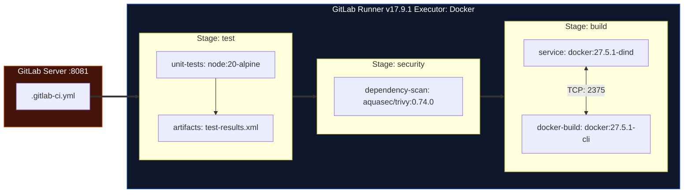

# LAB-GLB-01 — GitLab CI/CD Fundamentals: Stages, Jobs, Artifacts & Registry

| 🎯 Seviye | ⏱️ Tahmini Süre | 🛠️ Profil / Araçlar | 🔌 Açık Portlar |
| :--- | :--- | :--- | :--- |
| 🟡 **PRACTITIONER** (Orta Seviye) | ⏱️ 45 dakika | `gitlab-ci` | `8081` |

> [!TIP]
> 📥 **Başlangıç Paketi:** [Bu labın başlangıç paketini indir (LAB-GLB-01.zip)](/downloads/LAB-GLB-01.zip) — paket başlangıç kodlarını içerir; çözüm içermez.


## 1. Lab Senaryosu
Modern yazılım projelerinde kaynak kod yönetimi, issue takibi ve sürekli entegrasyon süreçlerinin tek bir çatı altında birleştirilmesi operasyonel verimliliği artırır. GitLab CI/CD, repoya push edilen her commit ile tetiklenen deklaratif `.gitlab-ci.yml` mimarisiyle çalışır. Hatalı kurgulanan artifact ve cache yapılandırmaları bağımlılıkların her seferinde baştan indirilmesine veya derleme çıktılarının sonraki aşamalara aktarılamamasına neden olur. Bu çalışmada Node.js mikroservisi için test, Trivy güvenlik taraması ve Docker imaj paketleme aşamalarını içeren gerçek bir GitLab CI/CD boru hattı kurgulanır.

## 2. Amaç
GitLab CI/CD sözdizimi (`.gitlab-ci.yml`) ile çok aşamalı (`stages`, `jobs`, `artifacts`, `cache`, `rules`) bir pipeline oluşturmak, Docker-in-Docker (dind) ve Trivy v0.74 ile güvenlik taramasını otomatize etmek ve YAML sözdizimini doğrulamak.

## 3. Mimari / Akış
```text
  [ GitLab Repository: .gitlab-ci.yml ]
                    |
                    v (Push / Merge Request)
  [ GitLab CI Pipeline ]
    ├── Aşama 1: test
    │     └── job: unit-tests (Artifacts: test sonuçları saklanır)
    ├── Aşama 2: security
    │     └── job: dependency-scan (Trivy fs taraması)
    └── Aşama 3: build
          └── job: docker-build (Docker 27.5 dind ile derleme ve Trivy kapısı)
```



> [!NOTE]
> **Docker-in-Docker (DinD) Mimarisi:** GitLab Runner'ın konteyner içinde yeni bir Docker imajı derleyebilmesi için `docker:27.5.1-dind` yardımcı servisi (`services:`) başlatılır. `docker:27.5.1-cli` işi, TLS üzerinden DinD daemon'ına bağlanarak izole ortamda imaj derler ve tarama yapar.


## 4. Ön Koşullar
- GitLab CE Web UI (port 8081) ve GitLab Runner çalışır durumda olmalıdır
- Merkezi referans platform için `https://devopsatolyesi.com/gitlab` adresini inceleyebilirsiniz
- Node.js (v20+) ve Python 3 (`python3-yaml`) kurulu olmalıdır
- Önceden tamamlanması önerilen lab: `LAB-DOC-03`

Aşağıdaki komutlarla çalışma dizinini hazırlayın:
```bash
mkdir -p ~/labs/LAB-GLB-01/app
cd ~/labs/LAB-GLB-01
```

## 5. Adım Adım Uygulama

### Adım 1 — Demo Uygulama Kodlarını Oluşturma
Node.js Express servisini ve birim test dosyasını oluşturun:
```bash
cat <<'EOF' > app/package.json
{
  "name": "gitlab-demo-api",
  "version": "1.0.0",
  "main": "server.js",
  "scripts": {
    "test": "node test.js",
    "start": "node server.js"
  },
  "dependencies": {
    "express": "^4.19.2"
  }
}
EOF

cat <<'EOF' > app/server.js
const express = require('express');
const app = express();
const PORT = process.env.PORT || 3000;

app.get('/', (req, res) => {
  res.json({ message: "GitLab CI/CD Driven API", status: "online" });
});

app.get('/health', (req, res) => {
  res.status(200).send("OK");
});

if (require.main === module) {
  app.listen(PORT, () => console.log(`Server listening on port ${PORT}`));
}

module.exports = app;
EOF

cat <<'EOF' > app/test.js
const assert = require('assert');
const app = require('./server');

console.log("Running unit tests...");
assert.strictEqual(typeof app, 'function', "App should be an express function");
console.log("ALL TESTS PASSED (1/1)");
EOF
```

### Adım 2 — `.gitlab-ci.yml` Pipeline Dosyasını Yazma
Test, güvenlik ve Docker derleme aşamalarını içeren `.gitlab-ci.yml` dosyasını oluşturun:
```yaml
cat <<'EOF' > .gitlab-ci.yml
image: node:20-alpine

stages:
  - test
  - security
  - build

variables:
  REGISTRY_HOST: "localhost:8082"
  IMAGE_NAME: "demo-service"
  DOCKER_DRIVER: overlay2

cache:
  key: ${CI_COMMIT_REF_SLUG}
  paths:
    - app/node_modules/

unit-tests:
  stage: test
  script:
    - cd app
    - npm ci
    - npm test
  artifacts:
    name: "test-results-${CI_COMMIT_SHORT_SHA}"
    when: always
    expire_in: 1 week
    paths:
      - app/package.json

dependency-scan:
  stage: security
  image:
    name: aquasec/trivy:0.74.0
    entrypoint: [""]
  script:
    - trivy fs --exit-code 1 --severity HIGH,CRITICAL app/
  rules:
    - if: '$CI_COMMIT_BRANCH == "main"'

docker-build:
  stage: build
  image: docker:27.5.1-cli
  services:
    - docker:27.5.1-dind
  variables:
    DOCKER_TLS_CERTDIR: ""
    DOCKER_HOST: tcp://docker:2375
  script:
    - docker build -t ${REGISTRY_HOST}/${IMAGE_NAME}:${CI_COMMIT_SHORT_SHA} app/
    - trivy image --exit-code 1 --severity CRITICAL ${REGISTRY_HOST}/${IMAGE_NAME}:${CI_COMMIT_SHORT_SHA}
    - echo "$HARBOR_PASSWORD" | docker login ${REGISTRY_HOST} -u "$HARBOR_USER" --password-stdin
    - docker push ${REGISTRY_HOST}/${IMAGE_NAME}:${CI_COMMIT_SHORT_SHA}
  rules:
    - if: '$CI_COMMIT_BRANCH == "main"'
EOF
```

### Adım 3 — Birim Testleri Yerel Olarak Çalıştırma
Uygulama dizinine geçerek testlerin çalıştığını teyit edin:
```bash
cd app
npm ci
npm test
cd ..
```

## 6. Beklenen Sonuç
Adım 3'teki birim test çıktısı:
```text
Running unit tests...
ALL TESTS PASSED (1/1)
```

## 8. Sorun Giderme

### Belirti
GitLab CI job'ı çalışırken `Cannot connect to the Docker daemon at tcp://docker:2375. Is the docker daemon running?` hatası alınır.

### Kanıt
GitLab Runner job konsolunda Docker daemon ile TCP iletişimi kurulamadığı görülür.

### Kontrol Komutu
```bash
docker ps | grep gitlab-runner
```

### Muhtemel Neden
Runner `config.toml` dosyasında `privileged = true` modu aktif edilmemiştir veya `dind` servisi ayağa kalkamamıştır.

### Çözüm
GitLab Runner yapılandırmasında `privileged = true` parametresini tanımlayın ve Runner servisini yeniden başlatın:
```bash
sudo sed -i 's/privileged = false/privileged = true/g' /etc/gitlab-runner/config.toml 2>/dev/null || true
sudo gitlab-runner restart 2>/dev/null || true
```

### Tekrar Doğrulama
Pipeline'ı yeniden tetikleyerek job çıktısını kontrol edin.

## 10. Production Notu
Üretim ortamlarında `cache` ve `artifacts` mekanizmaları birbirine karıştırılmamalıdır. `cache`, yalnızca sonraki derlemeleri hızlandırmak için kullanılan geçici bir önbellektir ve her zaman varlığı garanti edilmez. `artifacts` ise derleme çıktılarının (binary, paket, test raporu) aşamalar arasında deterministik olarak aktarılması için zorunludur.

## 11. Challenge
`.gitlab-ci.yml` dosyasına `needs: []` yönergesini ekleyerek `unit-tests` ve `dependency-scan` işlerinin sırayla değil, birbirini beklemeden tam paralel (DAG Pipeline) çalışmasını sağlayın.
