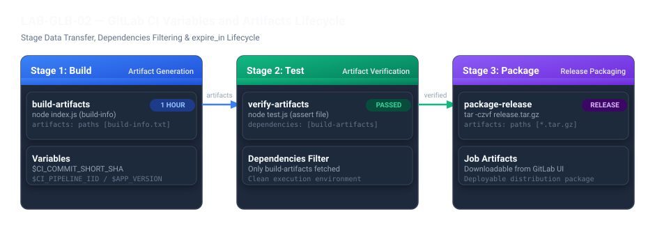

# LAB-GLB-02 — GitLab CI Variables ve Artifacts Yönetimi

## Metadata
- **Seviye:** PRACTITIONER
- **Önerilen Gün:** Gün 3
- **Tahmini Süre:** 30 dk
- **Gerekli Ortam:** Öğrenci Ubuntu Sunucusu (`Docker`, `Git`, `Node.js / npm` kurulu)
- **GitLab URL:** `https://gitlab.devopsatolyesi.com/devops-atolyesi/labs/lab-glb-02-variables-artifacts`
- **Çalışma Deposu:** `devops-atolyesi/labs/lab-glb-02-variables-artifacts`

---

## 1. Lab Senaryosu
Modern CI/CD süreçlerinde Pipeline aşamaları (`stages`) arasında veri ve derleme çıktısı aktarımı (`build outputs`, `binaries`, `test reports`) kritik bir gereksinimdir. GitLab CI mimarisinde her bir `job` varsayılan olarak izole bir konteyner ortamında çalışır ve iş bittiğinde konteyner silinir.

Bir Stage'de üretilen dosyaların sonraki Stage'lere aktarılabilmesi için GitLab CI **Artifacts** mekanizmasını sunar. `artifacts:paths` ile saklanacak dosyalar belirlenir, `expire_in` ile diskte kalma süresi sınırlandırılır ve `dependencies:` yönergesi ile hedef Job'ın yalnızca ihtiyaç duyduğu çıktıları indirmesi sağlanarak ağ ve disk maliyeti optimize edilir.

Bu laboratuvarda, kendi Ubuntu sunucunuzda sıfırdan bir Node.js projesi oluşturacak, GitLab CI ön tanımlı ve özel `variables` yapılarını kullanacak, `build` aşamasında bir manifest dosyası üretip bunu `test` ve `package` aşamalarına **Artifacts** olarak aktaracaksınız.

---

## 2. Amaçlar
- GitLab CI ön tanımlı değişkenlerini (`CI_COMMIT_SHORT_SHA`, `CI_PIPELINE_IID`, `CI_PROJECT_NAME`) kullanmak.
- Global ve Job seviyesinde `variables` tanımlamak.
- `artifacts:` bloğu ile dosya saklamak ve `expire_in` ile yaşam döngüsü belirlemek.
- `dependencies:` anahtar sözcüğü ile Job seviyesinde spesifik Artifact indirme filtrelemesi uygulamak.
- Üretilen dağıtım paketini (`release tarball`) GitLab UI üzerinden incelemek ve indirmek.

---

## 3. Pipeline Mimarisi



---

## 4. Öğrenci Ubuntu Sunucusunda Adım Adım Kurulum

### Adım 1: Ubuntu Terminalinde Çalışma Dizinini Hazırlama

Kendi Ubuntu sunucunuzun terminaline SSH ile bağlanın ve projeyi sıfırdan inşa edeceğiniz dizini oluşturun:

```bash
mkdir -p ~/devops-labs/lab-glb-02-variables-artifacts/app
cd ~/devops-labs/lab-glb-02-variables-artifacts
```

---

### Adım 2: Uygulama Kaynak Kodlarını Oluşturma

`build` aşamasında sistem ve pipeline metaverilerini toplayıp dosya üretecek `app/index.js` dosyasını oluşturun:

```bash
cat << 'EOF' > app/index.js
const fs = require('fs');

const appName = process.env.APP_NAME || "default-service";
const appVersion = process.env.APP_VERSION || "1.0.0";
const commitSha = process.env.CI_COMMIT_SHORT_SHA || "local-dev";
const pipelineId = process.env.CI_PIPELINE_IID || "0";

console.log("=========================================");
console.log(`Building Artifacts for: ${appName}`);
console.log(`Version: ${appVersion} | Commit: ${commitSha} | Pipeline: #${pipelineId}`);
console.log("=========================================");

const manifest = `app_name=${appName}
version=${appVersion}
commit=${commitSha}
pipeline_id=${pipelineId}
build_timestamp=${new Date().toISOString()}
`;

fs.writeFileSync('build-info.txt', manifest);
console.log("SUCCESS: app/build-info.txt generated successfully.");
EOF
```

Şimdi `test` aşamasında bu dosyanın varlığını ve bütünlüğünü denetleyecek `app/test.js` dosyasını oluşturun:

```bash
cat << 'EOF' > app/test.js
const fs = require('fs');
const assert = require('assert');

console.log("Running Artifact Verification Tests...");

// 1. Dosyanın varlığını kontrol et
assert(fs.existsSync('build-info.txt'), "FAIL: build-info.txt was not passed via Artifacts!");

// 2. İçerik doğrulama
const content = fs.readFileSync('build-info.txt', 'utf-8');
assert(content.includes('version='), "FAIL: build-info.txt does not contain version!");
assert(content.includes('commit='), "FAIL: build-info.txt does not contain commit info!");

console.log("-----------------------------------------");
console.log(content);
console.log("-----------------------------------------");
console.log("ALL ARTIFACT VERIFICATION TESTS PASSED (2/2)");
EOF
```

---

### Adım 3: GitLab CI Pipeline Dosyasını Oluşturma (`.gitlab-ci.yml`)

Proje kök dizininde `.gitlab-ci.yml` dosyasını oluşturun:

```bash
cat << 'EOF' > .gitlab-ci.yml
stages:
  - build
  - test
  - package

variables:
  APP_NAME: "demo-variables-service"
  APP_VERSION: "1.2.0"

# Stage 1: Artifacts üretimi
build-artifacts:
  stage: build
  image: node:20-alpine
  script:
    - echo "=== Stage 1: Generating Build Artifacts ==="
    - cd app
    - node index.js
  artifacts:
    name: "build-artifacts-$CI_COMMIT_SHORT_SHA"
    expire_in: 1 hour
    paths:
      - app/build-info.txt

# Stage 2: Artifacts doğrulama
verify-artifacts:
  stage: test
  image: node:20-alpine
  dependencies:
    - build-artifacts
  script:
    - echo "=== Stage 2: Verifying Ingested Artifacts ==="
    - cd app
    - node test.js

# Stage 3: Release paketi oluşturma
package-release:
  stage: package
  image: alpine:3.21
  dependencies:
    - build-artifacts
  script:
    - echo "=== Stage 3: Creating Release Package ==="
    - tar -czvf release-$CI_COMMIT_SHORT_SHA.tar.gz app/build-info.txt
    - ls -lh release-*.tar.gz
  artifacts:
    name: "release-package-$CI_COMMIT_SHORT_SHA"
    paths:
      - release-*.tar.gz
EOF
```

---

### Adım 4: Yerel Test (Ön Kontrol - Opsiyonel)

GitLab'e göndermeden önce kendi Ubuntu sunucunuzda kodların düzgün çalıştığını test edebilirsiniz:

```bash
export APP_NAME="local-test-app"
export APP_VERSION="1.0.0"
export CI_COMMIT_SHORT_SHA="local123"
export CI_PIPELINE_IID="1"

cd app
node index.js
node test.js
rm -f build-info.txt
cd ..
```

> Çıktıda `ALL ARTIFACT VERIFICATION TESTS PASSED` görüyorsanız kod mantığınız sorunsuzdur.

---

### Adım 5: Git İle Depoyu Başlatma ve GitLab'e Push Etme

Ubuntu terminalinizden Git repository'sini başlatın ve GitLab sunucunuza push edin:

```bash
git init
git config user.name "DevOps Student"
git config user.email "student@devopsatolyesi.com"
git branch -M main

git add .
git commit -m "feat: configure gitlab ci variables and artifacts lifecycle"

# GitLab sunucusunu origin olarak ekleyin
git remote add origin https://gitlab.devopsatolyesi.com/devops-atolyesi/labs/lab-glb-02-variables-artifacts.git

# Değişiklikleri push edin (Kullanıcı: devops / Parola: Eğitim şifreniz)
git push -u origin main --force
```

---

### Adım 6: Pipeline Yürütmesini ve Artifacts Çıktılarını İnceleme

1. Tarayıcınızda `https://gitlab.devopsatolyesi.com` adresini açın.
2. `devops-atolyesi/labs/lab-glb-02-variables-artifacts` projesine gidin.
3. Sol menüden **Build -> Pipelines** sekmesine tıklayın.
4. En son çalıştırılan Pipeline'ı açın:
   - `build-artifacts` Job'ının yeşil yandığını ve loglarında `app/build-info.txt generated` yazdığını görün.
   - `verify-artifacts` Job'ının önceki Job'ın ürettiği `build-info.txt` dosyasını `dependencies` sayesinde indirip başarıyla test ettiğini görün.
   - `package-release` Job'ının `release-<sha>.tar.gz` dosyasını paketlediğini gözlemleyin.

5. **Artifacts İndirme:**
   - `package-release` Job detayına tıklayın.
   - Sağ paneldeki **Job Artifacts** kutusundan `Download` butonuna tıklayarak tarball dosyasını indirin.
   - Arşiv içeriğini açtığınızda manifest dosyasının başarıyla taşındığını göreceksiniz:
     ```bash
     tar -ztvf release-*.tar.gz
     ```

---

## 5. Kritik Teknik Notlar

> [!IMPORTANT]
> - **`expire_in` Önemi:** CI/CD sunucularında disk dolmasını engellemek için geçici ara çıktılarda her zaman `expire_in: 1 hour` veya `1 day` gibi sınırlandırmalar kullanılmalıdır.
> - **`dependencies` vs `needs`:** Normal bir Pipeline'da `dependencies` yalnızca önceki aşamalardan hangi Job'ın Artifacts'ının indirileceğini filtreler. `needs` ise Stage sırasını beklemeden işleri doğrudan bağımlılık grafiğine (DAG) göre başlatır.
