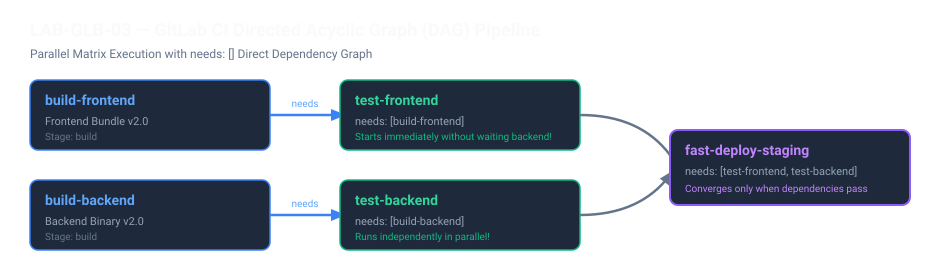

# LAB-GLB-03 — GitLab CI Directed Acyclic Graph (DAG) Pipeline

## 1. Lab Senaryosu
Geleneksel CI/CD hatlarında aşamalar katı bir sıralama ile (`linear stage execution`) çalışır: Bir Stage'deki tüm Job'lar bitmeden sonraki Stage başlayamaz. Örneğin monorepo veya birden fazla servisin bulunduğu projelerde, Frontend testleri Frontend build biter bitmez başlayabilecekken, Backend'in uzun süren derleme işlemini beklemek zorunda kalır.

GitLab CI, **DAG (Directed Acyclic Graph)** mimarisi ve `needs: []` sözdizimi ile bu darboğazı ortadan kaldırır. Bir Job, ait olduğu Stage sırasını beklemeden, yalnızca `needs:` listesinde belirtilen bağımlılıkları tamamlandığı anda paralel olarak yürütülür.

Bu laboratuvarda, kendi Ubuntu sunucunuzda bağımsız Frontend ve Backend iş akışlarını modelleyecek, `needs:` sözdizimiyle aşamaları atlayarak doğrudan bağımlılık grafiğine göre koşan modern bir DAG Pipeline inşa edeceksiniz.

---

## 2. Amaçlar
- Klasik lineer Pipeline ile DAG Pipeline arasındaki çalışma ve süre farkını anlamak.
- `needs: []` sözdizimi ile Job seviyesinde doğrudan bağımlılık tanımlamak.
- Bağımsız servislerin (Frontend & Backend) paralel olarak test edilmesini sağlamak.
- Tüm bağımlılıklar tamamlandığında birleşen bir `deploy` Job'ı kurgulamak.
- GitLab UI üzerinde **DAG Visualization** grafiğini analiz etmek.

---

## 3. Pipeline Mimarisi



---

## 4. Öğrenci Ubuntu Sunucusunda Adım Adım Kurulum

### Adım 1: Ubuntu Terminalinde Çalışma Dizinini Hazırlama

Kendi Ubuntu sunucunuzda proje dizinini oluşturun:

```bash
mkdir -p ~/devops-labs/lab-glb-03-dag-pipeline
cd ~/devops-labs/lab-glb-03-dag-pipeline
```

---

### Adım 2: GitLab CI Pipeline Dosyasını Oluşturma (`.gitlab-ci.yml`)

Projenin kök dizininde `.gitlab-ci.yml` dosyasını oluşturun:

```bash
cat << 'EOF' > .gitlab-ci.yml
stages:
  - build
  - test
  - deploy

variables:
  RELEASE_TAG: "v2.4.0"

# ==========================================
# STAGE: BUILD
# ==========================================
build-frontend:
  stage: build
  image: alpine:3.21
  script:
    - echo "=== Building Frontend Web Assets ==="
    - sleep 5
    - echo "Frontend compiled successfully." > frontend-dist.txt
  artifacts:
    paths:
      - frontend-dist.txt
    expire_in: 1 hour

build-backend:
  stage: build
  image: alpine:3.21
  script:
    - echo "=== Building Backend Go Binary ==="
    - sleep 10
    - echo "Backend binary compiled successfully." > backend-bin.txt
  artifacts:
    paths:
      - backend-bin.txt
    expire_in: 1 hour

# ==========================================
# STAGE: TEST (DAG: needs [])
# ==========================================
test-frontend:
  stage: test
  image: alpine:3.21
  # Backend build'i beklemez! Frontend bittiği anda başlar:
  needs: ["build-frontend"]
  script:
    - echo "=== Testing Frontend UI Components ==="
    - cat frontend-dist.txt
    - echo "Frontend Unit Tests PASSED"

test-backend:
  stage: test
  image: alpine:3.21
  # Frontend'den bağımsız olarak sadece backend build'i bekler:
  needs: ["build-backend"]
  script:
    - echo "=== Testing Backend API Endpoints ==="
    - cat backend-bin.txt
    - echo "Backend Unit Tests PASSED"

# ==========================================
# STAGE: DEPLOY
# ==========================================
fast-deploy-staging:
  stage: deploy
  image: alpine:3.21
  # Her iki test zinciri tamamlandığında otomatik tetiklenir:
  needs: ["test-frontend", "test-backend"]
  script:
    - echo "=== Deploying Staging Environment ==="
    - echo "Artifacts verified: Frontend & Backend"
    - echo "Release $RELEASE_TAG deployed successfully to Staging."
EOF
```

---

### Adım 3: Git İle Depoyu Başlatma ve GitLab'e Push Etme

Ubuntu terminalinizden Git repository'sini başlatıp GitLab'e push edin:

```bash
git init
git config user.name "DevOps Student"
git config user.email "student@devopsatolyesi.com"
git branch -M main

git add .
git commit -m "feat: implement dag pipeline architecture with direct needs dependencies"

# GitLab remote adresini tanımlayın
git remote add origin https://gitlab.devopsatolyesi.com/devops-atolyesi/labs/lab-glb-03-dag-pipeline.git

# GitLab'e push edin (Kullanıcı: devops / Parola: Eğitim şifreniz)
git push -u origin main --force
```

---

### Adım 4: GitLab UI Üzerinde DAG Görselleştirmesini İnceleme

1. Tarayıcınızda `https://gitlab.devopsatolyesi.com` adresini açın.
2. `devops-atolyesi/labs/lab-glb-03-dag-pipeline` projesine gidin.
3. Sol menüden **Build -> Pipelines** sekmesine tıklayın ve en son koşan Pipeline detayını açın.
4. Sayfada **Pipeline** sekmesinin yanında bulunan **Needs** veya **DAG** görselleştirme sekmesini seçin.
5. **Gözlem:**
   - `test-frontend` işinin `build-backend`'in bitmesini kesinlikle beklemediğini, `build-frontend` biter bitmez yeşile döndüğünü doğrulayın.
   - Lineer sıralama olsaydı toplam süre `5s + 10s + testler` şeklinde kümülatif artacakken, DAG sayesinde paralel kollarda toplam pipeline süresinin dramatik şekilde düştüğünü teyit edin.

---

## 5. Kritik Teknik Notlar

> [!TIP]
> - **`needs: []` (Boş Liste):** Eğer bir Job'a `needs: []` tanımlarsanız, bu Job hiçbir Stage sırasını beklemeden Pipeline tetiklendiği **ilk saniyede** anında başlar.
> - **Artifact İndirme Kuralı:** `needs:` tanımlanan bir Job, varsayılan olarak yalnızca `needs:` listesindeki Job'ların Artifacts dosyalarını indirir. Bu durum gereksiz dosya transferini engelleyerek runner performansını maksimize eder.
