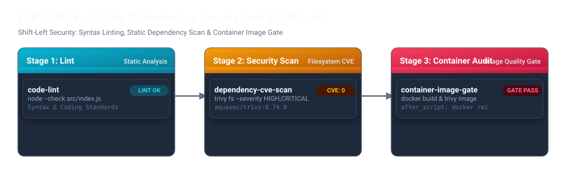

# LAB-GLB-04 — GitLab CI DevSecOps Security Gate ve Trivy CVE Taraması

## Metadata
- **Seviye:** ADVANCED PRACTITIONER
- **Önerilen Gün:** Gün 3
- **Tahmini Süre:** 35 dk
- **Gerekli Ortam:** Öğrenci Ubuntu Sunucusu (`Docker`, `Git` kurulu)
- **GitLab URL:** `https://gitlab.devopsatolyesi.com/devops-atolyesi/labs/lab-glb-04-security-gate`
- **Çalışma Deposu:** `devops-atolyesi/labs/lab-glb-04-security-gate`

---

## 1. Lab Senaryosu
Modern bulut yerel yazılım geliştirme döngülerinde güvenlik kontrollerinin en erken aşamada uygulanması **Shift-Left Security** olarak adlandırılır. Bir zafiyetin canlı ortama çıktıktan sonra tespit edilmesi yüksek maliyet ve itibar kaybına neden olurken, CI Pipeline aşamasında tespit edilip engellenmesi güvenli teslimatın temel şartıdır.

GitLab CI hatlarına entegre edilen **Security Gate** mekanizmaları ile:
1. **Statik Kod Analizi (Linting):** Sözdizimi hataları ve standart dışı kodlar derleme öncesinde yakalanır.
2. **Bağımlılık Taraması (Dependency Scan):** Kaynak kod ve kütüphaneler (SCA) bilinen CVE veri tabanlarına karşı taranır.
3. **Konteyner İmaj Taraması (Container Image Gate):** Üretilen Docker imajının katmanları, işletim sistemi paketleri ve çalışma zamanı zafiyetleri (Trivy ile) denetlenir; kritik eşik aşılırsa Pipeline bilinçli olarak durdurulur (`exit-code 1`).

Bu laboratuvarda, kendi Ubuntu sunucunuzda bir mikroservis projesi hazırlayacak, GitLab CI üzerinde **Trivy** entegrasyonu ile 3 katmanlı bir DevSecOps Security Gate kuracaksınız.

---

## 2. Amaçlar
- CI/CD sürecine Shift-Left güvenlik denetimlerini entegre etmek.
- Kod düzeyinde statik sözdizimi denetimi (`node --check`) uygulamak.
- **Trivy** ile kaynak kod ve paket dosya sistemi taraması (`trivy fs`) yapmak.
- Docker imajını derleyip imaj seviyesinde CVE taraması (`trivy image`) gerçekleştirmek.
- Konteyner imajının diskte gereksiz yer kaplamasını engellemek için `after_script` temizleme kuralını uygulamak.

---

## 3. Pipeline Mimarisi



---

## 4. Öğrenci Ubuntu Sunucusunda Adım Adım Kurulum

### Adım 1: Ubuntu Terminalinde Çalışma Dizinini Hazırlama

Kendi Ubuntu sunucunuzda proje dizinini oluşturun:

```bash
mkdir -p ~/devops-labs/lab-glb-04-security-gate/src
cd ~/devops-labs/lab-glb-04-security-gate
```

---

### Adım 2: Uygulama Kodları ve Dockerfile Oluşturma

Servis giriş noktası olan `src/index.js` dosyasını oluşturun:

```bash
cat << 'EOF' > src/index.js
const http = require('http');

const PORT = process.env.PORT || 8080;

const server = http.createServer((req, res) => {
  if (req.url === '/health') {
    res.writeHead(200, { 'Content-Type': 'application/json' });
    res.end(JSON.stringify({ status: 'UP', timestamp: new Date().toISOString() }));
    return;
  }
  res.writeHead(200, { 'Content-Type': 'text/plain' });
  res.end('DevSecOps Secure Microservice v1.0\n');
});

server.listen(PORT, () => {
  console.log(`Server listening on port ${PORT}`);
});
EOF
```

Minimum bağımlılık tanımını içeren `package.json` dosyasını oluşturun:

```bash
cat << 'EOF' > package.json
{
  "name": "devsecops-gate-demo",
  "version": "1.0.0",
  "description": "Trivy Security Gate Lab",
  "main": "src/index.js",
  "scripts": {
    "start": "node src/index.js"
  }
}
EOF
```

Güvenli ve minimal Alpine tabanlı `Dockerfile` dosyasını oluşturun:

```bash
cat << 'EOF' > Dockerfile
FROM node:20-alpine

WORKDIR /app

COPY package.json ./
COPY src/ ./src/

USER node

EXPOSE 8080

CMD ["node", "src/index.js"]
EOF
```

---

### Adım 3: GitLab CI Pipeline Dosyasını Oluşturma (`.gitlab-ci.yml`)

Projenin kök dizininde `.gitlab-ci.yml` dosyasını oluşturun:

```bash
cat << 'EOF' > .gitlab-ci.yml
stages:
  - lint
  - security-scan
  - container-audit

variables:
  IMAGE_NAME: "security-gate-app"
  TRIVY_VERSION: "0.58.2"

# 1. Aşama: Kod Sözdizimi Denetimi
code-lint:
  stage: lint
  image: node:20-alpine
  script:
    - echo "=== Stage 1: Static Code Linting ==="
    - node --check src/index.js
    - echo "SUCCESS: Syntax check passed."

# 2. Aşama: Kaynak Kod Dosya Sistemi CVE Taraması
dependency-cve-scan:
  stage: security-scan
  image:
    name: aquasec/trivy:$TRIVY_VERSION
    entrypoint: [""]
  script:
    - echo "=== Stage 2: Filesystem Dependency CVE Scan ==="
    - trivy fs --no-progress --severity HIGH,CRITICAL --exit-code 1 src/
    - echo "SUCCESS: Filesystem scan completed."

# 3. Aşama: Konteyner İmajı Derleme ve Trivy Güvenlik Kapısı
container-image-gate:
  stage: container-audit
  image: docker:27.5.1-cli
  script:
    - echo "=== Stage 3: Building Container Image ==="
    - docker build -t $IMAGE_NAME:$CI_COMMIT_SHORT_SHA .
    - echo "=== Running Trivy Container Image Scan ==="
    - docker run --rm -v /var/run/docker.sock:/var/run/docker.sock aquasec/trivy:$TRIVY_VERSION image --no-progress --severity CRITICAL --exit-code 1 $IMAGE_NAME:$CI_COMMIT_SHORT_SHA
    - echo "SUCCESS: Container image passed all security gates."
  after_script:
    - echo "=== Post Cleanup: Removing temporary image to save disk space ==="
    - docker rmi -f $IMAGE_NAME:$CI_COMMIT_SHORT_SHA || true
EOF
```

---

### Adım 4: Git İle Depoyu Başlatma ve GitLab'e Push Etme

Ubuntu terminalinizden dosyaları commit edip GitLab'e gönderin:

```bash
git init
git config user.name "DevOps Student"
git config user.email "student@devopsatolyesi.com"
git branch -M main

git add .
git commit -m "feat: implement trivy security gates and container audit"

# GitLab remote adresini bağlayın
git remote add origin https://gitlab.devopsatolyesi.com/devops-atolyesi/labs/lab-glb-04-security-gate.git

# GitLab'e push edin (Kullanıcı: devops / Parola: Eğitim şifreniz)
git push -u origin main --force
```

---

### Adım 5: Pipeline Sonuçlarını ve Güvenlik Raporlarını İnceleme

1. Tarayıcınızda `https://gitlab.devopsatolyesi.com` adresini açın.
2. `devops-atolyesi/labs/lab-glb-04-security-gate` projesine gidin.
3. Sol menüden **Build -> Pipelines** yolunu izleyip son Pipeline'a tıklayın.
4. **Log Analizi:**
   - `code-lint` Job'ında Node.js'in sözdizimini hatasız doğruladığını görün.
   - `dependency-cve-scan` Job loglarında Trivy'nin kaynak kodları tarayıp `Total: 0 (HIGH: 0, CRITICAL: 0)` raporunu bastığını inceleyin.
   - `container-image-gate` Job loglarında üretilen imajın başarıyla tarandığını ve `after_script` bloğunun sunucu diskinde atık imaj bırakmadan `docker rmi` yaptığını gözlemleyin.

---

## 5. Kritik Teknik Notlar

> [!WARNING]
> - **`--exit-code 1` Kullanımı:** Üretim ortamlarında pipeline'ın zafiyet durumunda anında başarısız olması (fail) isteniyorsa Trivy komutuna `--exit-code 1` eklenir. Böylece kritik CVE barındıran hiçbir imaj deploy aşamasına geçemez.
> - **`after_script` Temizliği:** CI sunucularında yüzlerce build sonrası disk dolmasını önlemek için test amaçlı üretilen ara imajlar mutlaka `after_script` aşamasında silinmelidir.
