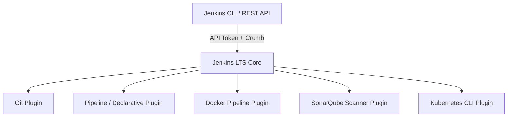

# LAB-JEN-02 — Jenkins İlk Yapılandırma, Yönetici Hesabı ve Eklenti Yönetimi

| 🎯 Seviye | ⏱️ Tahmini Süre | 🛠️ Profil / Araçlar | 🔌 Açık Portlar |
| :--- | :--- | :--- | :--- |
| 🟢 **CORE** (Temel Seviye) | ⏱️ 35 dakika | `jenkins` | `8080` |

> [!TIP]
> 📥 **Başlangıç Paketi:** [Bu labın başlangıç paketini indir (LAB-JEN-02.zip)](/downloads/LAB-JEN-02.zip) — paket başlangıç kodlarını içerir; çözüm içermez.


| 🎯 Seviye | ⏱️ Tahmini Süre | 🛠️ Profil / Araçlar | 🔌 Açık Portlar |
| :--- | :--- | :--- | :--- |
| 🟢 **CORE** (Temel Seviye) | ⏱️ 35 dakika | `jenkins`, `jenkins-cli`, `curl` | `8080` |

> [!TIP]
> 📥 **Başlangıç Paketi:** [Bu labın başlangıç paketini indir (LAB-JEN-02.zip)](/downloads/LAB-JEN-02.zip) — paket başlangıç kodlarını içerir; çözüm içermez.

---

## Amaç

Bu laboratuvarın amacı, Jenkins Controller üzerinde temel güvenlik, kullanıcı hesapları ve CI/CD süreçleri için zorunlu eklentileri (plugins) hem web arayüzünden hem de CLI/API üzerinden yönetmeyi öğrenmektir:

- İlk kurulum sihirbazını tamamlamak ve kalıcı admin hesabı oluşturmak.
- Temel Pipeline, Git, Docker Pipeline, SonarQube Scanner ve Kubernetes CLI eklentilerini kurmak.
- Jenkins CLI (`jenkins-cli.jar`) ile eklenti ve sistem durumunu terminalden yönetmek.
- CSRF koruması (Crumb Issuer) ve API Token oluşturma süreçlerini uygulamak.

---

## Ön Koşullar

- LAB-JEN-01 başarıyla tamamlanmış ve Jenkins Controller çalışır durumda olmalıdır.
- Jenkins web arayüzü `http://localhost:8080` üzerinden erişilebilir olmalıdır.

---

## Mimari ve Eklenti Ekosistemi



---

## Adım Adım Uygulama Rehberi

### Adım 1: Kurulum Sihirbazını Tamamlayın

1. Tarayıcınızdan `http://localhost:8080` adresine gidin.
2. `LAB-JEN-01` adımında aldığınız admin parolasını girin:
   ```bash
   docker exec jenkins-controller cat /var/jenkins_home/secrets/initialAdminPassword
   ```
3. **"Install suggested plugins"** seçeneğini tıklayın ve eklentilerin yüklenmesini bekleyin.
4. İlk yönetici kullanıcısını oluşturun:
   - **Kullanıcı adı:** `admin`
   - **Şifre:** `Admin123!`
   - **Tam İsim:** `DevOps Admin`
   - **E-posta:** `admin@devopsatolyesi.local`
5. Jenkins URL'ini `http://localhost:8080/` olarak onaylayın ve kurulumu tamamlayın.

---

### Adım 2: Jenkins CLI Aracını İndirin

Jenkins'i komut satırından otomatize etmek için CLI jar dosyasını indirin:

```bash
mkdir -p ~/labs/LAB-JEN-02
cd ~/labs/LAB-JEN-02
curl -sO http://localhost:8080/jnlpJars/jenkins-cli.jar
```

---

### Adım 3: Kullanıcı API Token Üretimi

1. Jenkins UI'da sağ üstten `admin` kullanıcısına tıklayın -> **Configure** seçeneğini seçin.
2. **API Token** bölümünde **Add new Token** butonuna tıklayın, isim olarak `cli-token` verin ve **Generate** deyin.
3. Üretilen token değerini kopyalayın (örnek: `11abcdef1234567890abcdef1234567890`).

Token değerini terminal ortam değişkenine aktarın:

```bash
export JENKINS_USER="admin"
export JENKINS_TOKEN="<KOPYALANAN_TOKEN>"
```

---

### Adım 4: CLI ile Kurulu Eklentileri Listeleyin

```bash
java -jar jenkins-cli.jar -s http://localhost:8080/   -auth ${JENKINS_USER}:${JENKINS_TOKEN}   list-plugins | head -n 20
```

---

### Adım 5: CI/CD ve Güvenlik Eklentilerini Otomatik Kurun

DevSecOps serüvenimiz boyunca ihtiyaç duyacağımız eklentileri tek komutla kurun:

```bash
java -jar jenkins-cli.jar -s http://localhost:8080/   -auth ${JENKINS_USER}:${JENKINS_TOKEN}   install-plugin   docker-workflow   sonar   kubernetes-cli   ansicolor   -restart
```

Jenkins Controller otomatik olarak yeniden başlayacaktır (yaklaşık 30-45 saniye sürer).

---

## Doğal Doğrulama

1. **Eklenti Kurulum Kontrolü:** Yeniden başlatma sonrası eklentilerin durumunu sorgulayın:
   ```bash
   java -jar jenkins-cli.jar -s http://localhost:8080/      -auth ${JENKINS_USER}:${JENKINS_TOKEN}      list-plugins docker-workflow sonar kubernetes-cli
   ```
   Tüm eklentilerin yanında sürüm numarası ve aktif durumu listelenmelidir.

2. **Sistem Sürüm ve Sağlık Kontrolü:**
   ```bash
   java -jar jenkins-cli.jar -s http://localhost:8080/      -auth ${JENKINS_USER}:${JENKINS_TOKEN}      version
   ```

---

## 🧠 İnteraktif Alıştırmalar ve Senaryo Soruları

??? question "Soru 1: Jenkins otomasyonlarında neden kullanıcı şifresi yerine API Token kullanılmalıdır?"
    ??? tip "💡 Çözümü Göster"
        **Cevap:**
        API Token'lar belirli izinlere bağlıdır, kullanıcının ana kimlik bilgilerini (LDAP/SSO şifresi) açığa çıkarmaz, istendiğinde tek tıkla iptal edilebilir (revoke) ve CSRF koruma mekanizmalarından (crumb) bağımsız olarak REST API çağrılarına izin verir.

??? question "Soru 2: Jenkins eklentisi kurulurken `-restart` bayrağı verildiğinde çalışan job'lar ne olur?"
    ??? tip "💡 Çözümü Göster"
        **Cevap:**
        Jenkins "Quiet Down" (Sakinleşme) moduna geçer. Mevcut çalışan pipeline job'larının tamamlanmasını bekler, yeni job kabul etmez ve tüm işler bittiğinde güvenli bir şekilde yeniden başlar (Safe Restart).

??? question "Soru 3: Eklenti güncellemelerinden sonra pipeline'ların bozulmaması için üretimde hangi yöntem izlenmelidir?"
    ??? tip "💡 Çözümü Göster"
        **Cevap:**
        Jenkins Configuration as Code (JCasC) ve `plugins.txt` dosyası kullanılarak eklenti sürümleri sabitlenmeli (pinned versions), doğrudan üretimde GUI'den güncelleme yapılmamalı, önce test/staging Jenkins örneğinde doğrulanmalıdır.

---

## Beklenen Sonuç & Sorun Giderme

| Belirti / Hata | Olası Neden | Çözüm |
| :--- | :--- | :--- |
| `java: command not found` | Host makinede OpenJDK kurulu değil | `sudo apt-get install -y default-jre` çalıştırın veya container içinden CLI çalıştırın. |
| `401 Unauthorized` | API Token veya kullanıcı adı hatalı | Jenkins UI üzerinden token'ı yenileyin ve `JENKINS_TOKEN` değişkenini güncelleyin. |
| `Plugin resolution failed` | İnternet bağlantısı veya proxy sorunu | Jenkins container'ının Update Center'a (`updates.jenkins.io`) erişebildiğini doğrulayın. |
