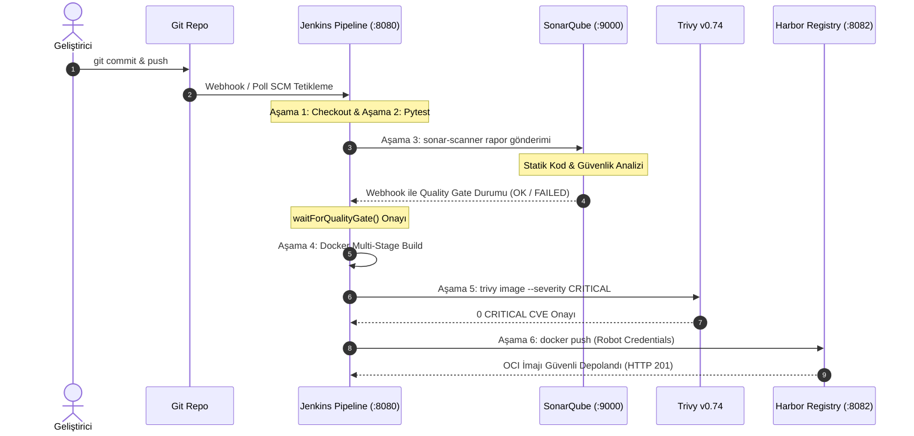

# LAB-JNK-02 — Jenkins Secure Pipeline: SonarQube Gate, Trivy & Harbor

| 🎯 Seviye | ⏱️ Tahmini Süre | 🛠️ Profil / Araçlar | 🔌 Açık Portlar |
| :--- | :--- | :--- | :--- |
| 🟡 **PRACTITIONER** (Orta Seviye) | ⏱️ 60 dakika | `secure-ci, harbor` | `8080, 8082, 9000` |

> [!TIP]
> 📥 **Başlangıç Paketi:** [Bu labın başlangıç paketini indir (LAB-JNK-02.zip)](/downloads/LAB-JNK-02.zip) — paket README ve başlangıç kodlarını içerir; çözüm içermez.
> 
> **Terminalde çalışma ortamını hazırlayın:**
> ```bash
> mkdir -p ~/labs/LAB-JNK-02
> cd ~/labs/LAB-JNK-02
> ```


## 1. Lab Senaryosu
Yalnızca derleme ve temel testleri çalıştıran geleneksel CI süreçleri, kod kalitesi hatalarını, güvenlik açıklarını ve zafiyetli konteyner imajlarını üretim ortamına taşır. Modern DevSecOps yaklaşımında "Shift-Left Security" prensibi gereğince güvenlik ve kalite denetimleri doğrudan boru hattının ilk aşamalarına entegre edilir. Bu çalışmada finansal işlem yapan Python FastAPI mikroservisi için uçtan uca güvenli bir Jenkins boru hattı kurulur. Kaynak kod SonarQube Clean Code analizinden geçirilir; `waitForQualityGate()` ile kalite onayı beklenir; derlenen multi-stage Docker imajı Trivy ile taranır ve sıfır kritik açıkla Harbor Private Registry'ye aktarılır.

## 2. Amaç
Jenkins üzerinde tam kapsamlı bir DevSecOps boru hattı (`Jenkinsfile`) oluşturmak, SonarQube statik analizini ve Quality Gate webhook mekanizmasını çalıştırmak, Trivy ile konteyner seviyesinde CVE taraması yapmak (`--exit-code 1 --severity CRITICAL`) ve onaylanan güvenli imajı Harbor Registry'ye kimlik bilgisi bağlama (Credentials Binding) ile yüklemek.

## 3. Mimari / Akış
```text
  [ Kaynak Kod (Git Commit) ]
                |
                v
  [ Jenkins Declarative Pipeline ]
    ├── Aşama 1: Checkout SCM
    ├── Aşama 2: Unit Tests (pytest & coverage.xml)
    ├── Aşama 3: SonarQube Scanner (http://localhost:9000)
    │     └── Quality Gate Webhook Callback ---> [ Durum: OK ]
    ├── Aşama 4: Docker Multi-Stage Build (Image: secure-payment-service)
    ├── Aşama 5: Trivy Container Vulnerability Scan (0 CRITICAL CVE)
    └── Aşama 6: Harbor Push (localhost:8082/devops/payment-service:tag)
```



> [!NOTE]
> **Quality Gate Webhook Mekanizması:** Jenkins, SonarQube taramasını başlattıktan sonra sonucu beklemeden thread'i askıya alabilir. SonarQube analizi tamamladığında, `http://jenkins:8080/sonarqube-webhook/` adresine bir POST isteği gönderir. `waitForQualityGate()` adımı bu callback bildirimini yakalayarak boru hattının sonraki adımlara geçmesini onaylar.


## 4. Ön Koşullar
- Jenkins (port 8080), SonarQube (port 9000) ve Harbor (port 8082) servisleri çalışır durumda olmalıdır
- Merkezi referans platformlar için `https://devopsatolyesi.com/sonarqube` ve `https://devopsatolyesi.com/harbor` adreslerini inceleyebilirsiniz
- `trivy` CLI kurulu olmalıdır (`trivy --version`)
- Önceden tamamlanması önerilen lablar: `LAB-JNK-01`, `LAB-DOC-06`

Aşağıdaki komutlarla servis durumlarını doğrulayın:
```bash
curl -sf http://localhost:8080/login > /dev/null && echo "Jenkins: OK" || echo "Jenkins: Check Port 8080"
curl -sf http://localhost:9000/api/system/status | grep -q "UP" && echo "SonarQube: OK" || echo "SonarQube: Check Port 9000"
curl -sf http://localhost:8082/api/v2.0/ping && echo "Harbor: OK" || echo "Harbor: Check Port 8082"
mkdir -p ~/labs/LAB-JNK-02/app ~/labs/LAB-JNK-02/tests
cd ~/labs/LAB-JNK-02
```

## 5. Adım Adım Uygulama

### Adım 1 — Mikroservis ve Test Kodlarını Hazırlama
Uygulama kaynak kodunu, birim testlerini ve Dockerfile dosyasını oluşturun:
```bash
cat <<'EOF' > app/main.py
from fastapi import FastAPI, HTTPException
import os

app = FastAPI(title="Secure Payment Service", version="1.2.0")

@app.get("/")
def home():
    return {
        "service": "secure-payment-service",
        "status": "active",
        "version": "1.2.0"
    }

@app.get("/api/v1/payments")
def get_payments():
    return [
        {"id": "PAY-1001", "amount": 450.0, "currency": "TRY", "status": "APPROVED"},
        {"id": "PAY-1002", "amount": 1250.5, "currency": "USD", "status": "PENDING"}
    ]

@app.get("/healthz")
def health():
    return {"status": "HEALTHY"}
EOF

cat <<'EOF' > app/requirements.txt
fastapi==0.110.0
uvicorn==0.28.0
pytest==8.0.2
pytest-cov==4.1.0
EOF

cat <<'EOF' > tests/test_main.py
from fastapi.testclient import TestClient
from app.main import app

client = TestClient(app)

def test_home():
    response = client.get("/")
    assert response.status_code == 200
    assert response.json()["status"] == "active"

def test_health():
    response = client.get("/healthz")
    assert response.status_code == 200
    assert response.json()["status"] == "HEALTHY"

def test_payments():
    response = client.get("/api/v1/payments")
    assert response.status_code == 200
    assert len(response.json()) == 2
EOF

cat <<'EOF' > app/Dockerfile
FROM python:3.11-slim-bookworm AS builder
WORKDIR /build
COPY requirements.txt .
RUN pip install --no-cache-dir -r requirements.txt

FROM python:3.11-slim-bookworm AS runner
WORKDIR /app
RUN adduser -u 10001 --disabled-password --gecos "" appuser && \
    chown -R appuser:appuser /app

COPY --from=builder /usr/local/lib/python3.11/site-packages /usr/local/lib/python3.11/site-packages
COPY --from=builder /usr/local/bin /usr/local/bin
COPY main.py .

USER 10001
EXPOSE 8000
CMD ["python", "main.py"]
EOF
```

### Adım 2 — SonarQube Proje Yapılandırmasını Tanımlama
SonarScanner için proje parametrelerini içeren `sonar-project.properties` dosyasını oluşturun:
```properties
cat <<'EOF' > sonar-project.properties
sonar.projectKey=secure-payment-service
sonar.projectName=Secure Payment Service
sonar.projectVersion=1.2.0
sonar.sources=app
sonar.tests=tests
sonar.python.version=3.11
sonar.python.coverage.reportPaths=coverage.xml
sonar.sourceEncoding=UTF-8
sonar.exclusions=**/__pycache__/**,**/.venv/**
EOF
```

### Adım 3 — Tam DevSecOps `Jenkinsfile` Boru Hattını Yazma
Kod analizi, Quality Gate, Trivy ve Harbor push adımlarını içeren `Jenkinsfile` dosyasını oluşturun:
```groovy
cat <<'EOF' > Jenkinsfile
pipeline {
    agent any

    environment {
        HARBOR_REGISTRY = "localhost:8082"
        HARBOR_PROJECT  = "devops"
        APP_NAME        = "secure-payment-service"
        IMAGE_TAG       = "v1.2.0-${BUILD_NUMBER}"
        FULL_IMAGE      = "${HARBOR_REGISTRY}/${HARBOR_PROJECT}/${APP_NAME}:${IMAGE_TAG}"
    }

    stages {
        stage('Checkout SCM') {
            steps {
                echo "--> [1] Kaynak kod repodan aliniyor..."
                checkout scm
            }
        }

        stage('Unit Tests & Coverage') {
            steps {
                echo "--> [2] Pytest ve kod kapsama analizi calistiriliyor..."
                sh '''
                    python3 -m venv .venv
                    . .venv/bin/activate
                    pip install --no-cache-dir -r app/requirements.txt
                    pytest --cov=app --cov-report=xml:coverage.xml --junitxml=junit-report.xml tests/
                '''
            }
        }

        stage('SonarQube Static Analysis') {
            steps {
                echo "--> [3] SonarScanner calistiriliyor..."
                withSonarQubeEnv('SonarQube-Server') {
                    sh '''
                        sonar-scanner \
                          -Dsonar.projectKey=${APP_NAME} \
                          -Dsonar.sources=app \
                          -Dsonar.python.coverage.reportPaths=coverage.xml
                    '''
                }
            }
        }

        stage('Quality Gate') {
            steps {
                echo "--> [4] SonarQube Kalite Kapisi sonucu bekleniyor..."
                timeout(time: 3, unit: 'MINUTES') {
                    script {
                        def qg = waitForQualityGate()
                        if (qg.status != 'OK') {
                            error "Hata: SonarQube Kalite Kapisi gecilemedi! Durum: ${qg.status}"
                        }
                    }
                }
            }
        }

        stage('Docker Multi-Stage Build') {
            steps {
                echo "--> [5] Guvenli konteyner imaji derleniyor: ${FULL_IMAGE}"
                dir('app') {
                    sh "docker build -t ${FULL_IMAGE} ."
                }
            }
        }

        stage('Trivy Security Gate') {
            steps {
                echo "--> [6] Trivy ile CRITICAL zafiyet taramasi yapiliyor..."
                sh """
                    trivy image --exit-code 1 --severity CRITICAL --no-progress ${FULL_IMAGE}
                """
            }
        }

        stage('Harbor Push') {
            steps {
                echo "--> [7] Harbor Registry kimlik dogrulamasi ve imaj yukleme..."
                withCredentials([usernamePassword(credentialsId: 'harbor-robot-creds', usernameVariable: 'HARBOR_USER', passwordVariable: 'HARBOR_PASS')]) {
                    sh """
                        echo \$HARBOR_PASS | docker login ${HARBOR_REGISTRY} -u \$HARBOR_USER --password-stdin
                        docker push ${FULL_IMAGE}
                        docker logout ${HARBOR_REGISTRY}
                    """
                }
            }
        }
    }

    post {
        always {
            junit allowEmptyResults: true, testResults: 'junit-report.xml'
            cleanWs deleteDirs: true, notFailBuild: true
        }
        success {
            echo "DEVSECOPS PIPELINE BASARILI: ${FULL_IMAGE} Harbor deposuna aktarildi."
        }
        failure {
            echo "DEVSECOPS PIPELINE GUVENLIK VEYA KALITE NEDENIYLE REDDEDILDI!"
        }
    }
}
EOF
```

### Adım 4 — Boru Hattı Adımlarını Yerel Olarak Koşturma ve Doğrulama
Pipeline içindeki test, build ve Trivy adımlarını terminal üzerinden test edin:
```bash
# 1. Sanal ortam ve testler
python3 -m venv .venv
. .venv/bin/activate
pip install -q -r app/requirements.txt
pytest --cov=app --cov-report=xml:coverage.xml --junitxml=junit-report.xml tests/

# 2. Multi-stage build
docker build -t localhost:8082/devops/secure-payment-service:v1.2.0-manual app/

# 3. Trivy Security Gate
trivy image --exit-code 1 --severity CRITICAL localhost:8082/devops/secure-payment-service:v1.2.0-manual
```

## 6. Beklenen Sonuç
Adım 4'teki Pytest çıktısı:
```text
====== 3 passed in ...s ======
- Generated xml file: .../junit-report.xml
```

Trivy tarama sonucu (0 CRITICAL açık):
```text
localhost:8082/devops/secure-payment-service:v1.2.0-manual (debian 12.x)
======================================================================
Total: 0 (CRITICAL: 0)
```

## 8. Sorun Giderme

### Belirti
Jenkins Pipeline `Quality Gate` aşamasında durur ve `Quality Gate failed with status ERROR` verir.

### Kanıt
SonarQube panelinde (`http://localhost:9000/dashboard?id=secure-payment-service`) "Coverage < 80%" veya güvenlik uyarısı görülür.

### Kontrol Komutu
```bash
curl -s http://localhost:9000/api/qualitygates/project_status?projectKey=secure-payment-service | jq .
```

### Muhtemel Neden
Yeni eklenen bir fonksiyon için birim test yazılmamış ve test kapsama oranı Quality Gate eşiğinin altına düşmüştür.

### Çözüm
`tests/test_main.py` içine eksik testleri ekleyin ve kapsama oranını artırıp commit edin.

### Tekrar Doğrulama
SonarQube dashboard'unda durumun yeşil `PASSED` olduğunu gözlemleyin.

## 10. Production Notu
Üretim boru hatlarında güvenlik kontrolleri (`trivy image ... || true`) şeklinde asla devre dışı bırakılmamalıdır. Harbor üzerinde tanımlanan robot hesaplarına yalnızca ilgili proje için `push/pull` yetkisi verilmeli ve düzenli olarak token rotasyonu uygulanmalıdır. Ayrıca tüm `Jenkinsfile` dosyaları merkezi bir Shared Library (`@Library`) üzerinden standartlaştırılmalıdır.

## 11. Challenge
`Jenkinsfile` içerisine `gitleaks detect --source . --verbose` adımını entegre ederek kod geçmişinde sızdırılmış API token veya şifre taraması yapan bir Secret Scanning aşaması ekleyin.
