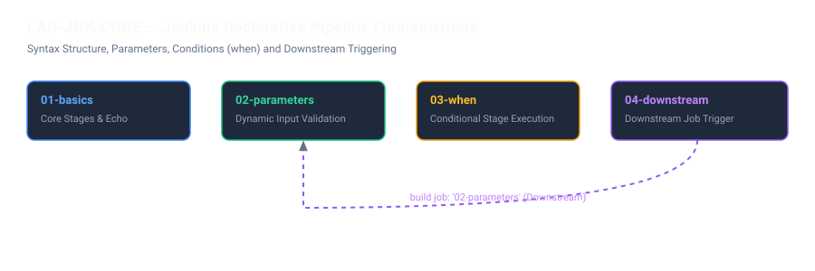

# LAB-JNK-CORE — Jenkins Pipeline Temelleri (Pipeline as Code)

## 1. Genel Bakış ve Amaç

Bu modül, Jenkins üzerinde **Pipeline-as-Code** yaklaşımının en temel yapı taşlarını pratik olarak deneyimlemenizi sağlar. Geleneksel serbest biçimli (freestyle) arayüz ayarları yerine, sürüm kontrol sisteminde (Git) saklanan bildirimsel (Declarative) pipeline betikleri kullanılır.

Bu laboratuvarda 4 aşamalı bir öğrenme döngüsü izlenir:
1. **01-declarative-basics:** `pipeline`, `agent`, `stages`, `steps` ve `archiveArtifacts` yapısı.
2. **02-parameters:** Tipli parametreler (`choice`, `booleanParam`), doğrulama ve dinamik parametre kullanımı.
3. **03-when:** Koşullu aşama çalıştırma (`when { expression { ... } }`) mekanizması.
4. **04-downstream:** Bir pipeline içerisinden başka bir pipeline işini tetikleme (`build job: ...`) ve durumunu izleme.

---

## 2. Mimari ve İş Akışı



---

## 3. Adım Adım Laboratuvar Uygulaması

### Bölüm 1: `01-declarative-basics` Çalıştırma

1. [https://jenkins.devopsatolyesi.com](https://jenkins.devopsatolyesi.com) adresine gidin.
2. Sol menüden **Labs** -> **01-Jenkins-Core** -> **01-declarative-basics** işine tıklayın.
3. Sol menüdeki **Build Now** butonuna basarak işi başlatın.
4. Sol alttaki **Build History** panelinden son build numarasına (`#1`) ve ardından **Console Output** seçeneğine tıklayın.

#### Beklenen Konsol Çıktısı:
```text
[Pipeline] { (Inspect agent)
[Pipeline] sh
+ git --version
git version 2.47.3
[Pipeline] sh
+ mkdir -p build
+ printf pipeline=%s\n jenkins-Labs-01-Jenkins-Core-01-declarative-basics-1
[Pipeline] }
[Pipeline] stage
[Pipeline] { (Publish learning artifact)
[Pipeline] archiveArtifacts
Archiving artifacts
Recording fingerprints
[Pipeline] End of Pipeline
Finished: SUCCESS
```
> **Önemli Nokta:** İş tamamlandıktan sonra build ana sayfasına gidin. `build/parameters.txt` dosyasının **Last Successful Artifacts** altında arşivlendiğini ve indirilebilir olduğunu göreceksiniz.

---

### Bölüm 2: `02-parameters` ile Parametreli Çalıştırma

1. **Labs** -> **02-Pipeline-as-Code** -> **02-parameters** işine gidin.
2. Sol menüdeki **Build with Parameters** butonuna tıklayın.
3. Karşınıza iki form alanı çıkacaktır:
   - `TARGET_ENVIRONMENT`: Açılır listeden `staging` seçin (Seçenekler: `dev`, `test`, `staging`).
   - `RUN_CHECKS`: Onay kutusunu işaretli bırakın.
4. **Build** butonuna basın.
5. **Console Output** üzerinden doğrulama adımını inceleyin:
```text
[Pipeline] { (Validate parameters)
[Pipeline] sh
+ mkdir -p build
+ printf target=%s\nchecks=%s\n staging true
[Pipeline] }
[Pipeline] { (Optional checks)
[Pipeline] sh
+ grep -qx target=staging build/parameters.txt
[Pipeline] }
Finished: SUCCESS
```

---

### Bölüm 3: `03-when` ile Koşullu Akış Denetimi

1. **Labs** -> **02-Pipeline-as-Code** -> **03-when** işine gidin.
2. Pipeline betiğinde tanımlı olan `when` koşulu ortam değişkeni veya dal adına göre belirli aşamaları atlar (`skipped due to when conditional`).
3. **Build Now** butonuna basın ve konsol çıktısını inceleyin. Koşulu sağlamayan aşamaların hata vermeden temiz bir şekilde atlandığını doğrulayın.

---

### Bölüm 4: `04-downstream` ile Pipeline Zincirleme

1. **Labs** -> **02-Pipeline-as-Code** -> **04-downstream** işine gidin.
2. **Build with Parameters** butonuna basın. Varsayılan parametre olarak `DOWNSTREAM_JOB: Labs/02-Pipeline-as-Code/02-parameters` tanımlıdır.
3. **Build** butonuna basın.
4. Konsol çıktısında bu işin `02-parameters` işini `TARGET_ENVIRONMENT=test` parametresiyle tetiklediğini ve sonucunu beklediğini göreceksiniz:
```text
[Pipeline] stage
[Pipeline] { (Trigger parameter lab)
[Pipeline] build
Scheduling project: Labs » 02-Pipeline-as-Code » 02-parameters
Starting building: Labs » 02-Pipeline-as-Code » 02-parameters #4
Build Labs » 02-Pipeline-as-Code » 02-parameters #4 completed: SUCCESS
[Pipeline] }
Finished: SUCCESS
```

---

## 4. Doğrulama ve Kontrol Listesi

- [x] `01-declarative-basics` başarılı çalıştı ve `parameters.txt` artifact'ı arşivlendi.
- [x] `02-parameters` farklı ortam parametreleriyle başarıyla doğrulandı.
- [x] `03-when` koşullu aşama denetimi başarıyla test edildi.
- [x] `04-downstream` alt pipeline'ı tetikleyip başarı durumunu ana pipeline'a iletti (`propagate: true`).
