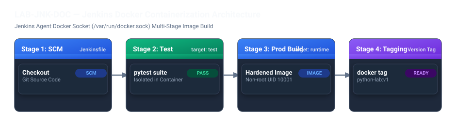

# LAB-JNK-DOC — Jenkins ile Docker Konteynerleştirme

## 1. Genel Bakış ve Amaç

Modern CI/CD süreçlerinde Jenkins agent'larının doğrudan ana makinede bağımlılık kurması yerine, işlerin izole Docker konteynerleri içinde derlenmesi ve test edilmesi beklenir. Bu laboratuvarda, Jenkins'in `/var/run/docker.sock` üzerinden Docker motoruyla nasıl etkileşime geçtiğini, çok aşamalı (multi-stage) bir Python Flask uygulamasını nasıl test ettiğini ve sertleştirilmiş bir çalışma zamanı (runtime) imajı ürettiğini adım adım deneyimleyeceksiniz.

---

## 2. Pipeline Mimarisi



Uygulamanın `Dockerfile` yapısı çok aşamalıdır:
- **`test` aşaması:** `requirements-dev.txt` bağımlılıklarını kurar ve `pytest` çalıştırır. Testler başarısız olursa pipeline anında kesilir ve imaj üretilmez.
- **`runtime` aşaması:** `app` adında kısıtlı (non-root, UID 10001) bir kullanıcı oluşturur, sadece gerekli çalışma zamanı kütüphanelerini kurar ve `gunicorn` ile servisi ayağa kaldırır.

---

## 3. Adım Adım Laboratuvar Uygulaması

1. [https://jenkins.devopsatolyesi.com](https://jenkins.devopsatolyesi.com) adresinde oturum açın.
2. Klasör yolunu takip edin: **Labs** -> **03-Docker** -> **01-python-containerize**.
3. Sol menüden **Build Now** butonuna tıklayarak işlemi başlatın.
4. **Console Output** ekranını açın ve aşamaları takip edin.

### Aşamaların Detaylı Analizi:

#### 1. Test Aşaması Derlemesi:
```text
[Pipeline] sh
+ docker build --target test -t docker-python-lab-test:1 .
Step 1/6 : FROM python:3.13.2-alpine3.21 AS test
...
Step 6/6 : RUN pytest -q
...
3 passed in 0.49s
```
Jenkins, testleri başarıyla tamamladıktan sonra bir sonraki aşamaya geçer.

#### 2. Sertleştirilmiş Üretim İmajı Derlemesi:
```text
Step 7/16 : FROM python:3.13.2-alpine3.21 AS runtime
Step 9/16 : RUN addgroup -S -g 10001 app && adduser -S -D -H -u 10001 -G app app
Step 13/16 : USER 10001
Step 14/16 : EXPOSE 8080
Step 15/16 : HEALTHCHECK --interval=15s --timeout=3s --retries=3 CMD wget -qO- http://127.0.0.1:8080/health >/dev/null || exit 1
Step 16/16 : CMD ["gunicorn", "--bind", "0.0.0.0:8080", "app:app"]
Successfully tagged docker-python-lab:1
Finished: SUCCESS
```

---

## 4. Doğrulama ve Öğrenim Çıktıları

- [x] Docker socket (`/var/run/docker.sock`) üzerinden Jenkins konteynerinin host üzerinde Docker komutlarını güvenle çalıştırabildiği doğrulandı.
- [x] Test aşaması başarısız olmadan üretim imajının üretilmediği görüldü.
- [x] Üretilen `docker-python-lab:1` imajının root yetkisi olmayan (`USER 10001`) güvenli bir kullanıcı ile çalıştığı ve hazır olma kontrolü (`HEALTHCHECK`) içerdiği teyit edildi.
