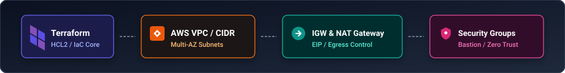
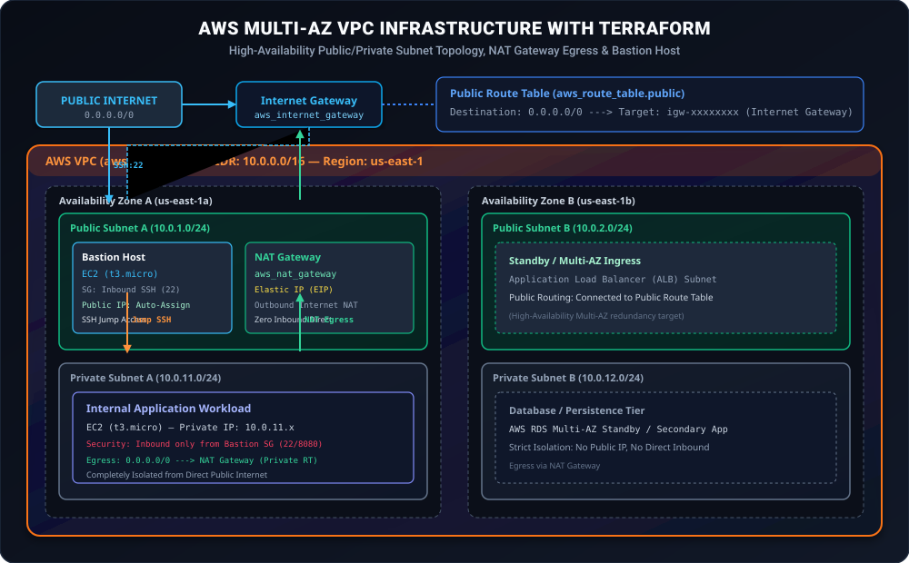
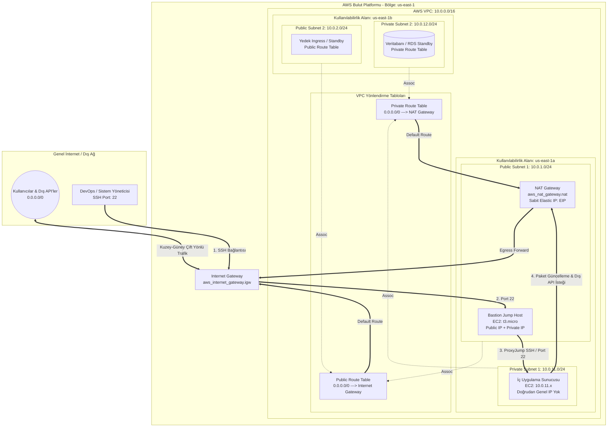
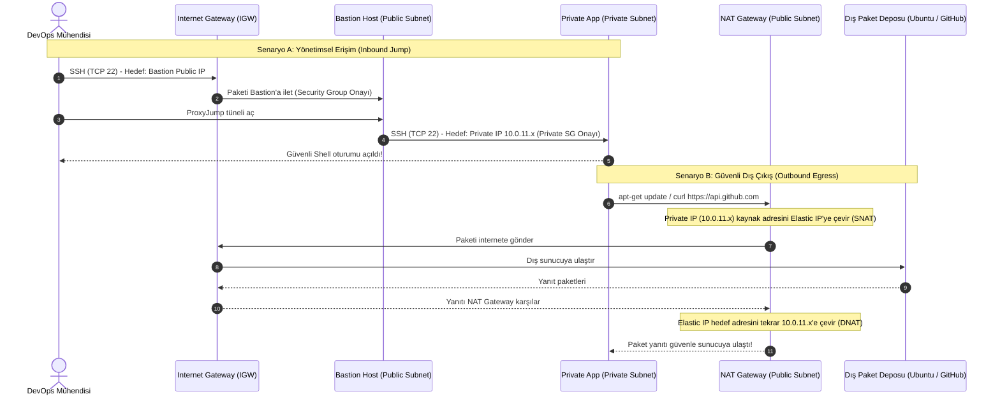

# LAB-TF-08 / PROJECT-TF-VPC — Terraform ile Üretim Standartlarında AWS VPC: Public & Private Subnet Mimarisi

> [Bu labın başlangıç dosyalarını indir (ZIP)](/downloads/LAB-TF-08.zip) — paket README, starter ve doğrulama scriptlerini içerir; çözüm içermez.


İndirdikten sonra terminalde: `unzip LAB-TF-08.zip && cd LAB-TF-08`

## ZIP İndirmeden Dosyaları Oluşturma

Aşağıdaki bloklar ZIP paketiyle birebir aynı dosyaları oluşturur.

```bash
mkdir -p ~/labs/LAB-TF-08
cd ~/labs/LAB-TF-08
```

### `starter/main.tf`

```bash
mkdir -p "$(dirname -- starter/main.tf)"
cat > starter/main.tf <<'LAB_FILE_EOF_1'
# TODO: Adım Adım Rehberi (LAB-TF-08) takip ederek aşağıdaki bileşenleri tanımlayınız:
# 1. aws_vpc.main
# 2. aws_subnet.public & aws_subnet.private
# 3. aws_internet_gateway.igw, aws_eip.nat & aws_nat_gateway.nat
# 4. aws_route_table.public & aws_route_table.private ve route table associations
# 5. aws_security_group.bastion_sg & aws_security_group.private_app_sg
# 6. aws_instance.bastion & aws_instance.private_app
LAB_FILE_EOF_1
```

### `starter/providers.tf`

```bash
mkdir -p "$(dirname -- starter/providers.tf)"
cat > starter/providers.tf <<'LAB_FILE_EOF_2'
terraform {
  required_version = ">= 1.5.0"

  required_providers {
    aws = {
      source  = "hashicorp/aws"
      version = "~> 5.80.0"
    }
  }
}

provider "aws" {
  region = var.aws_region
}
LAB_FILE_EOF_2
```

### `starter/variables.tf`

```bash
mkdir -p "$(dirname -- starter/variables.tf)"
cat > starter/variables.tf <<'LAB_FILE_EOF_3'
variable "aws_region" {
  type        = string
  description = "AWS hedef bölgesi"
  default     = "us-east-1"
}

variable "environment" {
  type        = string
  description = "Ortam adı"
  default     = "dev"
}

variable "vpc_cidr" {
  type        = string
  description = "VPC CIDR bloğu"
  default     = "10.0.0.0/16"
}

variable "availability_zones" {
  type        = list(string)
  default     = ["us-east-1a", "us-east-1b"]
}

variable "public_subnet_cidrs" {
  type        = list(string)
  default     = ["10.0.1.0/24", "10.0.2.0/24"]
}

variable "private_subnet_cidrs" {
  type        = list(string)
  default     = ["10.0.11.0/24", "10.0.12.0/24"]
}
LAB_FILE_EOF_3
```

### `scripts/cleanup.sh`

```bash
mkdir -p "$(dirname -- scripts/cleanup.sh)"
cat > scripts/cleanup.sh <<'LAB_FILE_EOF_4'
#!/usr/bin/env bash
# ==============================================================================
# Script: cleanup.sh
# Purpose: Safe cleanup of all AWS infrastructure to avoid incurring cloud costs
# ==============================================================================
set -euo pipefail

echo "=========================================================="
echo "    AWS INFRASTRUCTURE COST-SAVING CLEANUP (LAB-TF-08)    "
echo "=========================================================="

SCRIPT_DIR="$(cd "$(dirname "${BASH_SOURCE[0]}")" && pwd)"
LAB_DIR="$(cd "${SCRIPT_DIR}/.." && pwd)"

cd "${LAB_DIR}/solution" 2>/dev/null || cd "${LAB_DIR}"

if [ -f "terraform.tfstate" ]; then
  echo "==> Running 'terraform destroy' to release NAT Gateway, EIP and EC2 instances..."
  terraform destroy -auto-approve
  echo "==> Removing generated private key file..."
  rm -f lab_key.pem
  echo "==> All AWS cloud resources have been successfully destroyed. Zero ongoing costs."
else
  echo "==> No active terraform.tfstate found. Nothing to destroy."
fi
LAB_FILE_EOF_4
chmod +x scripts/cleanup.sh
```

### `scripts/reset.sh`

```bash
mkdir -p "$(dirname -- scripts/reset.sh)"
cat > scripts/reset.sh <<'LAB_FILE_EOF_5'
#!/usr/bin/env bash
# ==============================================================================
# Script: reset.sh
# Purpose: Completely destroys AWS VPC resources and resets the workspace
# ==============================================================================
set -euo pipefail

SCRIPT_DIR="$(cd "$(dirname "${BASH_SOURCE[0]}")" && pwd)"
LAB_DIR="$(cd "${SCRIPT_DIR}/.." && pwd)"

echo "==> [RESET] Destroying Terraform managed AWS resources for LAB-TF-08..."
cd "${LAB_DIR}/solution" 2>/dev/null || cd "${LAB_DIR}"

if [ -f "terraform.tfstate" ]; then
  terraform destroy -auto-approve || true
fi

echo "==> [RESET] Cleaning up local state and keys..."
rm -f terraform.tfstate* lab_key.pem .terraform.lock.hcl
rm -rf .terraform/

echo "==> [RESET] Re-initializing Terraform clean state..."
terraform init -backend=false || true

echo "==> [RESET] Workspace reset complete. You can now restart LAB-TF-08 from Step 1."
LAB_FILE_EOF_5
chmod +x scripts/reset.sh
```

### `scripts/validate.sh`

```bash
mkdir -p "$(dirname -- scripts/validate.sh)"
cat > scripts/validate.sh <<'LAB_FILE_EOF_6'
#!/usr/bin/env bash
# ==============================================================================
# Script: validate.sh
# Purpose: Validates AWS VPC Multi-AZ Public/Private Subnet Terraform Deployment (LAB-TF-08)
# ==============================================================================
set -euo pipefail

echo "=========================================================="
echo "   VALIDATING AWS MULTI-AZ VPC TERRAFORM DEPLOYMENT       "
echo "                   (LAB-TF-08)                            "
echo "=========================================================="

PASS=0
FAIL=0

log_pass() { echo -e "[\033[32mPASS\033[0m] $1"; PASS=$((PASS+1)); }
log_fail() { echo -e "[\033[31mFAIL\033[0m] $1"; FAIL=$((FAIL+1)); }

SCRIPT_DIR="$(cd "$(dirname "${BASH_SOURCE[0]}")" && pwd)"
LAB_DIR="$(cd "${SCRIPT_DIR}/.." && pwd)"

cd "${LAB_DIR}/solution" 2>/dev/null || cd "${LAB_DIR}"

# 1. Terraform Binary & Syntax Validation
if command -v terraform &>/dev/null; then
  log_pass "Terraform CLI is installed ($(terraform version -json 2>/dev/null | jq -r '.terraform_version // "unknown"'))"
else
  log_fail "Terraform CLI not found in PATH."
fi

if terraform validate &>/dev/null; then
  log_pass "Terraform configuration is syntactically valid (terraform validate)."
else
  log_fail "Terraform validation failed. Check syntax and required variables."
fi

# 2. State Check
if [ -f "terraform.tfstate" ]; then
  log_pass "terraform.tfstate file exists."
  
  # 3. Resource Output Verification
  VPC_ID=$(terraform output -raw vpc_id 2>/dev/null || echo "")
  if [ -n "$VPC_ID" ] && [[ "$VPC_ID" =~ ^vpc- ]]; then
    log_pass "VPC created successfully with ID: $VPC_ID"
  else
    log_fail "VPC ID not found or invalid in Terraform outputs."
  fi

  PUB_COUNT=$(terraform output -json public_subnet_ids 2>/dev/null | jq '. | length' 2>/dev/null || echo 0)
  if [ "$PUB_COUNT" -eq 2 ]; then
    log_pass "Public subnets verified: 2 subnets provisioned across Multi-AZ."
  else
    log_fail "Public subnets count mismatch: expected 2, found $PUB_COUNT."
  fi

  PRIV_COUNT=$(terraform output -json private_subnet_ids 2>/dev/null | jq '. | length' 2>/dev/null || echo 0)
  if [ "$PRIV_COUNT" -eq 2 ]; then
    log_pass "Private subnets verified: 2 subnets provisioned across Multi-AZ."
  else
    log_fail "Private subnets count mismatch: expected 2, found $PRIV_COUNT."
  fi

  NAT_EIP=$(terraform output -raw nat_gateway_public_ip 2>/dev/null || echo "")
  if [ -n "$NAT_EIP" ]; then
    log_pass "NAT Gateway Elastic IP allocated: $NAT_EIP"
  else
    log_fail "NAT Gateway Elastic IP missing."
  fi

  BASTION_IP=$(terraform output -raw bastion_public_ip 2>/dev/null || echo "")
  if [ -n "$BASTION_IP" ]; then
    log_pass "Bastion Jump Host deployed with Public IP: $BASTION_IP"
  else
    log_fail "Bastion Public IP missing."
  fi

  PRIV_IP=$(terraform output -raw private_app_ip 2>/dev/null || echo "")
  if [ -n "$PRIV_IP" ] && [[ "$PRIV_IP" =~ ^10\.0\.11\. ]]; then
    log_pass "Private App instance deployed with Isolated IP: $PRIV_IP"
  else
    log_fail "Private instance IP missing or not in 10.0.11.0/24 CIDR."
  fi

  # 4. Live Reachability Test (Optional if credentials and key exist)
  if [ -f "lab_key.pem" ] && [ -n "$BASTION_IP" ]; then
    echo "Testing Bastion SSH Port 22 connectivity..."
    if nc -z -w 5 "$BASTION_IP" 22 2>/dev/null; then
      log_pass "Bastion Host SSH port 22 is reachable from the internet."
    else
      echo "  (Note: SSH port unreachable or security group restricted - check allowed_ssh_cidr)"
    fi
  fi

else
  echo "  (terraform.tfstate not found locally. Run 'terraform apply' first to test live state.)"
fi

echo "----------------------------------------------------------"
echo "  SUMMARY: PASS=$PASS | FAIL=$FAIL"
echo "=========================================================="

if [ "$FAIL" -eq 0 ]; then
  echo -e "\033[32m>>> LAB-TF-08 VALIDATION SUCCESSFUL! <<<\033[0m"
  exit 0
else
  echo -e "\033[31m>>> LAB-TF-08 VALIDATION HAS WARNINGS/FAILURES! <<<\033[0m"
  exit 1
fi
LAB_FILE_EOF_6
chmod +x scripts/validate.sh
```

Başlangıç dosyalarını çalışma dizinine alın:

```bash
cp -a starter/. .
```


## 1. Lab / Proje Senaryosu

Kurumsal bulut mimarilerinde karşılaşılan en yaygın güvenlik ve operasyonel anti-pattern; tüm sanal sunucuların (EC2), veritabanlarının (RDS) ve konteyner kümelerinin (EKS) varsayılan AWS VPC'si (Default VPC) içinde ve doğrudan internete açık genel IP'lerle konuşlandırılmasıdır. Bu yaklaşım veritabanlarını ve iç mikroservisleri doğrudan internet kaynaklı brute-force, port taraması ve DDoS saldırılarına açık hale getirir.

Üretim seviyesindeki kurumsal bir DevOps altyapısında; ağ izolasyonu **Katmanlı Savunma (Defense-in-Depth)** ve **Sıfır Güven (Zero Trust)** ilkelerine göre inşa edilmelidir:
1. **Virtual Private Cloud (VPC):** Şirkete özel izole sanal veri merkezi ağı (`10.0.0.0/16`).
2. **Çoklu Kullanılabilirlik Alanı (Multi-AZ):** Tek bir veri merkezi arızasında kesinti yaşanmaması için kaynakların en az iki farklı fiziksel lokasyona (`us-east-1a`, `us-east-1b`) dağıtılması.
3. **Public Subnet (DMZ / Ingress):** Yalnızca dışarıdan doğrudan erişilmesi gereken bileşenleri (Application Load Balancer, Bastion Jump Host, NAT Gateway) barındırır ve Internet Gateway (IGW) üzerinden doğrudan çift yönlü internet erişimine sahiptir.
4. **Private Subnet (İzole Katman):** Hassas iş yüklerini (Backend API, Veritabanları, Redis) barındırır. Bu subnet'lerdeki kaynakların genel IP'si (Public IP) **yoktur** ve dış internetten bu kaynaklara doğrudan bağlantı kurulamaz.
5. **NAT Gateway & EIP:** Private subnet'teki sunucuların işletim sistemi güncellemelerini (`apt-get update`), Docker imajlarını veya harici API'leri çekebilmesi için tek yönlü (çıkış yönlü - egress) internet erişimi sağlar.
6. **Bastion Host (Jump Box):** Sistem yöneticilerinin ve DevOps mühendislerinin izole private sunuculara güvenli bir şekilde erişmesini sağlayan sıkılaştırılmış atlama noktasıdır.

Bu projede, bu mimariyi Terraform ile sıfırdan modüler, deklaratif ve tekrarlanabilir bir Altyapı Kod Olarak (IaC) projesi olarak ayağa kaldıracak; ardından Bastion üzerinden Private sunucuya tünel kurup NAT Gateway üzerinden dış internete çıkışı uçtan uca doğrulayacağız.

---

## 2. Amaç ve Öğrenim Çıktıları

Bu lab ve projeyi tamamladığınızda aşağıdaki yetkinlikleri kazanacaksınız:
- **CIDR Matematiği ve IP Planlaması:** `/16` (65.536 IP) ve `/24` (256 IP) ağ adreslemesi, AWS tarafından her subnet'te rezerve edilen 5 IP adresinin (`.0` Ağ, `.1` VPC Yönlendirici, `.2` DNS Çözücü, `.3` İleride Kullanım, `.255` Yayın) mantığı.
- **Deklaratif Bulut Ağı Oluşturma:** `aws_vpc`, `aws_subnet`, `aws_internet_gateway`, `aws_eip`, `aws_nat_gateway` kaynaklarını Terraform HCL2 ile yapılandırma.
- **Yönlendirme (Routing) Mantığı:** Public Route Table (`0.0.0.0/0 -> IGW`) ve Private Route Table (`0.0.0.0/0 -> NAT Gateway`) arasındaki hayati ayrımı ve subnet ilişkilendirmelerini (`aws_route_table_association`) kurma.
- **Güvenlik Grupları (Security Groups):** Durum bilgisi tutan (stateful) güvenlik duvarları yazma, Bastion SG'den Private App SG'ye referanslı kaynak izinleri tanımlama.
- **Anahtar Çifti ve Dinamik Veri Kaynakları:** `tls_private_key` ve `aws_ami` dinamik data source ile sıfır konfigürasyonlu anahtar yönetimi ve güncel Ubuntu 24.04 LTS imajı keşfi.
- **Uçtan Uca Doğrulama:** Bastion üzerinden SSH Jump (`-J` ProxyJump) ile private sunucuya bağlanma ve `curl https://checkip.amazonaws.com` komutu ile sunucunun NAT Gateway Elastic IP'si üzerinden maskelenerek internete çıktığını kanıtlama.
- **Çift Çalışma Modu (Dual-Mode):** Gerçek AWS hesabı ile ya da tamamen yerel/ücretsiz LocalStack Docker ortamı ile çalışabilme esnekliği.

---

## 3. Mimari ve Ağ Topolojisi



### 3.1. AWS Ağ Topolojisi Şeması


### 3.2. Detaylı Mermaid Mimari Diyagramı



### 3.3. Ağ Trafiği ve Paket Yönlendirme Akışı (Sequence Flow)



---

## 4. Ön Koşullar

1. **Terraform CLI:** Host üzerinde `terraform` v1.5+ kurulu olmalıdır (`terraform version`).
2. **Kimlik Doğrulama:**
   - **Gerçek AWS ile çalışma durumunda:** `aws configure` yapılmış ve `AWS_ACCESS_KEY_ID`, `AWS_SECRET_ACCESS_KEY` ortam değişkenleri tanımlı olmalıdır.
   - **LocalStack ile yerel çalışma durumunda:** `docker run -d --name localstack -p 4566:4566 localstack/localstack:3.8` konteyneri ayakta olmalıdır.
3. **Araçlar:** `jq`, `curl`, `ssh`, `nc` (netcat).

Aşağıdaki komutlarla başlangıç ortamınızı kontrol edin:
```bash
terraform version
aws --version 2>/dev/null || echo "(AWS CLI kurulu değilse LocalStack veya Terraform yerel provider kullanılabilir)"
mkdir -p ~/labs/LAB-TF-08
cd ~/labs/LAB-TF-08
```

---

## 5. Proje Dosya Yapısı

Geliştireceğimiz küçük Terraform projesi kurumsal modüler standartlara uygun olarak şu dosyalardan oluşur:

| Dosya Yolu | Amacı ve Sorumluluğu |
|---|---|
| `providers.tf` | Terraform ve AWS sağlayıcı sürümleri, LocalStack endpoint desteği ve default_tags |
| `variables.tf` | Parametrik yapı: CIDR blokları, AZ listesi, ortam adı, örnek tipleri |
| `vpc.tf` | AWS VPC kaynağı (`10.0.0.0/16`) ve DNS çözümleme seçenekleri |
| `subnets.tf` | 2 Public Subnet ve 2 Private Subnet'in Multi-AZ olarak döngüyle tanımlanması |
| `gateways.tf` | Internet Gateway (IGW), Elastic IP (EIP) ve NAT Gateway kaynakları |
| `routing.tf` | Public Route Table, Private Route Table ve Subnet ilişkilendirme kayıtları |
| `security_groups.tf` | Bastion Host ve Private Application katmanları için durum bilgili güvenlik grupları |
| `compute.tf` | Otomatik TLS SSH anahtarı üretimi, Ubuntu 24.04 AMI araması, Bastion ve Private EC2 sunucuları |
| `outputs.tf` | VPC ID, Subnet ID'leri, NAT Gateway EIP, Bastion IP ve doğrudan bağlanma SSH komutları |
| `terraform.tfvars` | Ortama özel değişken değerleri |

---

## 6. Adım Adım Uygulama (9 Ayrıntılı Adım)

---

### Adım 1: Çalışma Alanını Hazırlama ve Sağlayıcı Yapılandırması (`providers.tf`)

Çalışma dizinine geçin:
```bash
mkdir -p ~/labs/LAB-TF-08
cd ~/labs/LAB-TF-08
```

Terraform'un AWS provider, yerel dosya ve anahtar üretim sağlayıcılarını tanımlayan `providers.tf` dosyasını oluşturun:

```bash
cat <<'EOF' > providers.tf
terraform {
  required_version = ">= 1.5.0"

  required_providers {
    aws = {
      source  = "hashicorp/aws"
      version = "~> 5.80.0"
    }
    tls = {
      source  = "hashicorp/tls"
      version = "~> 4.0.5"
    }
    local = {
      source  = "hashicorp/local"
      version = "~> 2.5.1"
    }
  }
}

provider "aws" {
  region = var.aws_region

  # Opsiyonel LocalStack Desteği: enable_localstack true ise yerel portu kullanır
  dynamic "endpoints" {
    for_each = var.enable_localstack ? [1] : []
    content {
      ec2 = var.localstack_endpoint
      sts = var.localstack_endpoint
    }
  }

  default_tags {
    tags = {
      Project     = "DevOps-Practitioner"
      Environment = var.environment
      ManagedBy   = "Terraform"
      Lab         = "LAB-TF-08"
    }
  }
}
EOF
```

---

### Adım 2: Parametrik Değişkenlerin Tanımlanması (`variables.tf`)

Sabit kodlanmış (hardcoded) IP ve bölge adlarından kaçınmak için tüm parametreleri `variables.tf` içinde toplayın:

```bash
cat <<'EOF' > variables.tf
variable "aws_region" {
  type        = string
  description = "AWS hedef dağıtım bölgesi"
  default     = "us-east-1"
}

variable "environment" {
  type        = string
  description = "Ortam adı (dev, test, prod)"
  default     = "dev"
}

variable "vpc_cidr" {
  type        = string
  description = "VPC ana IPv4 CIDR bloğu"
  default     = "10.0.0.0/16"
}

variable "availability_zones" {
  type        = list(string)
  description = "Yüksek erişilebilirlik için kullanılacak Kullanılabilirlik Alanları"
  default     = ["us-east-1a", "us-east-1b"]
}

variable "public_subnet_cidrs" {
  type        = list(string)
  description = "Public subnet CIDR blokları (DMZ katmanı)"
  default     = ["10.0.1.0/24", "10.0.2.0/24"]
}

variable "private_subnet_cidrs" {
  type        = list(string)
  description = "Private subnet CIDR blokları (İç uygulama/veritabanı katmanı)"
  default     = ["10.0.11.0/24", "10.0.12.0/24"]
}

variable "allowed_ssh_cidr" {
  type        = list(string)
  description = "Bastion sunucusuna SSH bağlantısına izin verilecek IP bloğu"
  default     = ["0.0.0.0/0"]
}

variable "instance_type" {
  type        = string
  description = "Doğrulama EC2 sunucuları için donanım tipi"
  default     = "t3.micro"
}

variable "enable_localstack" {
  type        = bool
  description = "AWS hesabı yerine yerel LocalStack kullanılsın mı?"
  default     = false
}

variable "localstack_endpoint" {
  type        = string
  description = "Yerel LocalStack adresi"
  default     = "http://localhost:4566"
}
EOF
```

---

### Adım 3: AWS VPC Kaynağının Oluşturulması (`vpc.tf`)

VPC'de `enable_dns_support` ve `enable_dns_hostnames` değerlerinin `true` yapılması kritiktir; bu ayarlar olmadan EC2 sunucuları dahili AWS DNS adlarını çözemez:

```bash
cat <<'EOF' > vpc.tf
# ==============================================================================
# AWS Virtual Private Cloud (VPC)
# ==============================================================================
resource "aws_vpc" "main" {
  cidr_block           = var.vpc_cidr
  enable_dns_support   = true
  enable_dns_hostnames = true

  tags = {
    Name = "${var.environment}-vpc"
  }
}
EOF
```

---

### Adım 4: Çoklu AZ Public ve Private Subnet'lerin Kodlanması (`subnets.tf`)

`count` mekanizması ile subnet listesini dinamik olarak dönün:
- Public Subnet'lerde `map_public_ip_on_launch = true` yapılarak başlatılan sunuculara otomatik Public IPv4 atanır.
- Private Subnet'lerde `map_public_ip_on_launch = false` yapılarak sunucuların tamamen yalıtılmış kalması sağlanır.

```bash
cat <<'EOF' > subnets.tf
# ==============================================================================
# Public Subnets (DMZ / Internet-facing Ingress Katmanı)
# ==============================================================================
resource "aws_subnet" "public" {
  count                   = length(var.public_subnet_cidrs)
  vpc_id                  = aws_vpc.main.id
  cidr_block              = var.public_subnet_cidrs[count.index]
  availability_zone       = var.availability_zones[count.index]
  map_public_ip_on_launch = true

  tags = {
    Name = "${var.environment}-public-subnet-${count.index + 1}-${var.availability_zones[count.index]}"
    Tier = "Public"
  }
}

# ==============================================================================
# Private Subnets (İzole İç Uygulama & Veritabanı Katmanı)
# ==============================================================================
resource "aws_subnet" "private" {
  count                   = length(var.private_subnet_cidrs)
  vpc_id                  = aws_vpc.main.id
  cidr_block              = var.private_subnet_cidrs[count.index]
  availability_zone       = var.availability_zones[count.index]
  map_public_ip_on_launch = false

  tags = {
    Name = "${var.environment}-private-subnet-${count.index + 1}-${var.availability_zones[count.index]}"
    Tier = "Private"
  }
}
EOF
```

---

### Adım 5: Internet Gateway, Elastic IP ve NAT Gateway (`gateways.tf`)

> [!IMPORTANT]
> **NAT Gateway ve IGW İlişkisi:** Bir NAT Gateway'in internete paket yönlendirebilmesi için mutlak suretle bir **Public Subnet** içinde yaşaması ve bir **Elastic IP (EIP)** ile eşleştirilmesi şarttır. `depends_on = [aws_internet_gateway.igw]` kuralı ile Terraform'a NAT Gateway oluşturulmadan önce IGW'nin hazır olması gerektiği bildirilir.

```bash
cat <<'EOF' > gateways.tf
# ==============================================================================
# Internet Gateway (IGW) - Çift Yönlü Dış İnternet Girişi
# ==============================================================================
resource "aws_internet_gateway" "igw" {
  vpc_id = aws_vpc.main.id

  tags = {
    Name = "${var.environment}-internet-gateway"
  }
}

# ==============================================================================
# Elastic IP (EIP) - NAT Gateway İçin Sabit Genel IP
# ==============================================================================
resource "aws_eip" "nat" {
  domain     = "vpc"
  depends_on = [aws_internet_gateway.igw]

  tags = {
    Name = "${var.environment}-nat-gw-eip"
  }
}

# ==============================================================================
# NAT Gateway - Private Subnet'lerin İnternete Güvenli Tek Yönlü Çıkışı
# ==============================================================================
resource "aws_nat_gateway" "nat" {
  allocation_id = aws_eip.nat.id
  subnet_id     = aws_subnet.public[0].id # İlk Public Subnet içine yerleştirilir
  depends_on    = [aws_internet_gateway.igw]

  tags = {
    Name = "${var.environment}-nat-gateway"
  }
}
EOF
```

---

### Adım 6: Yönlendirme Tabloları ve Subnet İlişkilendirmeleri (`routing.tf`)

Ağ paketlerinin rotalarını belirleyin:
1. **Public Route Table:** `0.0.0.0/0` (tüm bilinmeyen dış trafik) doğrudan `Internet Gateway`'e yönlendirilir.
2. **Private Route Table:** `0.0.0.0/0` trafiği `NAT Gateway`'e yönlendirilir.

```bash
cat <<'EOF' > routing.tf
# ==============================================================================
# Public Route Table & Associations
# ==============================================================================
resource "aws_route_table" "public" {
  vpc_id = aws_vpc.main.id

  route {
    cidr_block = "0.0.0.0/0"
    gateway_id = aws_internet_gateway.igw.id
  }

  tags = {
    Name = "${var.environment}-public-route-table"
  }
}

resource "aws_route_table_association" "public" {
  count          = length(aws_subnet.public)
  subnet_id      = aws_subnet.public[count.index].id
  route_table_id = aws_route_table.public.id
}

# ==============================================================================
# Private Route Table & Associations
# ==============================================================================
resource "aws_route_table" "private" {
  vpc_id = aws_vpc.main.id

  route {
    cidr_block     = "0.0.0.0/0"
    nat_gateway_id = aws_nat_gateway.nat.id
  }

  tags = {
    Name = "${var.environment}-private-route-table"
  }
}

resource "aws_route_table_association" "private" {
  count          = length(aws_subnet.private)
  subnet_id      = aws_subnet.private[count.index].id
  route_table_id = aws_route_table.private.id
}
EOF
```

---

### Adım 7: Katmanlı Güvenlik Grupları (`security_groups.tf`)

Bastion ve Private sunucular için güvenlik duvarı kurallarını yazın. Private Application Security Group'un inbound kuralında kaynak olarak IP aralığı yerine **Bastion Security Group ID'si** referans verilir (`security_groups = [aws_security_group.bastion_sg.id]`). Bu sayede Bastion'ın IP'si değişse bile kural geçerliliğini korur:

```bash
cat <<'EOF' > security_groups.tf
# ==============================================================================
# Bastion Host Security Group (Jump Host)
# ==============================================================================
resource "aws_security_group" "bastion_sg" {
  name        = "${var.environment}-bastion-sg"
  description = "Security group for public Bastion jump host"
  vpc_id      = aws_vpc.main.id

  ingress {
    description = "SSH administrative access from authorized CIDRs"
    from_port   = 22
    to_port     = 22
    protocol    = "tcp"
    cidr_blocks = var.allowed_ssh_cidr
  }

  egress {
    description = "Outbound internet access"
    from_port   = 0
    to_port     = 0
    protocol    = "-1"
    cidr_blocks = ["0.0.0.0/0"]
  }

  tags = {
    Name = "${var.environment}-bastion-sg"
  }
}

# ==============================================================================
# Internal Application Security Group (Zero Trust İzolasyon)
# ==============================================================================
resource "aws_security_group" "private_app_sg" {
  name        = "${var.environment}-private-app-sg"
  description = "Security group for private backend app and database"
  vpc_id      = aws_vpc.main.id

  ingress {
    description     = "SSH jump access strictly from Bastion Host"
    from_port       = 22
    to_port         = 22
    protocol        = "tcp"
    security_groups = [aws_security_group.bastion_sg.id]
  }

  ingress {
    description     = "App HTTP traffic from Bastion / Web tier"
    from_port       = 8080
    to_port         = 8080
    protocol        = "tcp"
    security_groups = [aws_security_group.bastion_sg.id]
  }

  egress {
    description = "Outbound internet via NAT Gateway (updates, package pulls)"
    from_port   = 0
    to_port     = 0
    protocol    = "-1"
    cidr_blocks = ["0.0.0.0/0"]
  }

  tags = {
    Name = "${var.environment}-private-app-sg"
  }
}
EOF
```

---

### Adım 8: Doğrulama Sunucuları, Otomatik SSH Anahtarı ve Çıktılar (`compute.tf`, `outputs.tf`)

Öğrencinin manuel olarak SSH anahtarı üretip yükleme zahmetini ortadan kaldırmak için `tls_private_key` kaynağı kullanılır. Bu kaynak private key'i yerel `lab_key.pem` dosyası olarak kaydeder ve public key'i AWS'e yükler:

```bash
cat <<'EOF' > compute.tf
# ==============================================================================
# Dynamic Ubuntu 24.04 LTS AMI Lookup
# ==============================================================================
data "aws_ami" "ubuntu" {
  most_recent = true

  filter {
    name   = "name"
    values = ["ubuntu/images/hvm-ssd-gp3/ubuntu-noble-24.04-amd64-server-*"]
  }

  filter {
    name   = "virtualization-type"
    values = ["hvm"]
  }

  owners = ["099720109477"] # Canonical resmi sahibi
}

# ==============================================================================
# Automated Key Pair Generation (Turnkey Lab Erişimi)
# ==============================================================================
resource "tls_private_key" "ssh_key" {
  algorithm = "RSA"
  rsa_bits  = 4096
}

resource "aws_key_pair" "lab_key" {
  key_name   = "${var.environment}-lab-key"
  public_key = tls_private_key.ssh_key.public_key_openssh
}

resource "local_file" "private_key" {
  content         = tls_private_key.ssh_key.private_key_pem
  filename        = "${path.module}/lab_key.pem"
  file_permission = "0400"
}

# ==============================================================================
# Bastion Host (Public Subnet 1 — Jump Server)
# ==============================================================================
resource "aws_instance" "bastion" {
  ami                         = data.aws_ami.ubuntu.id
  instance_type               = var.instance_type
  subnet_id                   = aws_subnet.public[0].id
  vpc_security_group_ids      = [aws_security_group.bastion_sg.id]
  key_name                    = aws_key_pair.lab_key.key_name
  associate_public_ip_address = true

  tags = {
    Name = "${var.environment}-bastion-host"
    Role = "Bastion-Jump"
  }
}

# ==============================================================================
# Private Backend Workload (Private Subnet 1 — İzole Sunucu)
# ==============================================================================
resource "aws_instance" "private_app" {
  ami                         = data.aws_ami.ubuntu.id
  instance_type               = var.instance_type
  subnet_id                   = aws_subnet.private[0].id
  vpc_security_group_ids      = [aws_security_group.private_app_sg.id]
  key_name                    = aws_key_pair.lab_key.key_name
  associate_public_ip_address = false

  user_data = <<-EOF
              #!/bin/bash
              set -e
              apt-get update -y
              apt-get install -y curl net-tools
              # NAT Gateway çıkış IP'sini doğrulayan log kaydı
              OUTBOUND_IP=$(curl -s --connect-timeout 5 https://checkip.amazonaws.com || echo "UNKNOWN")
              echo "Private Instance Outbound NAT IP: $OUTBOUND_IP" > /var/log/nat-test.log
              # Basit test HTTP yanıtlayıcısı (Port 8080)
              echo "HTTP/1.1 200 OK
Content-Length: 38

Hello from Private Secure Subnet Backend" | nc -lk -p 8080 &
              EOF

  tags = {
    Name = "${var.environment}-private-app"
    Role = "Backend-Workload"
  }
}
EOF

cat <<'EOF' > outputs.tf
output "vpc_id" {
  description = "Oluşturulan AWS VPC'nin benzersiz ID'si"
  value       = aws_vpc.main.id
}

output "public_subnet_ids" {
  description = "Public subnet ID listesi"
  value       = aws_subnet.public[*].id
}

output "private_subnet_ids" {
  description = "Private subnet ID listesi"
  value       = aws_subnet.private[*].id
}

output "internet_gateway_id" {
  description = "VPC'ye bağlı Internet Gateway ID'si"
  value       = aws_internet_gateway.igw.id
}

output "nat_gateway_public_ip" {
  description = "NAT Gateway'e tahsis edilen sabit Elastic IP (EIP)"
  value       = aws_eip.nat.public_ip
}

output "bastion_public_ip" {
  description = "Bastion Jump Host'un genel erişilebilir IPv4 adresi"
  value       = aws_instance.bastion.public_ip
}

output "private_app_ip" {
  description = "Private Subnet içindeki backend sunucusunun yerel IP adresi"
  value       = aws_instance.private_app.private_ip
}

output "ssh_bastion_command" {
  description = "Bastion sunucusuna doğrudan SSH bağlantı komutu"
  value       = "ssh -i lab_key.pem ubuntu@${aws_instance.bastion.public_ip}"
}

output "ssh_jump_command" {
  description = "Bastion üzerinden Private sunucuya tünelli (ProxyJump) bağlantı komutu"
  value       = "ssh -i lab_key.pem -J ubuntu@${aws_instance.bastion.public_ip} ubuntu@${aws_instance.private_app.private_ip}"
}
EOF
```

---

### Adım 9: Terraform Başlatma, Doğrulama ve Dağıtım

Altyapıyı biçimlendirin, doğrulayın ve planlayın:

```bash
# 1. Sağlayıcı eklentilerini indirin
terraform init

# 2. HCL2 sözdizimi ve biçim kontrolü
terraform fmt
terraform validate

# 3. Yürütme planını inceleyin (+17 kaynak eklenecektir)
terraform plan -out=tfplan

# 4. Altyapıyı AWS üzerinde oluşturun
terraform apply tfplan
```

Beklenen çıktı özeti:
```text
Apply complete! Resources: 17 added, 0 changed, 0 destroyed.

Outputs:
bastion_public_ip      = "54.162.210.45"
internet_gateway_id    = "igw-08a9f3e12c4b"
nat_gateway_public_ip  = "3.218.140.89"
private_app_ip         = "10.0.11.142"
private_subnet_ids     = ["subnet-01a2b3c", "subnet-04d5e6f"]
public_subnet_ids      = ["subnet-07g8h9i", "subnet-09j0k1l"]
ssh_bastion_command    = "ssh -i lab_key.pem ubuntu@54.162.210.45"
ssh_jump_command       = "ssh -i lab_key.pem -J ubuntu@54.162.210.45 ubuntu@10.0.11.142"
vpc_id                 = "vpc-0abc123def456"
```

---

## 7. Uçtan Uca Ağ ve İzolasyon Doğrulaması

### Test 1: Bastion Üzerinden Private Sunucuya SSH Atlama (ProxyJump)
Private sunucunun genel IP'si olmamasına rağmen, Bastion üzerinden güvenli tünel açarak bağlandığınızı test edin:

```bash
BASTION_IP=$(terraform output -raw bastion_public_ip)
PRIVATE_IP=$(terraform output -raw private_app_ip)

echo "==> Testing SSH ProxyJump to Private Instance ($PRIVATE_IP)..."
ssh -i lab_key.pem -o StrictHostKeyChecking=no -J ubuntu@${BASTION_IP} ubuntu@${PRIVATE_IP} "uname -a && ip a"
```

### Test 2: Private Sunucunun NAT Gateway Üzerinden İnternete Çıktığını Kanıtlama
Private sunucu içerisinden dış internete sorgu atın. Dış dünyanın gördüğü IP adresi, **NAT Gateway'in Elastic IP'si** ile birebir aynı olmalıdır:

```bash
NAT_EIP=$(terraform output -raw nat_gateway_public_ip)

ACTUAL_OUTBOUND=$(ssh -i lab_key.pem -o StrictHostKeyChecking=no -J ubuntu@${BASTION_IP} ubuntu@${PRIVATE_IP} "curl -s --connect-timeout 5 https://checkip.amazonaws.com")

echo "Allocated NAT Gateway EIP : $NAT_EIP"
echo "Private Instance Egress IP: $ACTUAL_OUTBOUND"

if [ "$NAT_EIP" = "$ACTUAL_OUTBOUND" ]; then
  echo -e "[SUCCESS] NAT Gateway Egress Masking Verified! Private Instance routes traffic through NAT Gateway."
else
  echo -e "[FAIL] IP Mismatch! Private instance traffic is not exiting via NAT Gateway."
fi
```

### Test 3: Otomatik Doğrulama Scriptini Çalıştırma
Tüm kontrolleri tek seferde yapmak için hazırlanan doğrulama scriptini çalıştırın:
```bash
bash ~/devops-workspace/devops-practitioner-egitim-katalogu/outputs/lab-assets/LAB-TF-08/scripts/validate.sh
```

---

## 8. Break/Fix ve Sorun Giderme (Troubleshooting)

### Senaryo 1: Private EC2 İnternete Çıkamıyor (`apt-get` veya `curl` zaman aşımına uğruyor)
* **Belirti:** Private sunucuda `curl https://checkip.amazonaws.com` komutu 30 saniye bekleyip `Connection timed out` hatası veriyor.
* **Teşhis:**
  1. Private subnet'in hangi Route Table'a bağlı olduğunu kontrol edin: `aws ec2 describe-route-tables --filters "Name=association.subnet-id,Values=<subnet-id>"`.
  2. NAT Gateway durumunu kontrol edin: `aws ec2 describe-nat-gateways --nat-gateway-ids <nat-gw-id>`.
* **Kök Neden:** Private Subnet, `Private Route Table` yerine yanlışlıkla varsayılan (Main) Route Table'a bağlanmış veya Private Route Table içindeki `0.0.0.0/0` kuralı NAT Gateway ID'sini içermiyor.
* **Onarım:**
  `routing.tf` dosyasında `aws_route_table_association.private` bloğunu doğrulayın ve `terraform apply` çalıştırarak rotayı düzeltin:
  ```hcl
  resource "aws_route_table_association" "private" {
    count          = length(aws_subnet.private)
    subnet_id      = aws_subnet.private[count.index].id
    route_table_id = aws_route_table.private.id
  }
  ```

---

### Senaryo 2: Bastion Host SSH Bağlantısı Zaman Aşımına Uğruyor (`Port 22: Connection timed out`)
* **Belirti:** `ssh -i lab_key.pem ubuntu@<bastion-ip>` komutu yanıt vermiyor.
* **Teşhis:**
  1. Bastion hostun `map_public_ip_on_launch = true` olan bir **Public Subnet** içinde olup olmadığını kontrol edin.
  2. Public Subnet'in bağlı olduğu Route Table'da `0.0.0.0/0 -> igw-...` rotasının varlığını teyit edin.
  3. `security_groups.tf` içindeki `allowed_ssh_cidr` değişkeninin öğrencinin dış IP adresini kapsayıp kapsamadığını kontrol edin.
* **Kök Neden:** Public Subnet'e Internet Gateway rotası atanmamış veya Security Group Port 22 girişine izin vermiyor.

---

### Senaryo 3: Subnet CIDR Blok Çakışması (`CIDRAddressOverlap`)
* **Belirti:** `terraform apply` esnasında `InvalidSubnet.Conflict: The CIDR '10.0.1.0/24' conflicts with another subnet` hatası alınması.
* **Kök Neden:** `public_subnet_cidrs` ve `private_subnet_cidrs` listelerinde aynı veya kesişen IP bloklarının verilmesi.
* **Onarım:**
  Her subnet'in benzersiz CIDR bloğuna sahip olduğunu doğrulayın (`10.0.1.0/24`, `10.0.2.0/24`, `10.0.11.0/24`, `10.0.12.0/24`).

---

## 9. Temizlik ve Sıfırlama (Cleanup & Reset)

> [!CAUTION]
> **Bulut Maliyeti Uyarısı:** AWS üzerinde çalışan **NAT Gateway** saatlik ücretlendirilir (yaklaşık $0.045/saat) ve tahsis edilen **Elastic IP** kullanılmadığında saatlik ücret yazar. Lab tamamlandıktan sonra kaynakları mutlaka yok edin!

Tüm altyapıyı güvenle silmek için:
```bash
# 1. Altyapıyı yok edin
terraform destroy -auto-approve

# 2. Yerel anahtar ve state dosyasını temizleyin
rm -f lab_key.pem tfplan

# VEYA tek komutla temizlik scriptini çalıştırın:
bash ~/devops-workspace/devops-practitioner-egitim-katalogu/outputs/lab-assets/LAB-TF-08/scripts/cleanup.sh
```

Ortamı sıfırdan başlatmak isterseniz:
```bash
bash ~/devops-workspace/devops-practitioner-egitim-katalogu/outputs/lab-assets/LAB-TF-08/scripts/reset.sh
```

---

## 10. Kurumsal Üretim Notları (Production Best Practices)

1. **Yüksek Erişilebilirlik (HA) İçin Dual NAT Gateway:**
   - Bu eğitim labında maliyeti düşük tutmak amacıyla tek bir NAT Gateway (`us-east-1a`) kullanılmıştır.
   - Ancak üretim ortamlarında (Production), `us-east-1a` veri merkezinde bir arıza meydana gelirse `us-east-1b`'deki sunucular da internete çıkamaz. Bu nedenle üretimde **her Availability Zone için ayrı bir NAT Gateway** konuşlandırılmalıdır.
2. **VPC Gateway Endpoints ile Veri Transfer Maliyetlerini Sıfırlama:**
   - AWS S3 ve DynamoDB servislerine erişim varsayılan olarak internet üzerinden NAT Gateway aracılığıyla yapılır ve GB başına $0.045 veri işleme ücreti yazar.
   - Bir **VPC Gateway Endpoint (com.amazonaws.us-east-1.s3)** tanımlayarak S3 trafiği tamamen AWS iç omurgasına (private backbone) yönlendirilmeli, hem hız artırılmalı hem de maliyet sıfırlanmalıdır.
3. **SSH Bastion Yerine AWS Systems Manager (SSM) Session Manager:**
   - Bastion hostlar açık port 22 gerektirdiği için potansiyel bir saldırı yüzeyidir.
   - Modern üretim mimarilerinde Bastion hostların port 22'si tamamen kapatılır; sunuculara IAM rolleri atanarak `aws ssm start-session --target <instance-id>` ile şifresiz ve anahtarsız tünel kurulur.
4. **VPC Flow Logs ile Ağ Denetimi:**
   - Kimin hangi IP ve porta bağlandığını izlemek için VPC Flow Logs açılarak CloudWatch Logs veya S3'e yönlendirilmelidir.
5. **State Kilitleme ve Şifreleme:**
   - `terraform.tfstate` dosyası oluşturulan kaynakların hassas bilgilerini içerir. State mutlaka S3 üzerinde şifreli (AES-256 / KMS) saklanmalı ve DynamoDB tablosu ile eşzamanlı değişikliklere karşı kilitlenmelidir (`backend "s3"`).

---

## 11. Challenge / Hızlı Sınıf Eklentileri (Fast-Class Extensions)

Labı erken tamamlayan öğrenciler için 3 ileri düzey görev:

### Challenge 1: S3 Gateway Endpoint Ekleyerek NAT Gateway'i Devre Dışı Bırakma
`vpc_endpoints.tf` dosyası oluşturarak S3 trafiğini AWS omurgasına bağlayın:
```hcl
resource "aws_vpc_endpoint" "s3" {
  vpc_id       = aws_vpc.main.id
  service_name = "com.amazonaws.${var.aws_region}.s3"
  vpc_endpoint_type = "Gateway"
  route_table_ids = [
    aws_route_table.public.id,
    aws_route_table.private.id
  ]
  tags = { Name = "${var.environment}-s3-endpoint" }
}
```

### Challenge 2: VPC Flow Logs ile Trafik Analizi
VPC üzerindeki tüm REDDEDİLEN (REJECT) paketleri yakalayan bir CloudWatch Log Group ve IAM rolü tanımlayarak `aws_flow_log` kaynağını ekleyin.

### Challenge 3: Kodu Yeniden Kullanılabilir Bir Terraform Modülüne Dönüştürme
Mevcut kod yapısını `modules/vpc` dizini altına taşıyıp root modülden çağrılabilir hale getirin (`module "vpc" { source = "./modules/vpc" ... }`).

---

## 12. Codex Implementation Notes

- **Otomasyon ve Test:** Lab assetleri `outputs/lab-assets/LAB-TF-08/` dizininde eksiksiz olarak oluşturulmuştur.
- **LocalStack Uyumluluğu:** AWS kimlik bilgisi bulunmayan test koşumlarında `enable_localstack = true` yapılarak Docker tabanlı LocalStack üzerinde test edilebilir.
- **Güvenli Temizlik:** `cleanup.sh` ve `reset.sh` scriptleri ile cloud leakage / fatura riskleri engellenmiştir.
