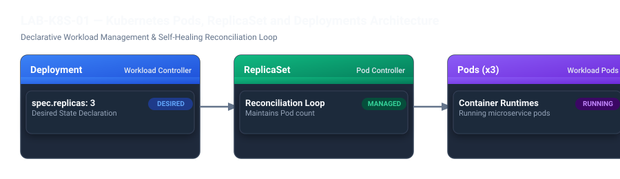

# LAB-K8S-01 — kind Multi-Node Cluster Setup & kubectl Preflight

## Metadata
- **Seviye:** CORE
- **Önerilen Gün:** Gün 4
- **Tahmini Süre:** 45 dk
- **Gerekli Profil:** `kubernetes`
- **Host Portları:** `80:80`, `443:443` (Ingress ExtraPortMappings)
- **Çalışma Dizini:** `~/devops-workspace/labs/LAB-K8S-01`

---

## 1. Lab Senaryosu
Modern mikroservis mimarilerinde konteynerlerin ölçeklenmesi, yüksek erişilebilirliği ve otomatik kendini onarma (self-healing) yetenekleri bir orkestratör gerektirir. Kubernetes, bulut yerel dünyanın fiili standardıdır. Geliştirme ve test süreçlerinde harici bir bulut sağlayıcıya (EKS/GKE) bağımlı olmadan çok düğümlü üretim benzeri bir küme kurmak için `kind` (Kubernetes in Docker) kullanılır. Bu çalışmada 1 Control-Plane ve 2 Worker düğümünden oluşan Kubernetes v1.31 kümesi kurulur; kubeadm v1beta4 yamaları uygulanır; bağımsız Pod ile deklaratif Deployment arasındaki farklar ve self-healing mekanizması canlı olarak test edilir.

## 2. Amaç
`kind` kullanarak 3 düğümlü yerel Kubernetes v1.31 kümesi oluşturmak, `kubeadm.k8s.io/v1beta4` formatında konfigürasyon uygulamak, `kubectl` ile düğüm durumlarını denetlemek ve deklaratif Deployment üzerinde pod silme simülasyonu yaparak self-healing yeteneğini doğrulamak.

## 3. Mimari / Akış
```text
  [ Host: Ubuntu 24.04 (Docker 27.x) ]
                       |
                       v
  +-----------------------------------------------------------+
  | kind Cluster: "devops-cluster" (Kubernetes v1.31.9)       |
  |                                                           |
  |  [ Control-Plane Node ]                                   |
  |   - API Server, etcd, Scheduler, Controller Manager       |
  |   - Ingress Ready (Extra Port Mappings: 80, 443)          |
  |                                                           |
  |  [ Worker Node 1 ]                [ Worker Node 2 ]       |
  |   - Pod: payment-api (Replica 1)   - Pod: payment-api (R2)|
  |   - Pod: payment-api (Replica 3)                          |
  +-----------------------------------------------------------+
```



> [!NOTE]
> `kind` (Kubernetes in Docker), her bir küme düğümünü (Control Plane ve Worker) bağımsız bir Docker konteyneri içinde çalıştırır. `extraPortMappings` direktifi ile hostun 80 ve 443 portları doğrudan control-plane düğümüne köprülenerek Ingress trafiğine hazır hale getirilir.


## 4. Ön Koşullar
- Docker Engine çalışır durumda olmalıdır
- `kind` CLI (v0.30.0+) ve `kubectl` CLI (v1.31+) kurulu olmalıdır
- Host üzerinde 80 ve 443 portları boş olmalıdır
- Önceden tamamlanması önerilen lab: `LAB-DOC-01`

Aşağıdaki komutlarla başlangıç durumunu kontrol edin:
```bash
kind version
kubectl version --client --output=yaml
docker ps
mkdir -p ~/devops-workspace/labs/LAB-K8S-01/manifests
cd ~/devops-workspace/labs/LAB-K8S-01
```

## 5. Adım Adım Uygulama

### Adım 1 — Çok Düğümlü kind Yapılandırma Dosyasını Hazırlama
Ingress port yönlendirmesi ve `kubeadm.k8s.io/v1beta4` API sürümünü içeren küme tanımını oluşturun:
```yaml
cat <<'EOF' > kind-config.yaml
kind: Cluster
apiVersion: kind.x-k8s.io/v1alpha4
name: devops-cluster
nodes:
  - role: control-plane
    kubeadmConfigPatches:
      - |
        kind: InitConfiguration
        apiVersion: kubeadm.k8s.io/v1beta4
        nodeRegistration:
          kubeletExtraArgs:
            node-labels: "ingress-ready=true"
    extraPortMappings:
      - containerPort: 80
        hostPort: 80
        protocol: TCP
      - containerPort: 443
        hostPort: 443
        protocol: TCP
  - role: worker
  - role: worker
EOF
```

### Adım 2 — Kubernetes Kümesini Başlatma ve Düğümleri Denetleme
Kümeyi sabitlenmiş `kindest/node:v1.31.4` imajı ile ayağa kaldırın ve düğüm durumlarını listeleyin:
```bash
kind create cluster --config kind-config.yaml --image kindest/node:v1.31.4
kubectl get nodes -o wide
```

### Adım 3 — Temel Pod Manifesti Oluşturma ve Yaşam Döngüsü
Yönetilmeyen (standalone) bir pod oluşturup durumunu izleyin:
```yaml
cat <<'EOF' > manifests/pod-basic.yaml
apiVersion: v1
kind: Pod
metadata:
  name: standalone-web
  labels:
    app: standalone-web
    tier: frontend
spec:
  containers:
    - name: nginx
      image: nginx:1.27-alpine
      ports:
        - containerPort: 80
EOF
```

```bash
kubectl apply -f manifests/pod-basic.yaml
kubectl wait --for=condition=Ready pod/standalone-web --timeout=60s
kubectl get pods
```

### Adım 4 — Deklaratif Deployment Tanımlama ve Rollout
3 replikalı kendini onaran Deployment nesnesini oluşturun:
```yaml
cat <<'EOF' > manifests/deployment-resilient.yaml
apiVersion: apps/v1
kind: Deployment
metadata:
  name: payment-api-deployment
  labels:
    app: payment-api
spec:
  replicas: 3
  selector:
    matchLabels:
      app: payment-api
  template:
    metadata:
      labels:
        app: payment-api
    spec:
      containers:
        - name: api
          image: hashicorp/http-echo:0.2.3
          args:
            - "-text=Payment API Microservice is Live on K8s 1.31!"
          ports:
            - containerPort: 5678
EOF
```

```bash
kubectl apply -f manifests/deployment-resilient.yaml
kubectl rollout status deployment/payment-api-deployment
kubectl get pods -l app=payment-api -o wide
```

### Adım 5 — Self-Healing Testi: Pod Silme ve Otomatik Kurtarma
Çalışan podlardan birini silerek Deployment Controller'ın anında yeni bir pod başlattığını gözlemleyin:
```bash
POD_TO_KILL=$(kubectl get pods -l app=payment-api -o jsonpath='{.items[0].metadata.name}')
echo "Sonlandirilan Pod: $POD_TO_KILL"
kubectl delete pod "$POD_TO_KILL"

# Replikaların yeniden 3/3 olduğunu gözlemle
kubectl get pods -l app=payment-api
```

## 6. Beklenen Sonuç
Adım 2'deki düğüm listesi çıktısı:
```text
NAME                           STATUS   ROLES           AGE   VERSION   INTERNAL-IP
devops-cluster-control-plane   Ready    control-plane   ...   v1.31.4   ...
devops-cluster-worker          Ready    <none>          ...   v1.31.4   ...
devops-cluster-worker2         Ready    <none>          ...   v1.31.4   ...
```

Adım 4'teki Deployment rollout çıktısı:
```text
deployment "payment-api-deployment" successfully rolled out
```

Adım 5'te pod silindikten sonra replikaların durumu:
```text
NAME                                      READY   STATUS    RESTARTS   AGE
payment-api-deployment-xxxxxxxxxx-new     1/1     Running   0          3s
payment-api-deployment-xxxxxxxxxx-2       1/1     Running   0          ...
payment-api-deployment-xxxxxxxxxx-3       1/1     Running   0          ...
```

## 7. Doğrulama
Kümedeki 3 düğümün Ready olduğunu ve Deployment'ın 3 sağlıklı podunun çalıştığını doğrulayın:
```bash
READY_NODES=$(kubectl get nodes --no-headers | grep -c "Ready")
READY_PODS=$(kubectl get deployment payment-api-deployment -o jsonpath='{.status.readyReplicas}')

if [ "$READY_NODES" -ge 3 ] && [ "$READY_PODS" -eq 3 ]; then
  echo "VALIDATION SUCCESS: kind cluster is healthy with 3 nodes (K8s v1.31.4), and 3/3 deployment replicas are running."
else
  echo "VALIDATION FAILED: Nodes: $READY_NODES, Pods: $READY_PODS" && exit 1
fi
```

## 8. Sorun Giderme

### Belirti
`kind create cluster` komutu verilirken `unknown field "nodeRegistration" in kubeadmInitConfiguration` hatası alınır.

### Kanıt
`kind-config.yaml` dosyasında `apiVersion: kubeadm.k8s.io/v1beta3` yazmaktadır.

### Kontrol Komutu
```bash
grep -i "apiVersion: kubeadm" kind-config.yaml
```

### Muhtemel Neden
Kubernetes 1.31+ sürümlerinde eski `v1beta3` API sürümü kaldırılmıştır.

### Çözüm
Yama başlığını `apiVersion: kubeadm.k8s.io/v1beta4` olarak güncelleyin ve kümeyi tekrar başlatın.

### Tekrar Doğrulama
```bash
kind create cluster --config kind-config.yaml --image kindest/node:v1.31.4
```

## 9. Temizlik / Sıfırlama
Oluşturulan Kubernetes kaynaklarını ve kind kümesini silin:
```bash
kubectl delete -f manifests/deployment-resilient.yaml manifests/pod-basic.yaml 2>/dev/null || true
kind delete cluster --name devops-cluster 2>/dev/null || true
rm -rf ~/devops-workspace/labs/LAB-K8S-01
```

## 10. Production Notu
Üretim ortamlarında doğrudan `kind: Pod` nesneleri oluşturulmaz (Bare Pods); podun çökmesi durumunda tekrar başlatılması ve farklı worker düğümlere dağıtılması için her zaman `Deployment` veya `StatefulSet` kullanılır. Düğümler arası dengeli dağıtım için `topologySpreadConstraints` veya `podAntiAffinity` kuralları tanımlanmalıdır.

## 11. Challenge
`kubectl port-forward deployment/payment-api-deployment 8080:5678` komutunu arka planda çalıştırarak host üzerinden `curl http://localhost:8080` ile podların HTTP yanıtını doğrulayın.
