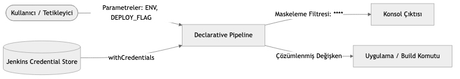

# LAB-JEN-06 — Environment Değişkenleri, Parametreler ve Güvenli Credentials Yönetimi

| Seviye | Tahmini Süre | Profil / Araçlar | Açık Portlar |
| --- | --- | --- | --- |
| Orta | 45 dakika | `jenkins` | `8080` |

[LAB-JEN-06.zip](/downloads/LAB-JEN-06.zip)


---

## Amaç

Bu laboratuvarın amacı, üretim seviyesindeki CI/CD süreçlerinde hassas verilerin (parolalar, API anahtarları, sertifikalar) güvenliğini sağlamak ve pipeline'ları dinamik parametrelerle esnek kılmaktır:

- Pipeline düzeyinde ve aşama düzeyinde `environment` blokları tanımlamak.
- Dinamik kullanıcı girdisi için `parameters` (string, choice, boolean) mekanizmasını kurmak.
- Jenkins Credential Store üzerinde **Secret text**, **Username with password** ve **Secret file** tanımlamak.
- Pipeline içinde `withCredentials` bloğu kullanarak gizli anahtarları çağırmak ve konsol çıktısında log maskeleme (`****`) mekanizmasını doğrulamak.

---

## Ön Koşullar

- LAB-JEN-05 tamamlanmış ve Declarative Pipeline sözdizimine aşina olunmalıdır.
- Jenkins Controller çalışır durumda olmalıdır.

---

## Mimari ve Kimlik Bilgisi Maskeleme


---

## Adım Adım Uygulama Rehberi

### Adım 1: Jenkins Üzerinde Credentials Tanımlayın

1. Jenkins UI sol menüsünden **"Manage Jenkins"** -> **"Credentials"** bölümüne gidin.
2. **System** -> **Global credentials (unrestricted)** seçeneğine tıklayın.
3. Sol menüden **"Add Credentials"** butonuna tıklayın:
   - **Kind:** `Secret text`
   - **Scope:** `Global`
   - **Secret:** `SuperSecretProductionApiKey12345!`
   - **ID:** `app-api-key`
   - **Description:** `Production API Key for Order Service`
4. **Create** butonuna tıklayın.
5. Tekrar **Add Credentials** deyin:
   - **Kind:** `Username with password`
   - **Username:** `db_admin`
   - **Password:** `DatabaseUltraSecurePassword!`
   - **ID:** `db-credentials`
   - **Description:** `PostgreSQL Production Database Credentials`
6. **Create** butonuna tıklayın.

---

### Adım 2: Parametreli ve Güvenli Pipeline Oluşturun

1. **New Item** -> `04-credentials-and-parameters` adıyla bir **Pipeline** oluşturun.
2. **Pipeline** script alanına aşağıdaki kodu yapıştırın:

```groovy
pipeline {
    agent any

    parameters {
        choice(name: 'ENVIRONMENT', choices: ['development', 'staging', 'production'], description: 'Hedef dağıtım ortamı')
        string(name: 'APP_VERSION', defaultValue: '1.2.0', description: 'Yayınlanacak sürüm etiketi')
        booleanParam(name: 'FORCE_DEPLOY', defaultValue: false, description: 'Zorunlu dağıtım yapılsın mı?')
    }

    environment {
        APP_NAME = "order-management-service"
        GLOBAL_TIMEOUT = "30"
    }

    stages {
        stage('Validate Parameters') {
            steps {
                echo "==> Seçilen Ortam: ${params.ENVIRONMENT}"
                echo "==> Yayınlanacak Sürüm: ${params.APP_VERSION}"
                echo "==> Zorunlu Dağıtım: ${params.FORCE_DEPLOY}"
                echo "==> Uygulama Adı: ${env.APP_NAME}"
            }
        }

        stage('Secure API Execution') {
            steps {
                withCredentials([string(credentialsId: 'app-api-key', variable: 'SECURE_TOKEN')]) {
                    sh '''
                        echo "==> API Token ile işlem yapılıyor..."
                        # Jenkins SECURE_TOKEN içeriğini otomatik olarak loglarda maskeler (****)
                        echo "Token uzunluğu: ${#SECURE_TOKEN}"
                        echo "Token doğrulaması: Token değeri -> $SECURE_TOKEN"
                    '''
                }
            }
        }

        stage('Database Credentials Binding') {
            steps {
                withCredentials([usernamePassword(credentialsId: 'db-credentials', usernameVariable: 'DB_USER', passwordVariable: 'DB_PASS')]) {
                    sh '''
                        echo "==> Veritabanı kimlik doğrulaması simülasyonu..."
                        echo "Kullanıcı: $DB_USER"
                        echo "Parola: $DB_PASS"
                    '''
                }
            }
        }
    }

    post {
        always {
            echo "Pipeline tamamlandı."
        }
    }
}
```

Kaydedin.

---

### Adım 3: "Build with Parameters" ile Çalıştırın

1. Sol menüde artık **"Build Now"** yerine **"Build with Parameters"** seçeneği belirecektir.
2. Açılan formda:
   - **ENVIRONMENT:** `production`
   - **APP_VERSION:** `1.2.5`
   - **FORCE_DEPLOY:** İşaretleyin
3. **Build** butonuna basın.

---

### Adım 4: Log Maskelemeyi Konsolda Doğrulayın

Build tamamlandıktan sonra **Console Output** sayfasına gidin:
- `Token değeri -> ****` şeklinde parolanın maskelendiğini görün.
- `Parola: ****` satırında veritabanı şifresinin gizlendiğini doğrulayın.

---

## Doğal Doğrulama

Konsol çıktısında gizli anahtarın gerçekten maskelenip maskelenmediğini terminalden API ile kontrol edin:

```bash
curl -s -u admin:${JENKINS_TOKEN}   http://localhost:8080/job/04-credentials-and-parameters/lastBuild/consoleText   | grep -E "Token değeri|Parola"
```

Çıktıda hiçbir açık metin parolanın yer almadığı, yalnızca `****` karakterlerinin bulunduğu teyit edilmelidir.

---

## Doğal Doğrulama ve Beklenen Sonuç

| Hata / Durum | Çözüm |
| :--- | :--- |
| `Could not find credentials entry with ID 'app-api-key'` | Credential ID yazımını kontrol edin; harf duyarlıdır (case-sensitive). |
| `Build with Parameters` görünmüyor | Pipeline en az bir kez normal çalıştırılmalıdır; Jenkins parametre tanımını ilk çalıştırmada öğrenir. |
