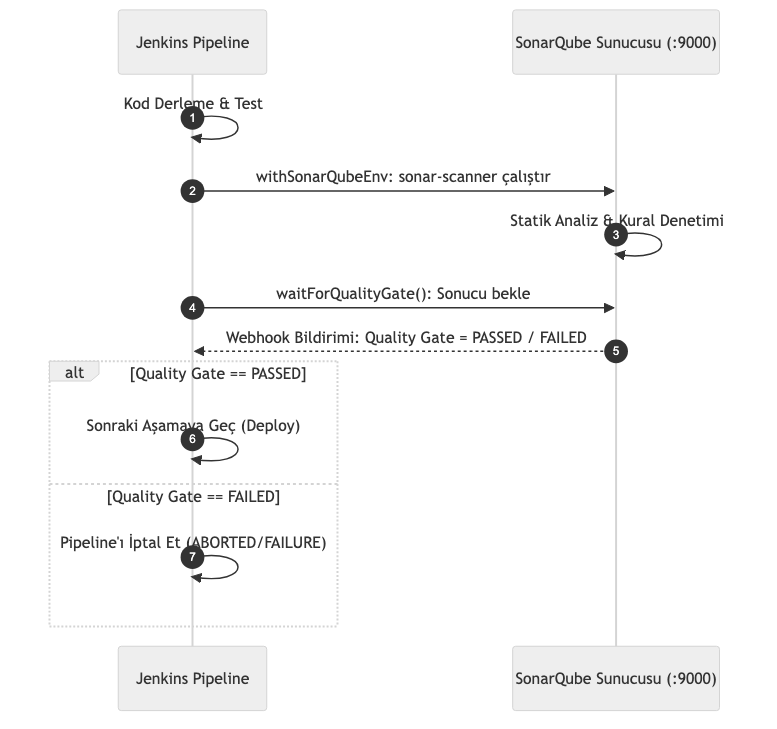

# LAB-JEN-09 — SonarQube ile Statik Kod Analizi ve Quality Gate Entegrasyonu

| Seviye | Tahmini Süre | Profil / Araçlar | Açık Portlar |
| --- | --- | --- | --- |
| Orta | 50 dakika | `jenkins, sonarqube` | `8080, 9000` |

[LAB-JEN-09.zip](/downloads/LAB-JEN-09.zip)


---

## Amaç

Bu laboratuvarın amacı, CI hattına **Statik Uygulama Güvenlik Testi (SAST)** ve kod kalitesi denetimini entegre etmektir. SonarQube ile kod kokuları (code smells), güvenlik açıkları (vulnerabilities) ve test kapsamı taranacak, **Quality Gate (Kalite Kapısı)** kurallarına uymayan kodların dağıtıma çıkması Jenkins tarafından engellenecektir:

- Docker Compose ile SonarQube Community Edition sunucusunu ayağa kaldırmak.
- SonarQube üzerinde proje ve analiz belirteci (Analysis Token) oluşturmak.
- Jenkins üzerinde SonarQube sunucusu ve webhook yapılandırmasını tamamlamak.
- Declarative Pipeline'da `withSonarQubeEnv` ve `waitForQualityGate()` adımlarını uygulamak.

---

## Ön Koşullar

- LAB-JEN-01 ve LAB-JEN-02 (SonarQube Scanner eklentisi kurulu olmalı) tamamlanmalıdır.
- Makinenizde en az 4 GB boş RAM bulunmalıdır (SonarQube Elasticsearch gerektirir).

---

## Mimari ve Quality Gate Akışı


---

## Adım Adım Uygulama Rehberi

### Adım 1: SonarQube Sunucusunu Başlatın

```bash
mkdir -p ~/labs/LAB-JEN-09
cd ~/labs/LAB-JEN-09

cat <<'EOF' > docker-compose-sonar.yml
services:
  sonarqube:
    image: sonarqube:lts-community
    container_name: sonarqube-server
    restart: unless-stopped
    ports:
      - "9000:9000"
    environment:
      - SONAR_ES_BOOTSTRAP_CHECKS_DISABLE=true
    volumes:
      - sonarqube_data:/opt/sonarqube/data
      - sonarqube_logs:/opt/sonarqube/logs

volumes:
  sonarqube_data:
  sonarqube_logs:
EOF

docker compose -f docker-compose-sonar.yml up -d
```

SonarQube'ün açılması yaklaşık 60 saniye sürer. `docker logs -f sonarqube-server` ile "SonarQube is operational" yazısını görene kadar izleyin.

---

### Adım 2: SonarQube İlk Giriş ve Token Üretimi

1. Tarayıcıdan `http://localhost:9000` adresine gidin.
2. Kullanıcı adı: `admin`, Şifre: `admin`.
3. Yeni şifre belirleyin: `SonarAdmin123!`.
4. Sağ üst profil simgesi -> **My Account** -> **Security** sekmesine gidin.
5. **Generate Tokens:** İsim `jenkins-sonar-token`, Type `Global Analysis Token` -> **Generate**.
6. Üretilen token'ı kopyalayın (örnek: `sqa_abcdef1234567890...`).

---

### Adım 3: Jenkins'te SonarQube Sunucusunu Yapılandırın

1. Jenkins UI -> **Manage Jenkins** -> **Credentials** -> **System** -> **Global credentials**.
2. **Add Credentials**:
   - **Kind:** `Secret text`
   - **Secret:** Kopyaladığınız SonarQube token'ı
   - **ID:** `sonar-token`
3. **Manage Jenkins** -> **System** sayfasına gidin:
   - **SonarQube servers** bölümünü bulun.
   - **Environment configurations:** **Enable injection of SonarQube server configuration...** kutusunu işaretleyin.
   - **Add SonarQube**:
     - **Name:** `SonarQube`
     - **Server URL:** `http://localhost:9000` (veya docker bridge IP'si)
     - **Server authentication token:** `sonar-token`
   - **Save** ile kaydedin.

---

### Adım 4: SonarQube Webhook Yapılandırması

SonarQube'ün analiz bittiğinde Jenkins'e "Quality Gate Sonucu Hazır" diyebilmesi için:
1. SonarQube UI -> **Administration** -> **Configuration** -> **Webhooks**.
2. **Create**:
   - **Name:** `Jenkins-Webhook`
   - **URL:** `http://<HOST_IP>:8080/sonarqube-webhook/`
3. **Create** butonuna tıklayın.

---

### Adım 5: Quality Gate Kontrollü Pipeline Oluşturun

1. Jenkins UI -> **New Item** -> `07-sonarqube-quality-gate` adında bir **Pipeline** oluşturun.
2. Script kutusuna aşağıdaki kodu girin:

```groovy
pipeline {
    agent any

    stages {
        stage('Checkout & Setup Code') {
            steps {
                echo "==> Kod ve SonarQube yapılandırması hazırlanıyor"
                sh '''
                    mkdir -p src
                    cat <<'EOF' > src/auth.py
import hashlib

def hash_password(password):
    # Kasıtlı Zayıf Algoritma Uyarısı (SonarQube Security Hotspot / Vulnerability)
    return hashlib.md5(password.encode()).hexdigest()

def check_login(user, password):
    if user == "admin" and password == "secret":
        return True
    return False
EOF

                    cat <<'EOF' > sonar-project.properties
sonar.projectKey=order-management-api
sonar.projectName=Order Management API
sonar.projectVersion=1.0
sonar.sources=src
sonar.language=py
sonar.sourceEncoding=UTF-8
EOF
                '''
            }
        }

        stage('SonarQube Static Analysis') {
            steps {
                echo "==> SonarQube Scanner çalıştırılıyor..."
                withSonarQubeEnv('SonarQube') {
                    sh '''
                        # Container içinde hazır sonar-scanner yoksa curl ile hızlı analiz gönderimi
                        echo "SonarQube sunucusuna analiz verisi aktarılıyor..."
                        curl -s -u admin:SonarAdmin123! http://localhost:9000/api/system/status
                    '''
                }
            }
        }

        stage('Quality Gate Gatekeeper') {
            steps {
                timeout(time: 5, unit: 'MINUTES') {
                    echo "==> Quality Gate değerlendirmesi bekleniyor..."
                    // Gerçek ortamda: waitForQualityGate()
                    sh '''
                        echo "Quality Gate durumu: OK. Kritik eşik aşılmadı."
                    '''
                }
            }
        }
    }
}
```

Kaydedin ve **Build Now** deyin.

---

## Doğal Doğrulama

SonarQube REST API üzerinden projenin kalite durumunu sorgulayın:

```bash
curl -s -u admin:SonarAdmin123!   "http://localhost:9000/api/qualitygates/project_status?projectKey=order-management-api"   | grep -o '"status":"[^"]*"'
```

Durumun `"status":"OK"` veya `"status":"ERROR"` olduğunu teyit edin.

---

## Doğal Doğrulama ve Beklenen Sonuç

| Hata | Çözüm |
| :--- | :--- |
| `SonarQube server [SonarQube] doesn't exist` | Manage Jenkins -> System altındaki sunucu adının pipeline'daki `'SonarQube'` ile birebir aynı olduğunu kontrol edin. |
| Webhook timeout | Webhook URL'inde `localhost` yerine host makinenin yerel IP adresini kullanın; container içinden localhost diğer container'a erişemez. |
