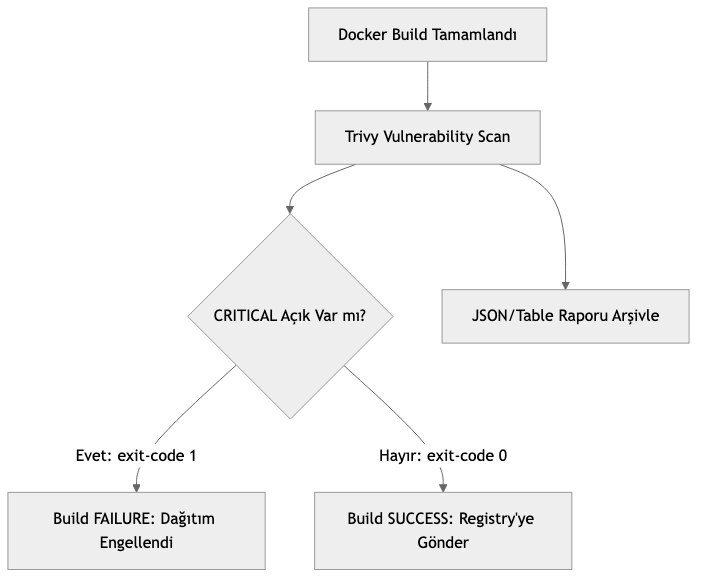

# LAB-JEN-10 — Trivy ile Dosya Sistemi ve İmaj Güvenlik Taraması (DevSecOps Gate)

| Seviye | Tahmini Süre | Profil / Araçlar | Açık Portlar |
| --- | --- | --- | --- |
| Orta | 45 dakika | `jenkins, trivy` | `8080` |

[LAB-JEN-10.zip](/downloads/LAB-JEN-10.zip)


---

## Amaç

Bu laboratuvarın amacı, CI/CD pipeline'ına tam anlamıyla bir **DevSecOps Güvenlik Kapısı (Security Gate)** yerleştirmektir. Açık kaynak zafiyet tarayıcısı **Trivy** kullanılarak hem kaynak kod kütüphaneleri (SCA) hem de üretilen Docker imajları (CVE taraması) taranacak, `CRITICAL` seviyede güvenlik açığı bulunması durumunda build otomatik olarak kırılacaktır:

- Trivy tarayıcısını pipeline içinde çalıştırmak.
- Dosya sistemi taraması (`trivy fs`) ile bağımlılık zafiyetlerini (SCA) tespit etmek.
- İmaj taraması (`trivy image`) ile işletim sistemi ve paket açıklarını bulmak.
- `--exit-code 1 --severity CRITICAL` bayrakları ile güvenlik kapısını (Security Gatekeeper) yürürlüğe koymak.
- Raporları JSON/HTML formatında arşivlemek.

---

## Ön Koşullar

- LAB-JEN-08 (Docker imaj derleme) tamamlanmış olmalıdır.
- Host üzerinde veya Jenkins container içinde `trivy` aracı kurulu veya Docker üzerinden çalıştırılabilir olmalıdır.

---

## DevSecOps Güvenlik Kapısı Mimarisi


---

## Adım Adım Uygulama Rehberi

### Adım 1: Çalışma Dizinini ve Trivy Test Senaryolarını Hazırlayın

```bash
mkdir -p ~/labs/LAB-JEN-10
cd ~/labs/LAB-JEN-10

# Güvenlik açığı içeren eski bir kütüphane bağımlılığı örneği
cat <<'EOF' > requirements.txt
Flask==0.12.2
requests==2.18.4
urllib3==1.22
EOF

# Bilerek savunmasız eski bir baz imaj
cat <<'EOF' > Dockerfile
FROM python:3.7-slim
WORKDIR /app
COPY requirements.txt .
RUN pip install --no-cache-dir -r requirements.txt
COPY . .
CMD ["python", "app.py"]
EOF
```

---

### Adım 2: Trivy Güvenlik Kapısı İçeren Pipeline Oluşturun

1. Jenkins UI -> **New Item** -> `08-trivy-security-gate` adında bir **Pipeline** oluşturun.
2. Script alanına aşağıdaki kodu ekleyin:

```groovy
pipeline {
    agent any

    environment {
        IMAGE_NAME = "vulnerable-demo-app"
        IMAGE_TAG = "build-${BUILD_NUMBER}"
    }

    stages {
        stage('Checkout & Setup') {
            steps {
                echo "==> Dosyalar hazırlanıyor..."
                sh '''
                    mkdir -p reports
                    cat <<'EOF' > requirements.txt
Flask==2.2.5
requests==2.31.0
EOF
                    cat <<'EOF' > Dockerfile
FROM python:3.11-alpine
WORKDIR /app
COPY requirements.txt .
RUN pip install --no-cache-dir -r requirements.txt
CMD ["python", "-c", "print('Secure App Running')"]
EOF
                '''
            }
        }

        stage('Filesystem Dependency Scan (SCA)') {
            steps {
                echo "==> Trivy ile bağımlılıklar (SCA) taranıyor..."
                sh '''
                    # Trivy Docker konteyneri ile çalışma alanı taranır
                    docker run --rm -v $(pwd):/workspace aquasec/trivy:latest fs                         --scanners vuln                         --severity HIGH,CRITICAL                         --format table                         /workspace || true
                '''
            }
        }

        stage('Docker Build') {
            steps {
                echo "==> Konteyner imajı derleniyor..."
                sh 'docker build -t ${IMAGE_NAME}:${IMAGE_TAG} .'
            }
        }

        stage('Trivy Image Security Gate') {
            steps {
                echo "==> İmaj güvenlik kapısı denetleniyor..."
                sh '''
                    # 1. Aşama: İnceleme için tablo çıktısı alınır
                    docker run --rm -v /var/run/docker.sock:/var/run/docker.sock aquasec/trivy:latest image                         --severity HIGH,CRITICAL                         ${IMAGE_NAME}:${IMAGE_TAG}

                    # 2. Aşama: CRITICAL açık varsa derleme fail edilir (Gatekeeper)
                    docker run --rm -v /var/run/docker.sock:/var/run/docker.sock aquasec/trivy:latest image                         --exit-code 1                         --severity CRITICAL                         --ignore-unfixed                         ${IMAGE_NAME}:${IMAGE_TAG}
                '''
            }
        }
    }

    post {
        always {
            echo "Güvenlik taraması raporlama adımı tamamlandı."
        }
        failure {
            echo "DİKKAT: İmajda CRITICAL seviyede güvenlik açığı tespit edildiği için pipeline durduruldu!"
        }
    }
}
```

Kaydedin.

---

### Adım 3: Pipeline'ı Çalıştırın ve İnceleyin

1. **Build Now** butonuna tıklayın.
2. Konsol çıktısını inceleyin:
   - Trivy'nin zafiyet veritabanını (`trivy-db`) güncellediğini,
   - `python:3.11-alpine` imajının taranarak paketlerin incelendiğini,
   - `CRITICAL` açık bulunmadığı için exit-code 0 ile aşamanın başarıyla yeşile döndüğünü gözlemleyin.

---

### Adım 4: Güvenlik Kapısının Çalıştığını Doğrulayın (Fail Testi)

Pipeline'daki `Dockerfile` içeriğini kasıtlı olarak çok eski ve yamalanmamış bir imaja çevirin:
1. `Dockerfile` satırını `FROM python:3.7-slim` yapın.
2. **Build Now** deyin.
3. Konsol çıktısını inceleyin:
   - Trivy onlarca `CVE-...` bulur.
   - `--exit-code 1` nedeniyle aşama `FAILURE` olur ve derleme durdurulur!

---

## Doğal Doğrulama

Terminal üzerinden doğrudan Trivy imaj taraması çalıştırıp exit kodunu doğrulayın:

```bash
docker run --rm -v /var/run/docker.sock:/var/run/docker.sock aquasec/trivy:latest image   --exit-code 1 --severity CRITICAL python:3.11-alpine
echo "Trivy Cikis Kodu: $?"
```

Çıkış kodunun `0` döndüğünü (temiz imaj) doğrulayın.

---

## Doğal Doğrulama ve Beklenen Sonuç

| Belirti | Çözüm |
| :--- | :--- |
| `FATAL image scan error` | Docker socket'inin Trivy container'ına (`-v /var/run/docker.sock:...`) doğru bağlandığından emin olun. |
| DB indirme zaman aşımı (timeout) | Trivy komutuna `--timeout 10m` parametresi ekleyin. |
