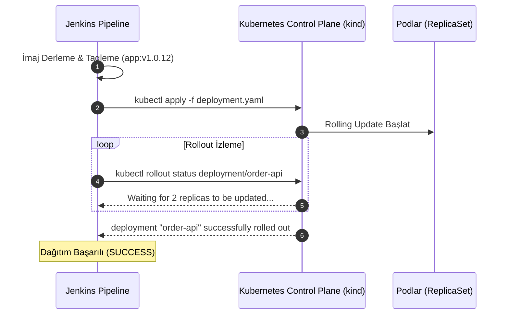

# LAB-JEN-12 — Kubernetes (kind) Kümesine Otomatik Deployment (CD)

| Seviye | Tahmini Süre | Profil / Araçlar | Açık Portlar |
| --- | --- | --- | --- |
| İleri | 45 dakika | `jenkins, kubernetes` | `8080` |

[LAB-JEN-12.zip](/downloads/LAB-JEN-12.zip)


---

## Amaç

Bu laboratuvarın amacı, CI hattını **Sürekli Dağıtım (Continuous Delivery / CD)** aşamasıyla tamamlamaktır. Jenkins üzerinden yerel bir Kubernetes (kind) kümesine güvenli kimlik doğrulama ile bağlanılacak, manifest dosyaları dinamik imaj etiketleri ile güncellenip otomatik olarak deploy edilecektir:

- Jenkins Credential Store'da `kubeconfig` dosyasını **Secret file** olarak saklamak.
- `withKubeConfig` veya `withCredentials([file(...)])` ile kubectl bağlamını yönetmek.
- Deployment manifesti üzerindeki imaj etiketini `set image` veya `envsubst` ile dinamik güncellemek.
- `kubectl rollout status` komutu ile podların sağlıklı ayağa kalktığını pipeline içinde doğrulamak.

---

## Ön Koşullar

- LAB-JEN-08 (Docker derleme) tamamlanmış olmalıdır.
- Yerel kind cluster'ı çalışır durumda olmalıdır (`kubectl get nodes` erişilebilir olmalıdır).

---

## Mimari ve Kubernetes CD Modeli



---

## Adım Adım Uygulama Rehberi

### Adım 1: Host Makinedeki Kubeconfig'i Hazırlayın

Jenkins container'ının kind kümesine erişebilmesi için `kubeconfig` içindeki sunucu adresinin `127.0.0.1` yerine docker köprüsü veya host adresi olması gerekir:

```bash
mkdir -p ~/labs/LAB-JEN-12
cd ~/labs/LAB-JEN-12

# Mevcut kind kubeconfig'ini kopyalayın
kubectl config view --raw --minify --flatten > kubeconfig-jenkins

# Container içinden erişim için host IP adresini yazın
sed -i 's/127.0.0.1:[0-9]*/host.docker.internal:6443/g' kubeconfig-jenkins 2>/dev/null || true
```

---

### Adım 2: Jenkins'e Kubeconfig Credential'ı Ekleyin

1. Jenkins UI -> **Manage Jenkins** -> **Credentials** -> **System** -> **Global credentials**.
2. **Add Credentials**:
   - **Kind:** `Secret file`
   - **File:** `~/labs/LAB-JEN-12/kubeconfig-jenkins` dosyasını seçip yükleyin.
   - **ID:** `k8s-kubeconfig`
   - **Description:** `Kind Kubernetes Kubeconfig for CI/CD`
3. **Create** deyin.

---

### Adım 3: Kubernetes CD Pipeline Oluşturun

1. Jenkins UI -> **New Item** -> `10-k8s-cd-deployment` adında bir **Pipeline** oluşturun.
2. Script kutusuna aşağıdaki kodu girin:

```groovy
pipeline {
    agent any

    environment {
        NAMESPACE  = "production"
        DEPLOYMENT = "order-api"
        IMAGE_NAME = "nginx:1.25-alpine"
    }

    stages {
        stage('Prepare Manifests') {
            steps {
                echo "==> Aşama 1: Kubernetes manifestoları hazırlanıyor..."
                sh '''
                    cat <<'EOF' > k8s-deployment.yaml
apiVersion: apps/v1
kind: Deployment
metadata:
  name: order-api
  namespace: production
  labels:
    app: order-api
spec:
  replicas: 2
  selector:
    matchLabels:
      app: order-api
  template:
    metadata:
      labels:
        app: order-api
    spec:
      containers:
      - name: order-api
        image: nginx:1.25-alpine
        ports:
        - containerPort: 80
---
apiVersion: v1
kind: Service
metadata:
  name: order-api-svc
  namespace: production
spec:
  type: ClusterIP
  selector:
    app: order-api
  ports:
  - port: 80
    targetPort: 80
EOF
                '''
            }
        }

        stage('Deploy to Kubernetes') {
            steps {
                echo "==> Aşama 2: Kubeconfig yükleniyor ve dağıtım yapılıyor..."
                withCredentials([file(credentialsId: 'k8s-kubeconfig', variable: 'KUBECONFIG_FILE')]) {
                    sh '''
                        export KUBECONFIG="${KUBECONFIG_FILE}"

                        # Namespace oluştur
                        kubectl create namespace ${NAMESPACE} --dry-run=client -o yaml | kubectl apply -f -

                        # Manifestoları uygula
                        kubectl apply -f k8s-deployment.yaml

                        # Rollout durumunu doğrula (Timeout: 120 saniye)
                        kubectl rollout status deployment/${DEPLOYMENT} -n ${NAMESPACE} --timeout=120s

                        # Pod durumlarını listele
                        kubectl get pods -n ${NAMESPACE} -l app=order-api
                    '''
                }
            }
        }
    }

    post {
        always {
            echo "Kubernetes CD adımı tamamlandı."
        }
    }
}
```

Kaydedin ve **Build Now** deyin.

---

## Doğal Doğrulama

Host terminalinden Kubernetes podlarını doğrudan sorgulayın:

```bash
kubectl get pods -n production -l app=order-api
kubectl get svc -n production
```

Podların `Running` durumunda ve 2/2 replica ile ayakta olduğunu teyit edin.

---

## Doğal Doğrulama ve Beklenen Sonuç

| Hata | Çözüm |
| :--- | :--- |
| `The connection to the server was refused` | Kubeconfig içindeki server IP'sinin Jenkins container'ından erişilebilir olduğunu kontrol edin (`host.docker.internal`). |
| `error: timed out waiting for the condition` | Podlar ayağa kalkamıyor; `kubectl describe pod -n production` ile olayı inceleyin. |
