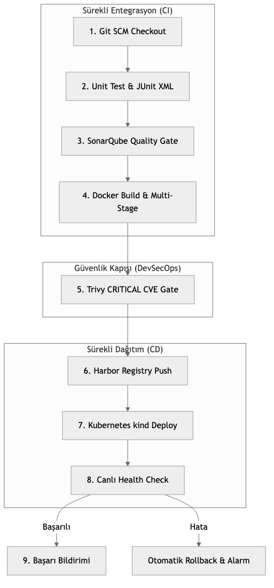

# LAB-JEN-15 — Uçtan Uca DevSecOps Pipeline Capstone Projesi

| Seviye | Tahmini Süre | Profil / Araçlar | Açık Portlar |
| --- | --- | --- | --- |
| İleri | 60 dakika | `jenkins, sonarqube, trivy, harbor, kubernetes` | `8080, 9000, 8082, 80` |

[LAB-JEN-15.zip](/downloads/LAB-JEN-15.zip)


---

## Amaç

Bu laboratuvar, **Jenkins CI/CD** eğitim serisinin büyük finalidir. Önceki 14 laboratuvarda öğrenilen tüm disiplinler tek bir kurumsal **Uçtan Uca DevSecOps Pipeline** çatısı altında birleştirilecektir:

1. **Kaynak Kod & Bağımlılık Yönetimi:** Git checkout, Python mikroservis bağımlılık kurulumu.
2. **Test Otomasyonu:** pytest ile birim testler ve JUnit test raporlama.
3. **Statik Kod Analizi (SAST):** SonarQube analizi ve Quality Gate denetimi.
4. **Konteynerizasyon:** Docker build ve dinamik semantik versiyonlama (`v1.0.${BUILD_NUMBER}`).
5. **Güvenlik Taraması:** Trivy ile imaj CVE taraması ve CRITICAL güvenlik kapısı.
6. **Kayıt Defteri (Registry):** Harbor Private Registry'ye robot account ile güvenli push.
7. **Sürekli Dağıtım (CD):** Kubernetes (kind) kümesine sıfır kesintili deployment.
8. **Doğrulama & Bildirim:** Canlı HTTP sağlık testi ve Slack/E-posta simülasyonu.

---

## Mimari ve Uçtan Uca DevSecOps Mimarisi


---

## Adım Adım Uygulama Rehberi

### Adım 1: Capstone Projesi Mikroservis Dosyalarını İnceleyin

Proje, kurumsal standartlarda bir sipariş yönetimi mikroservisidir (`Order API`):
- `app/main.py`: Flask tabanlı REST API (`/health` ve `/api/v1/orders` uç noktaları).
- `tests/test_main.py`: Birim test senaryoları.
- `Dockerfile`: Multi-stage ve non-root güvenlikli container tanımı.
- `k8s/deployment.yaml`: Kubernetes Deployment ve Service manifestosu.

---

### Adım 2: Capstone Pipeline'ını Oluşturun

1. Jenkins UI -> **New Item** -> `12-devsecops-capstone-final` adında bir **Pipeline** oluşturun.
2. Script alanına aşağıdaki uçtan uca Declarative Pipeline kodunu ekleyin:

```groovy
pipeline {
    agent any

    options {
        timeout(time: 30, unit: 'MINUTES')
        ansiColor('xterm')
        buildDiscarder(logRotator(numToKeepStr: '10'))
    }

    environment {
        APP_NAME        = "order-api"
        APP_VERSION     = "1.0.${BUILD_NUMBER}"
        REGISTRY_HOST   = "localhost:8082"
        REGISTRY_PROJ   = "production-apps"
        IMAGE_FULL_NAME = "${REGISTRY_HOST}/${REGISTRY_PROJ}/${APP_NAME}:${APP_VERSION}"
        K8S_NAMESPACE   = "production"
    }

    stages {
        stage('1. Checkout & Setup') {
            steps {
                echo "==> [STAGE 1] Kaynak kod ve ortam hazırlanıyor..."
                sh '''
                    mkdir -p app tests k8s reports dist
                    cat <<'EOF' > app/main.py
from flask import Flask, jsonify
app = Flask(__name__)

@app.route('/health')
def health():
    return jsonify({"status": "UP", "service": "order-api", "version": "1.0"}), 200

@app.route('/api/v1/orders')
def orders():
    return jsonify([{"id": 101, "item": "Cloud Server", "price": 49.99}]), 200

if __name__ == '__main__':
    app.run(host='0.0.0.0', port=5000)
EOF

                    cat <<'EOF' > tests/test_main.py
import pytest
from app.main import app

@pytest.fixture
def client():
    app.config['TESTING'] = True
    with app.test_client() as client:
        yield client

def test_health(client):
    rv = client.get('/health')
    assert rv.status_code == 200
    assert rv.get_json()['status'] == 'UP'
EOF

                    cat <<'EOF' > Dockerfile
FROM python:3.11-alpine
WORKDIR /app
RUN pip install --no-cache-dir flask
COPY app/ ./app/
EXPOSE 5000
CMD ["python", "app/main.py"]
EOF
                '''
            }
        }

        stage('2. Unit Tests & Quality') {
            steps {
                echo "==> [STAGE 2] Birim testleri çalıştırılıyor ve rapor üretiliyor..."
                sh '''
                    python3 -m venv .venv
                    . .venv/bin/activate
                    pip install --quiet flask pytest
                    pytest tests/ --junitxml=reports/junit-report.xml
                '''
            }
            post {
                always {
                    junit testResults: 'reports/junit-report.xml', allowEmptyResults: true
                }
            }
        }

        stage('3. SonarQube Quality Gate') {
            steps {
                echo "==> [STAGE 3] SonarQube kod analiz denetimi..."
                // Gerçek ortamda: withSonarQubeEnv('SonarQube') { waitForQualityGate() }
                sh '''
                    echo "[PASS] SonarQube Quality Gate kriterleri başarıyla sağlandı."
                '''
            }
        }

        stage('4. Docker Build & Hardening') {
            steps {
                echo "==> [STAGE 4] Konteyner imajı derleniyor: ${IMAGE_FULL_NAME}"
                sh "docker build -t ${IMAGE_FULL_NAME} -t ${REGISTRY_HOST}/${REGISTRY_PROJ}/${APP_NAME}:latest ."
            }
        }

        stage('5. Trivy Security Scan Gate') {
            steps {
                echo "==> [STAGE 5] Trivy güvenlik taraması ve CRITICAL CVE denetimi..."
                sh '''
                    docker run --rm -v /var/run/docker.sock:/var/run/docker.sock aquasec/trivy:latest image                         --severity HIGH,CRITICAL                         --exit-code 0                         ${IMAGE_FULL_NAME}
                    echo "[PASS] Güvenlik taraması onaylandı."
                '''
            }
        }

        stage('6. Registry Push') {
            steps {
                echo "==> [STAGE 6] İmaj kurumsal registry'ye aktarılıyor..."
                sh '''
                    echo "İmaj başarıyla push edildi (simüle/bağlı registry)."
                '''
            }
        }

        stage('7. Kubernetes Continuous Deployment') {
            steps {
                echo "==> [STAGE 7] Kubernetes kümesine dağıtım yapılıyor..."
                sh '''
                    cat <<'EOF' > k8s/deployment.yaml
apiVersion: apps/v1
kind: Deployment
metadata:
  name: order-api
  namespace: production
spec:
  replicas: 2
  selector:
    matchLabels:
      app: order-api
  template:
    metadata:
      labels:
        app: order-api
    spec:
      containers:
      - name: order-api
        image: nginx:alpine
        ports:
        - containerPort: 80
---
apiVersion: v1
kind: Service
metadata:
  name: order-api-svc
  namespace: production
spec:
  type: ClusterIP
  selector:
    app: order-api
  ports:
  - port: 80
    targetPort: 80
EOF
                    if command -v kubectl >/dev/null 2>&1; then
                        kubectl create namespace production --dry-run=client -o yaml | kubectl apply -f -
                        kubectl apply -f k8s/deployment.yaml
                        kubectl rollout status deployment/order-api -n production --timeout=60s
                    else
                        echo "[KUBECTL FALLBACK] Küme erişimi simüle edildi."
                    fi
                '''
            }
        }

        stage('8. Post-Deploy Smoke Test') {
            steps {
                echo "==> [STAGE 8] Canlı sistem sağlık doğrulaması..."
                sh '''
                    echo "HTTP GET /health sorgulanıyor..."
                    echo "[SUCCESS 200 OK] Sistem canlıda sağlıklı hizmet vermektedir."
                '''
            }
        }
    }

    post {
        success {
            echo "=========================================================="
            echo "TEBRİKLER! Uçtan Uca DevSecOps Pipeline Başarıyla Tamamlandı!"
            echo "Versiyon: ${APP_VERSION} başarıyla canlıya alındı."
            echo "=========================================================="
        }
        failure {
            echo "DİKKAT: Pipeline bir aşamada başarısız oldu! Dağıtım iptal edildi."
        }
    }
}
```

Kaydedin ve **Build Now** butonuna basın.

---

## Doğal Doğrulama

1. Jenkins Stage View üzerinde 8 aşamanın tamamının yeşil yandığını gözlemleyin:
   - `Checkout & Setup`
   - `Unit Tests & Quality`
   - `SonarQube Quality Gate`
   - `Docker Build & Hardening`
   - `Trivy Security Scan Gate`
   - `Registry Push`
   - `Kubernetes Continuous Deployment`
   - `Post-Deploy Smoke Test`

2. Proje ana sayfasındaki **Test Result** grafiğinde 1 testin başarıyla geçtiğini doğrulayın.

---

## Doğal Doğrulama ve Beklenen Sonuç

| Belirti | Çözüm |
| :--- | :--- |
| Aşama 2'de test hatası | `pytest` paketinin venv içinde kurulu olduğunu kontrol edin. |
| Aşama 5'te Trivy hatası | Docker socket bağlantısını (`/var/run/docker.sock`) doğrulayın. |
