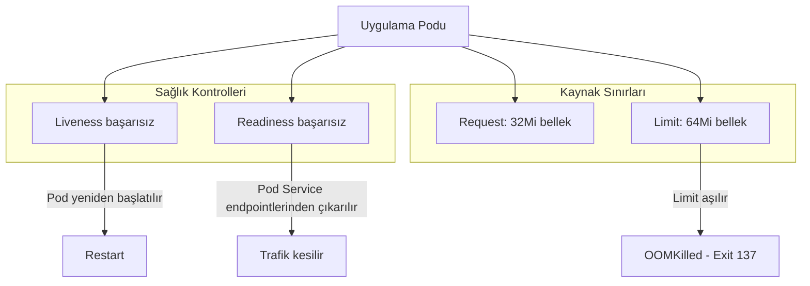

# LAB-K8S-07 — Liveness, Readiness ve Resource Limits

| Seviye | Tahmini Süre | Profil / Araçlar | Açık Portlar |
| --- | --- | --- | --- |
| Orta | 50 dakika | `kubernetes` | `Küme içi` |

[LAB-K8S-07.zip](/downloads/LAB-K8S-07.zip)


---

## Amaç

- **Liveness Probe** (canlılık) ile **Readiness Probe** (hazır olma) arasındaki kritik farkı kavramak.
- Readiness probe başarısız olduğunda Service'in ilgili Pod'a gelen kullanıcı trafiğini nasıl kestiğini gözlemlemek.
- CPU ve RAM için `requests` (garanti edilen kaynak) ve `limits` (maksimum sınır) kurallarını belirlemek.
- Bellek sınırını aşan bir uygulamada Kubernetes'in **OOMKilled** (Exit Code 137) davranışını tetiklemek ve teşhis etmek.

---

## Ön Koşullar

- Docker Engine ve kind kümesi aktif olmalıdır. Kurulum için [kind Kubernetes kümesi rehberine](/setup/kind-cluster/) bakın.

---

## Probe ve Kaynak Sınırları Mimarisi



---

## Adım Adım Uygulama Rehberi

### Adım 1: Çalışma Dizinine Geçiş

```bash
mkdir -p ~/labs/LAB-K8S-07
cd ~/labs/LAB-K8S-07
```

---

### Adım 2: Probe Destekli Uygulama Pod'u Tanımlayın

Dosya tabanlı liveness ve readiness kontrolleri kullanan bir Pod yazalım:

```bash
cat <<'EOF' > probes-demo.yaml
apiVersion: v1
kind: Pod
metadata:
  name: probe-pod
  labels:
    app: probe-demo
spec:
  containers:
    - name: app
      image: busybox:1.36
      # Başlangıçta /tmp/ready ve /tmp/healthy dosyalarını oluşturalım
      command:
        - sh
        - -c
        - "touch /tmp/ready /tmp/healthy; sleep 3600"
      livenessProbe:
        exec:
          command:
            - cat
            - /tmp/healthy
        initialDelaySeconds: 5
        periodSeconds: 5
      readinessProbe:
        exec:
          command:
            - cat
            - /tmp/ready
        initialDelaySeconds: 5
        periodSeconds: 5
      resources:
        limits:
          memory: "64Mi"
          cpu: "250m"
        requests:
          memory: "32Mi"
          cpu: "100m"
EOF

kubectl apply -f probes-demo.yaml
```

---

### Adım 3: Readiness Probe Arıza Deneyi (Trafik Kesme)

Pod için bir servis açalım:

```bash
kubectl expose pod probe-pod --port=80 --targetPort=80 --name=probe-svc
kubectl get endpoints probe-svc
```

Şimdi Pod içindeki hazır dosyasını silerek readiness kontrolünü bozalım:

```bash
kubectl exec probe-pod -- rm /tmp/ready
```

10 saniye sonra Pod ve Endpoint durumunu inceleyin:

```bash
kubectl get pod probe-pod
kubectl get endpoints probe-svc
```

Farkı görün: Pod **çökmedi**, çalışmaya devam ediyor (`STATUS: Running`), ancak `READY: 0/1` oldu ve Service Endpoint listesinden IP'si çıkarıldı (`<none>`). Böylece bozuk servise kullanıcı trafiği gitmesi engellendi!

Dosyayı geri koyup trafiği tekrar açın:

```bash
kubectl exec probe-pod -- touch /tmp/ready
sleep 6
kubectl get endpoints probe-svc
```

---

### Adım 4: OOMKilled (Out-of-Memory) Simülasyonu

64MB RAM limitli bir pod'da 150MB bellek tüketelim:

```bash
cat <<'EOF' > oom-pod.yaml
apiVersion: v1
kind: Pod
metadata:
  name: oom-tester
spec:
  restartPolicy: Never
  containers:
    - name: memory-hog
      image: alpine:3.19
      command: ["sh", "-c", "x=''; while true; do x=$x$(head -c 10000000 /dev/urandom | base64); sleep 0.1; done"]
      resources:
        limits:
          memory: "64Mi"
EOF

kubectl apply -f oom-pod.yaml
sleep 5
```

---

## Doğal Doğrulama

OOMKilled durumunu teşhis edin:

```bash
# Pod durumunu sorgulayın
kubectl get pod oom-tester

# Çıkış kodunu ve nedenini describe ile inceleyin
kubectl describe pod oom-tester | grep -E "(OOMKilled|Exit Code)"
```

Çıktıda `Reason: OOMKilled` ve `Exit Code: 137` görerek teşhisi kesinleştirin.

---

## Doğal Doğrulama ve Beklenen Sonuç

- Readiness dosyası silindiğinde `kubectl get endpoints` çıktısının `<none>` olması.
- OOM testinde `Reason: OOMKilled` ve `Exit Code: 137` doğrulaması.
