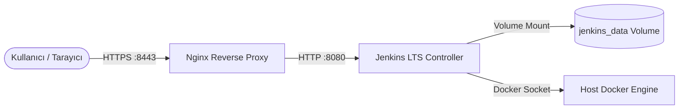

# LAB-JEN-01 — Docker Compose ile Jenkins Kurulumu ve Nginx Reverse Proxy

| 🎯 Seviye | ⏱️ Tahmini Süre | 🛠️ Profil / Araçlar | 🔌 Açık Portlar |
| :--- | :--- | :--- | :--- |
| 🟢 **CORE** (Temel Seviye) | ⏱️ 40 dakika | `jenkins`, `docker`, `nginx` | `8080`, `8443` |

> [!TIP]
> 📥 **Başlangıç Paketi:** [Bu labın başlangıç paketini indir (LAB-JEN-01.zip)](/downloads/LAB-JEN-01.zip) — paket başlangıç kodlarını içerir; çözüm içermez.

---

## Amaç

Bu laboratuvarın amacı, üretim standartlarında kurumsal bir **Jenkins Controller** ortamını Docker Compose ile ayağa kaldırmak, verilerin kalıcılığını (persistence) sağlamak ve Nginx reverse proxy arkasında güvenli bir şekilde yayınlamaktır:

- Resmi `jenkins/jenkins:lts-jdk21` imajı ile Jenkins Controller çalıştırmak.
- `jenkins_home` named volume ile iş yapılandırmalarını, pluginleri ve credential verilerini korumak.
- Jenkins container'ı içerisinden host Docker daemon'ına erişim (`/var/run/docker.sock`) mekanizmasını yapılandırmak.
- Nginx reverse proxy ile SSL/TLS sonlandırma ve standart reverse proxy header'larını (`X-Forwarded-For`, `X-Forwarded-Proto`) yapılandırmak.

---

## Ön Koşullar

- Docker Engine ve Docker Compose v2 kurulu olmalıdır.
- Host üzerinde 8080 ve 8443 portları boş olmalıdır.

Hızlı sistem ön kontrolü:

```bash
docker --version
docker compose version
```

---

## Mimari ve Çalışma Modeli



---

## Adım Adım Uygulama Rehberi

### Adım 1: Çalışma Dizinini Hazırlayın

```bash
mkdir -p ~/labs/LAB-JEN-01
cd ~/labs/LAB-JEN-01
```

---

### Adım 2: Nginx Reverse Proxy Yapılandırması

Nginx'in Jenkins'e gelen istekleri proxy etmesi ve reverse proxy header'larını doğru iletmesi için `nginx.conf` oluşturun:

```bash
cat <<'EOF' > nginx.conf
events {
    worker_connections 1024;
}

http {
    upstream jenkins_upstream {
        server jenkins:8080;
    }

    server {
        listen 8443 ssl;
        server_name localhost;

        ssl_certificate /etc/nginx/ssl/server.crt;
        ssl_certificate_key /etc/nginx/ssl/server.key;

        location / {
            proxy_pass http://jenkins_upstream;
            proxy_set_header Host $host:$server_port;
            proxy_set_header X-Real-IP $remote_addr;
            proxy_set_header X-Forwarded-For $proxy_add_x_forwarded_for;
            proxy_set_header X-Forwarded-Proto https;
            proxy_set_header X-Forwarded-Port $server_port;

            proxy_read_timeout 90;
            proxy_connect_timeout 90;
            proxy_redirect http:// https://;
        }
    }
}
EOF
```

---

### Adım 3: Kendi Kendine İmzalı (Self-Signed) SSL Sertifikası Üretin

Nginx HTTPS sonlandırması için test sertifikası oluşturun:

```bash
mkdir -p ssl
openssl req -x509 -nodes -days 365 -newkey rsa:2048   -keyout ssl/server.key -out ssl/server.crt   -subj "/C=TR/ST=Istanbul/O=DevOpsAtolyesi/CN=localhost"
```

---

### Adım 4: Docker Compose Dosyasını Oluşturun

Jenkins ve Nginx servislerini tanımlayan `docker-compose.yml` dosyasını oluşturun:

```bash
cat <<'EOF' > docker-compose.yml
services:
  jenkins:
    image: jenkins/jenkins:lts-jdk21
    container_name: jenkins-controller
    restart: unless-stopped
    user: root
    ports:
      - "8080:8080"
      - "50000:50000"
    volumes:
      - jenkins_data:/var/jenkins_home
      - /var/run/docker.sock:/var/run/docker.sock
    environment:
      - JAVA_OPTS=-Djenkins.install.runSetupWizard=true

  nginx:
    image: nginx:alpine
    container_name: jenkins-proxy
    restart: unless-stopped
    ports:
      - "8443:8443"
    volumes:
      - ./nginx.conf:/etc/nginx/nginx.conf:ro
      - ./ssl:/etc/nginx/ssl:ro
    depends_on:
      - jenkins

volumes:
  jenkins_data:
    name: jenkins_data
EOF
```

---

### Adım 5: Servisleri Başlatın

```bash
docker compose up -d
```

Konteynerlerin durumunu kontrol edin:

```bash
docker compose ps
```

---

### Adım 6: İlk Yönetici Parolasını (Initial Admin Password) Alın

Jenkins kurulum sihirbazını başlatmak için otomatik oluşturulan başlangıç şifresini loglardan veya container içerisinden okuyun:

```bash
docker exec jenkins-controller cat /var/jenkins_home/secrets/initialAdminPassword
```

---

## Doğal Doğrulama

1. **HTTP Yanıt Kontrolü:** Doğrudan Jenkins portunu test edin:
   ```bash
   curl -I http://localhost:8080/login
   ```
   HTTP 200 yanıtı dönmelidir.

2. **HTTPS Proxy Kontrolü:** Nginx üzerinden güvenli portu test edin:
   ```bash
   curl -k -I https://localhost:8443/login
   ```
   Nginx üzerinden HTTP 200 yanıtı dönmelidir.

3. **Docker Daemon Erişimi:** Jenkins container içinden docker komutunu test edin:
   ```bash
   docker exec jenkins-controller docker ps
   ```

---

## 🧠 İnteraktif Alıştırmalar ve Senaryo Soruları

??? question "Soru 1: Jenkins container'ına `/var/run/docker.sock` bağlandığında hangi güvenlik riski ortaya çıkar?"
    ??? tip "💡 Çözümü Göster"
        **Cevap:**
        Docker daemon socket'ine erişim, ana makinede (host) sınırsız root yetkisine eşdeğerdir. Jenkins üzerinde çalışan herhangi bir kötü amaçlı script veya kullanıcı, host üzerinde yeni container'lar başlatabilir, host dosya sistemini bağlayabilir veya host'u ele geçirebilir. Üretim ortamlarında Docker-in-Docker (dind), kısıtlı Docker agent'ları veya Kubernetes ephemerial agent mimarileri tercih edilmelidir.

??? question "Soru 2: Jenkins container'ı silinse bile job ve yapılandırmalarımız neden kaybolmaz?"
    ??? tip "💡 Çözümü Göster"
        **Cevap:**
        `docker-compose.yml` içinde `jenkins_data` adında bir named volume tanımlanmıştır ve container içindeki `/var/jenkins_home` dizinine bağlanmıştır. Docker, container silinse dahi bu volume'ü saklar (`docker compose down` volume'ü silmez, yalnızca `docker compose down -v` siler).

??? question "Soru 3: Nginx reverse proxy yapılandırmasında `proxy_set_header X-Forwarded-Proto https;` satırının önemi nedir?"
    ??? tip "💡 Çözümü Göster"
        **Cevap:**
        Jenkins Controller kendisi düz HTTP (8080) üzerinde çalışmaktadır. İstemci ile Nginx arasındaki iletişim ise HTTPS (8443) üzerindedir. Bu header eklenmezse Jenkins yönlendirmeleri `http://` protokolü ile yapar ve tarayıcılarda "Mixed Content" veya "Broken Reverse Proxy Setup" uyarıları oluşur.

---

## Beklenen Sonuç & Sorun Giderme

| Belirti / Hata | Olası Neden | Çözüm |
| :--- | :--- | :--- |
| `8080` portu zaten kullanımda | Host üzerinde başka bir servis çalışıyor | `lsof -i :8080` ile kontrol edin veya Compose port eşlemesini değiştirin. |
| `permission denied while trying to connect to the Docker daemon socket` | Socket dosya izinleri yetersiz | Container içinde `chmod 666 /var/run/docker.sock` çalıştırın veya user yetkisini düzenleyin. |
| Jenkins açılışta takılıyor | Yetersiz bellek / CPU | `docker stats jenkins-controller` ile kaynak kullanımını izleyin. |
