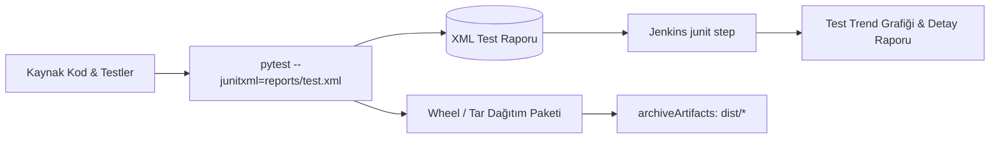

# LAB-JEN-07 — Uygulama Derleme, Birim Testleri ve JUnit Test Raporlama

| 🎯 Seviye | ⏱️ Tahmini Süre | 🛠️ Profil / Araçlar | 🔌 Açık Portlar |
| :--- | :--- | :--- | :--- |
| 🟡 **PRACTITIONER** (Orta Seviye) | ⏱️ 45 dakika | `jenkins`, `python`, `pytest`, `junit` | `8080` |

> [!TIP]
> 📥 **Başlangıç Paketi:** [Bu labın başlangıç paketini indir (LAB-JEN-07.zip)](/downloads/LAB-JEN-07.zip) — paket başlangıç kodlarını içerir; çözüm içermez.

---

## Amaç

Bu laboratuvarın amacı, gerçek bir Python Flask mikroservisinin test otomasyonunu Jenkins Pipeline'a entegre etmek, test sonuçlarını standart XML (JUnit) formatında ayrıştırarak Jenkins arayüzünde grafiksel test raporları üretmektir:

- Python sanal ortamı (`venv`) ve bağımlılık yönetimini pipeline içinde kurmak.
- `pytest` ile birim testleri koşturmak ve `--junitxml` bayrağı ile test raporu üretmek.
- `junit` pipeline adımı ile test trendlerini (başarılı, başarısız, atlanan testler) görselleştirmek.
- `archiveArtifacts` adımı ile derleme çıktılarını versiyonlayarak saklamak.

---

## Ön Koşullar

- LAB-JEN-05 Declarative Pipeline temelleri tamamlanmış olmalıdır.
- Jenkins ortamında Python 3 kurulu olmalıdır.

---

## Mimari ve Test Raporlama Akışı



---

## Adım Adım Uygulama Rehberi

### Adım 1: Test Edilecek Mikroservis Kodunu Hazırlayın

```bash
mkdir -p ~/labs/LAB-JEN-07/app ~/labs/LAB-JEN-07/tests
cd ~/labs/LAB-JEN-07

cat <<'EOF' > app/calculator.py
class Calculator:
    def add(self, a, b):
        return a + b

    def subtract(self, a, b):
        return a - b

    def multiply(self, a, b):
        return a * b

    def divide(self, a, b):
        if b == 0:
            raise ValueError("Sıfıra bölünemez!")
        return a / b
EOF

cat <<'EOF' > tests/test_calculator.py
import pytest
from app.calculator import Calculator

def test_add():
    calc = Calculator()
    assert calc.add(10, 5) == 15

def test_subtract():
    calc = Calculator()
    assert calc.subtract(10, 5) == 5

def test_multiply():
    calc = Calculator()
    assert calc.multiply(4, 5) == 20

def test_divide():
    calc = Calculator()
    assert calc.divide(20, 4) == 5

def test_divide_by_zero():
    calc = Calculator()
    with pytest.raises(ValueError):
        calc.divide(10, 0)
EOF

cat <<'EOF' > requirements.txt
pytest==8.1.1
pytest-cov==4.1.0
EOF
```

---

### Adım 2: Jenkins Pipeline Oluşturun

1. Jenkins UI -> **New Item** -> `05-unit-tests-and-reports` adında bir **Pipeline** oluşturun.
2. Pipeline script alanına aşağıdaki kodu ekleyin:

```groovy
pipeline {
    agent any

    stages {
        stage('Prepare Workspace') {
            steps {
                echo "==> Aşama 1: Çalışma alanı ve test dosyaları hazırlanıyor"
                sh '''
                    mkdir -p app tests reports dist
                    cat <<'EOF' > app/calculator.py
class Calculator:
    def add(self, a, b):
        return a + b
    def subtract(self, a, b):
        return a - b
    def multiply(self, a, b):
        return a * b
    def divide(self, a, b):
        if b == 0:
            raise ValueError("Sıfıra bölünemez!")
        return a / b
EOF

                    cat <<'EOF' > tests/test_calculator.py
import pytest
from app.calculator import Calculator

def test_add():
    assert Calculator().add(10, 5) == 15

def test_subtract():
    assert Calculator().subtract(10, 5) == 5

def test_multiply():
    assert Calculator().multiply(4, 5) == 20

def test_divide():
    assert Calculator().divide(20, 4) == 5

def test_divide_by_zero():
    with pytest.raises(ValueError):
        Calculator().divide(10, 0)
EOF
                '''
            }
        }

        stage('Install Dependencies') {
            steps {
                echo "==> Aşama 2: Python bağımlılıkları yükleniyor"
                sh '''
                    python3 -m venv .venv
                    . .venv/bin/activate
                    pip install --quiet --upgrade pip
                    pip install --quiet pytest
                '''
            }
        }

        stage('Run Unit Tests') {
            steps {
                echo "==> Aşama 3: pytest çalıştırılıyor ve JUnit XML üretiliyor"
                sh '''
                    . .venv/bin/activate
                    pytest tests/ --junitxml=reports/junit-report.xml
                '''
            }
        }

        stage('Package Artifact') {
            steps {
                echo "==> Aşama 4: Uygulama paketi (tar.gz) üretiliyor"
                sh '''
                    tar -czf dist/calculator-app-v${BUILD_NUMBER}.tar.gz app/
                    ls -la dist/
                '''
            }
        }
    }

    post {
        always {
            echo "==> Test raporları ayrıştırılıyor..."
            junit testResults: 'reports/junit-report.xml', allowEmptyResults: false
            archiveArtifacts artifacts: 'dist/*.tar.gz', fingerprint: true
        }
    }
}
```

Kaydedin.

---

### Adım 3: Pipeline'ı Çalıştırın ve Test Raporunu İnceleyin

1. **Build Now** butonuna tıklayın.
2. İşlem tamamlandığında projenin ana sayfasında **"Test Result"** grafiği belirecektir.
3. **Test Result** linkine tıklayın:
   - `5 tests / 0 failures` bilgisini görün.
   - `test_add`, `test_subtract`, `test_multiply`, `test_divide`, `test_divide_by_zero` testlerinin sürelerini ve durumlarını inceleyin.
4. Sol menüde **Build Artifacts** altında `calculator-app-v1.tar.gz` dosyasını görüntüleyin ve indirin.

---

## Doğal Doğrulama

Jenkins REST API üzerinden test başarı istatistiklerini sorgulayın:

```bash
curl -s -u admin:${JENKINS_TOKEN}   http://localhost:8080/job/05-unit-tests-and-reports/lastBuild/testReport/api/json   | grep -o '"totalCount":[0-9]*,"failCount":[0-9]*'
```

Çıktıda `"totalCount":5,"failCount":0` değerlerini doğrulayın.

---

## 🧠 İnteraktif Alıştırmalar ve Senaryo Soruları

??? question "Soru 1: Birim testlerden biri başarısız olursa `archiveArtifacts` adımı çalışır mı?"
    ??? tip "💡 Çözümü Göster"
        **Cevap:**
        Mevcut kodda `Package Artifact` aşaması `Run Unit Tests` aşamasından sonra gelmektedir. Eğer test aşamasında hata alınırsa pipeline kesilir ve `Package Artifact` aşaması çalışmaz; dolayısıyla bozuk/hatalı kod paketlenmez. Ancak `post { always { ... } }` içindeki `junit` raporlama adımı çalışarak başarısız testin detaylarını kaydeder.

??? question "Soru 2: JUnit XML rapor formatı neden CI/CD platformlarında evrensel bir standarttır?"
    ??? tip "💡 Çözümü Göster"
        **Cevap:**
        JUnit XML şeması Java, Python (pytest), Node.js (jest), Go ve C# dahil tüm popüler test kütüphaneleri tarafından desteklenir. Jenkins, GitLab, Azure DevOps ve GitHub Actions gibi tüm CI/CD sunucuları bu XML'i doğrudan okuyup zengin grafikler ve hata detayları sunabilir.

??? question "Soru 3: `archiveArtifacts` adımında `fingerprint: true` ne işe yarar?"
    ??? tip "💡 Çözümü Göster"
        **Cevap:**
        Dosyanın MD5 özetini (fingerprint) çıkararak Jenkins veritabanına kaydeder. Bu sayede bu artefaktın hangi downstream job'lar tarafından kullanıldığı veya hangi dağıtım ortamına gittiği uçtan uca takip edilebilir (Provenance & Traceability).

---

## Beklenen Sonuç & Sorun Giderme

| Hata | Çözüm |
| :--- | :--- |
| `No test report files were found` | `reports/junit-report.xml` yolunu kontrol edin; test aşamasında XML'in üretildiğinden emin olun. |
| `pip: command not found` | Jenkins container'ında `python3-pip` kurulu değilse `python3 -m ensurepip` çalıştırın. |
