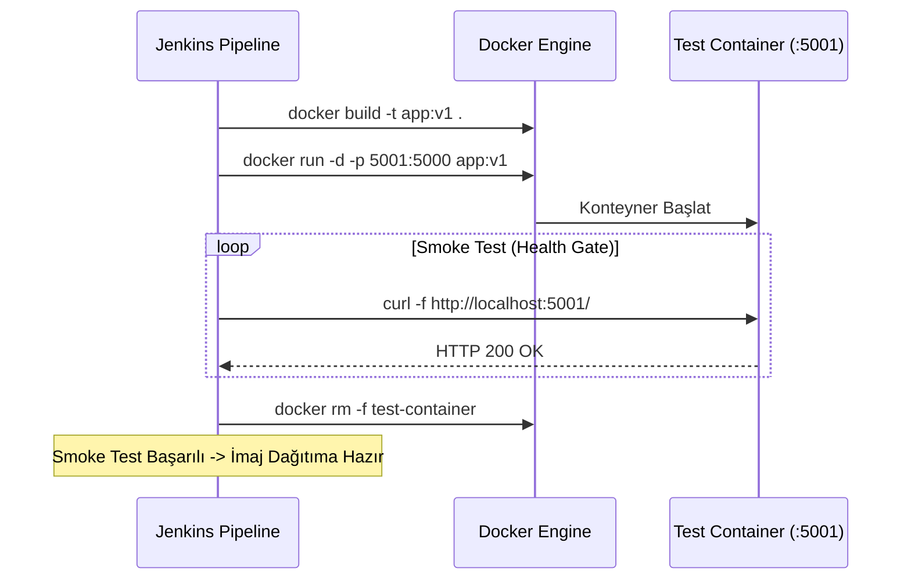

# LAB-JEN-08 — Pipeline İçinde Docker İmaj Derleme, Tagging ve Smoke Test

| 🎯 Seviye | ⏱️ Tahmini Süre | 🛠️ Profil / Araçlar | 🔌 Açık Portlar |
| :--- | :--- | :--- | :--- |
| 🟡 **PRACTITIONER** (Orta Seviye) | ⏱️ 45 dakika | `jenkins`, `docker`, `curl` | `8080`, `5001` |

> [!TIP]
> 📥 **Başlangıç Paketi:** [Bu labın başlangıç paketini indir (LAB-JEN-08.zip)](/downloads/LAB-JEN-08.zip) — paket başlangıç kodlarını içerir; çözüm içermez.

---

## Amaç

Bu laboratuvarın amacı, CI sürecine konteynerizasyon aşamasını ekleyerek uygulamanın Docker imajını pipeline içinde dinamik etiketlerle derlemek ve geçici bir konteyner ayağa kaldırarak HTTP smoke test ile doğrulamaktır:

- Jenkins pipeline içinden Docker daemon komutlarını çalıştırmak (`docker build`, `docker run`).
- Değişmezlik (immutability) ilkesi gereği imajı dinamik olarak `BUILD_NUMBER` ve Git commit hash ile etiketlemek.
- Konteyneri arka planda başlatıp `/health` veya ana sayfa üzerinden HTTP 200 yanıtı aldığını doğrulamak.
- Test tamamlandıktan sonra konteyneri temizlemek (`docker rm -f`).

---

## Ön Koşullar

- LAB-JEN-01 (Docker socket mount yapılandırması) tamamlanmış olmalıdır.
- Jenkins container'ının Docker çalıştırma yetkisi bulunmalıdır (`docker ps` hatasız dönmelidir).

---

## Mimari ve Smoke Test Modeli



---

## Adım Adım Uygulama Rehberi

### Adım 1: Test Edilecek Basit Web Uygulaması ve Dockerfile

```bash
mkdir -p ~/labs/LAB-JEN-08
cd ~/labs/LAB-JEN-08

cat <<'EOF' > server.py
from http.server import HTTPServer, BaseHTTPRequestHandler
import json

class SimpleHandler(BaseHTTPRequestHandler):
    def do_GET(self):
        self.send_response(200)
        self.send_header('Content-Type', 'application/json')
        self.end_headers()
        response = {
            "status": "healthy",
            "service": "order-api",
            "version": "1.0.0"
        }
        self.wfile.write(json.dumps(response).encode('utf-8'))

if __name__ == '__main__':
    server = HTTPServer(('0.0.0.0', 5000), SimpleHandler)
    print("Sunucu 5000 portunda calisiyor...")
    server.serve_forever()
EOF

cat <<'EOF' > Dockerfile
FROM python:3.11-alpine
WORKDIR /app
COPY server.py .
EXPOSE 5000
CMD ["python", "server.py"]
EOF
```

---

### Adım 2: Jenkins Pipeline Kodunu Yazın

1. Jenkins UI -> **New Item** -> `06-docker-build-and-smoke-test` adında bir **Pipeline** oluşturun.
2. Script kutusuna aşağıdaki kodu girin:

```groovy
pipeline {
    agent any

    environment {
        IMAGE_NAME = "devopsatolyesi/order-api"
        TEST_CONTAINER = "smoke-test-${BUILD_NUMBER}"
        TEST_PORT = "5001"
    }

    stages {
        stage('Checkout & Setup') {
            steps {
                echo "==> Aşama 1: Dosyalar hazırlanıyor"
                sh '''
                    cat <<'EOF' > server.py
from http.server import HTTPServer, BaseHTTPRequestHandler
import json

class SimpleHandler(BaseHTTPRequestHandler):
    def do_GET(self):
        self.send_response(200)
        self.send_header('Content-Type', 'application/json')
        self.end_headers()
        self.wfile.write(json.dumps({"status": "healthy", "service": "order-api"}).encode('utf-8'))

if __name__ == '__main__':
    HTTPServer(('0.0.0.0', 5000), SimpleHandler).serve_forever()
EOF

                    cat <<'EOF' > Dockerfile
FROM python:3.11-alpine
WORKDIR /app
COPY server.py .
EXPOSE 5000
CMD ["python", "server.py"]
EOF
                '''
            }
        }

        stage('Docker Build & Tag') {
            steps {
                echo "==> Aşama 2: Docker imajı derleniyor"
                sh '''
                    docker build -t ${IMAGE_NAME}:${BUILD_NUMBER} -t ${IMAGE_NAME}:latest .
                    docker images ${IMAGE_NAME}:${BUILD_NUMBER}
                '''
            }
        }

        stage('Smoke Test Container') {
            steps {
                echo "==> Aşama 3: Konteyner çalıştırılıyor ve smoke test yapılıyor"
                sh '''
                    # Varsa eski test konteynerini temizle
                    docker rm -f ${TEST_CONTAINER} 2>/dev/null || true

                    # Test konteynerini başlat
                    docker run -d --name ${TEST_CONTAINER} -p ${TEST_PORT}:5000 ${IMAGE_NAME}:${BUILD_NUMBER}

                    # Başlaması için 3 saniye bekle
                    sleep 3

                    # HTTP yanıtını doğrula
                    echo "Smoke Test: http://localhost:${TEST_PORT}/ sorgulanıyor..."
                    curl -s -f http://localhost:${TEST_PORT}/ | grep "healthy"
                    echo "Smoke test basariyla gecti!"
                '''
            }
        }
    }

    post {
        always {
            echo "==> Temizlik: Test konteyneri durduruluyor ve siliniyor"
            sh 'docker rm -f ${TEST_CONTAINER} 2>/dev/null || true'
        }
    }
}
```

Kaydedin.

---

### Adım 3: Pipeline'ı Çalıştırın

1. **Build Now** butonuna tıklayın.
2. Konsol çıktısını izleyin:
   - Docker build katmanlarının derlendiğini,
   - `smoke-test-1` konteynerinin ayağa kalktığını,
   - `curl` ile `{"status": "healthy"}` yanıtının alındığını,
   - `post { always }` bloğunda test konteynerinin silindiğini doğrulayın.

---

## Doğal Doğrulama

Ana makine terminalinde derlenen imajı doğrulayın:

```bash
docker images | grep devopsatolyesi/order-api
```

Test konteynerinin arkada açık kalmadığını teyit edin:

```bash
docker ps -a | grep smoke-test
```

---

## 🧠 İnteraktif Alıştırmalar ve Senaryo Soruları

??? question "Soru 1: Üretim ortamlarında imaj etiketlerken neden sadece `:latest` kullanmak tehlikelidir?"
    ??? tip "💡 Çözümü Göster"
        **Cevap:**
        `:latest` etiketi değişkendir (mutable). Hangi kod commit'inden derlendiğini belirtmez, rollback yapılmasını imkansız kılar ve Kubernetes cluster'larında `imagePullPolicy: IfNotPresent` ayarı varsa düğümler yeni sürümü çekmeyip eski cache'deki imajı çalıştırmaya devam edebilir. Üretimde mutlaka sabit bir Git commit hash veya semantik sürüm (`v1.2.3`) kullanılmalıdır.

??? question "Soru 2: Smoke test sırasında `curl -f` parametresinin önemi nedir?"
    ??? tip "💡 Çözümü Göster"
        **Cevap:**
        `-f` (`--fail`) bayrağı, sunucu HTTP 404 veya 500 gibi hata kodları döndüğünde `curl` komutunun sıfırdan farklı bir çıkış kodu (exit code != 0) üretmesini sağlar. Bu bayrak olmazsa `curl` 500 hatası alsa dahi başarılı (exit 0) sayılır ve Jenkins testi geçirdiğini zanneder.

??? question "Soru 3: Birden fazla Jenkins build'i aynı anda çalıştığında port çakışması (`bind: address already in use`) nasıl engellenir?"
    ??? tip "💡 Çözümü Göster"
        **Cevap:**
        Sabit port (`5001:5000`) yerine dinamik port eşlemesi (`docker run -P` veya `docker run -p 0:5000`) kullanılmalı, ardından `docker port` komutu ile rastgele atanan host portu okunarak curl isteği o porta yönlendirilmelidir.

---

## Beklenen Sonuç & Sorun Giderme

| Hata | Çözüm |
| :--- | :--- |
| `Cannot connect to the Docker daemon` | Jenkins container'ına Docker socket'inin (`/var/run/docker.sock`) bağlandığını doğrulayın. |
| `curl: (7) Failed to connect` | Container henüz tam başlamamış olabilir; `sleep` süresini artırın veya container loglarını (`docker logs`) inceleyin. |
