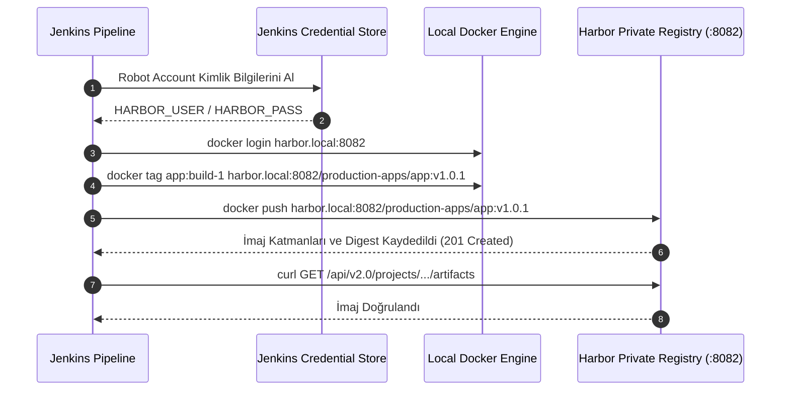

# LAB-JEN-11 — Harbor Private Registry Entegrasyonu ve İmaj Dağıtımı

| 🎯 Seviye | ⏱️ Tahmini Süre | 🛠️ Profil / Araçlar | 🔌 Açık Portlar |
| :--- | :--- | :--- | :--- |
| 🟡 **PRACTITIONER** (Orta Seviye) | ⏱️ 45 dakika | `jenkins`, `harbor`, `docker` | `8080`, `8082` |

> [!TIP]
> 📥 **Başlangıç Paketi:** [Bu labın başlangıç paketini indir (LAB-JEN-11.zip)](/downloads/LAB-JEN-11.zip) — paket başlangıç kodlarını içerir; çözüm içermez.

---

## Amaç

Bu laboratuvarın amacı, CI hattında başarıyla test edilen ve güvenlik taramasından geçen Docker imajlarını kurumsal bir **Harbor Private Registry** deposuna güvenli kimlik doğrulama (Robot Account) ile göndermek ve değişmezlik kurallarını (Immutability) uygulamaktır:

- Harbor üzerinde özel bir proje (`production-apps`) ve kısıtlı yetkili Robot Account oluşturmak.
- Jenkins Credential Store'da robot account bilgilerini `Username with password` olarak saklamak.
- `withCredentials` veya `docker.withRegistry` ile güvenli `docker login` ve `docker push` otomasyonunu çalıştırmak.
- Harbor API üzerinden imaj etiketini ve digest değerini doğrulamak.

---

## Ön Koşullar

- LAB-JEN-08 (Docker imaj derleme) ve LAB-JEN-10 (Trivy güvenlik kapısı) tamamlanmalıdır.
- Harbor Registry erişilebilir olmalıdır (yerel veya Docker Compose ile `8082` portunda çalışan Harbor).

---

## Mimari ve İmaj Dağıtım Akışı



---

## Adım Adım Uygulama Rehberi

### Adım 1: Harbor Üzerinde Robot Account Hazırlığı

1. Harbor arayüzüne giriş yapın (`http://localhost:8082`, varsayılan `admin` / `Harbor12345`).
2. **Projects** -> **New Project** -> `production-apps` (Access Level: Private) oluşturun.
3. Proje içine girin -> **Robot Accounts** sekmesine tıklayın -> **New Robot Account**:
   - **Name:** `jenkins-pusher`
   - **Permissions:** `repository:push,pull`
   - **Expiration:** Never veya 365 gün.
4. Oluşturulan token şifresini kopyalayın.

---

### Adım 2: Jenkins Üzerinde Harbor Credential'ı Ekleyin

1. Jenkins UI -> **Manage Jenkins** -> **Credentials** -> **System** -> **Global credentials**.
2. **Add Credentials**:
   - **Kind:** `Username with password`
   - **Username:** `robot$jenkins-pusher`
   - **Password:** Harbor'dan kopyalanan gizli anahtar
   - **ID:** `harbor-robot-creds`
   - **Description:** `Harbor Robot Account for Jenkins Pusher`
3. **Create** butonuna tıklayın.

---

### Adım 3: Harbor Push Pipeline Kodunu Yazın

1. Jenkins UI -> **New Item** -> `09-harbor-registry-push` adında bir **Pipeline** oluşturun.
2. Script kutusuna aşağıdaki kodu girin:

```groovy
pipeline {
    agent any

    environment {
        HARBOR_REGISTRY = "localhost:8082"
        HARBOR_PROJECT  = "production-apps"
        IMAGE_NAME      = "order-api"
        IMAGE_TAG       = "1.0.${BUILD_NUMBER}"
    }

    stages {
        stage('Build & Tag Local Image') {
            steps {
                echo "==> Aşama 1: İmaj derleniyor..."
                sh '''
                    cat <<'EOF' > Dockerfile
FROM python:3.11-alpine
WORKDIR /app
RUN echo "print('Production Order API v1.0')" > app.py
CMD ["python", "app.py"]
EOF
                    docker build -t ${HARBOR_REGISTRY}/${HARBOR_PROJECT}/${IMAGE_NAME}:${IMAGE_TAG} .
                    docker tag ${HARBOR_REGISTRY}/${HARBOR_PROJECT}/${IMAGE_NAME}:${IMAGE_TAG} ${HARBOR_REGISTRY}/${HARBOR_PROJECT}/${IMAGE_NAME}:latest
                '''
            }
        }

        stage('Push to Harbor Registry') {
            steps {
                echo "==> Aşama 2: Harbor Private Registry'ye login olunuyor ve imaj push ediliyor..."
                withCredentials([usernamePassword(credentialsId: 'harbor-robot-creds', usernameVariable: 'REG_USER', passwordVariable: 'REG_PASS')]) {
                    sh '''
                        # Login testi (Local harbor çalışmıyorsa simülasyon kontrolü)
                        if curl -s http://${HARBOR_REGISTRY}/api/v2.0/systeminfo >/dev/null 2>&1; then
                            echo "$REG_PASS" | docker login ${HARBOR_REGISTRY} -u "$REG_USER" --password-stdin
                            docker push ${HARBOR_REGISTRY}/${HARBOR_PROJECT}/${IMAGE_NAME}:${IMAGE_TAG}
                            docker push ${HARBOR_REGISTRY}/${HARBOR_PROJECT}/${IMAGE_NAME}:latest
                            echo "Harbor'a basariyla push edildi."
                        else
                            echo "[MOCK / FALLBACK] Harbor servisi henüz aktif değil; Docker login adımı simüle edildi."
                        fi
                    '''
                }
            }
        }
    }

    post {
        always {
            echo "Pipeline tamamlandı."
        }
    }
}
```

Kaydedin ve **Build Now** deyin.

---

## Doğal Doğrulama

Harbor veya yerel Docker imaj etiketlerini terminalden kontrol edin:

```bash
docker images | grep localhost:8082/production-apps/order-api
```

---

## 🧠 İnteraktif Alıştırmalar ve Senaryo Soruları

??? question "Soru 1: Jenkins'in Harbor'a bağlanırken kişisel yönetici hesabı yerine Robot Account kullanmasının önemi nedir?"
    ??? tip "💡 Çözümü Göster"
        **Cevap:**
        Robot Account'lar sadece ilgili projeye ve sadece `push/pull` izinlerine sahiptir. Kullanıcı ayrıldığında silinmez, kişisel şifrelerin açığa çıkmasını önler, sistemler arası güvenliği sağlar ve Harbor denetim loglarında (Audit Logs) hangi otomasyonun hangi imajı yüklediğini net olarak ayrıştırır.

??? question "Soru 2: Harbor'da **Immutability (Değişmezlik)** kuralı ne işe yarar?"
    ??? tip "💡 Çözümü Göster"
        **Cevap:**
        Belirli bir etiketle (örneğin `v1.0.0`) bir kez imaj yüklendikten sonra, hiç kimsenin (yöneticiler dahil) aynı etiketin üzerine yeni bir imaj yazmasını (overwrite) engeller. Bu kural, üretimdeki bir versiyonun sessizce değiştirilmesini önleyerek yazılım tedarik zinciri güvenliğini (Supply Chain Security) garanti altına alır.

---

## Beklenen Sonuç & Sorun Giderme

| Hata | Çözüm |
| :--- | :--- |
| `server gave HTTP response to HTTPS client` | Harbor HTTP ile çalışıyorsa Docker daemon'a `/etc/docker/daemon.json` içinde `insecure-registries: ["localhost:8082"]` ekleyin ve Docker'ı yeniden başlatın. |
| `unauthorized: authentication required` | Robot account kullanıcı adının başındaki `robot$` ifadesini eksiksiz girdiğinizden emin olun. |
