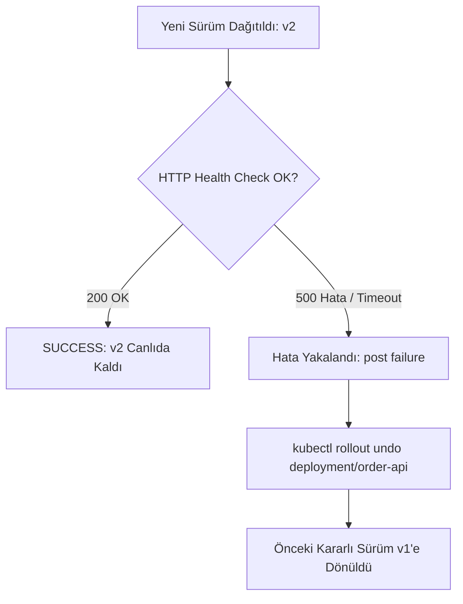

# LAB-JEN-13 — Rolling Update, Canlı Doğrulama ve Otomatik Rollback

| 🎯 Seviye | ⏱️ Tahmini Süre | 🛠️ Profil / Araçlar | 🔌 Açık Portlar |
| :--- | :--- | :--- | :--- |
| 🔴 **ADVANCED** (İleri Seviye) | ⏱️ 45 dakika | `jenkins`, `kubernetes`, `bash` | `8080` |

> [!TIP]
> 📥 **Başlangıç Paketi:** [Bu labın başlangıç paketini indir (LAB-JEN-13.zip)](/downloads/LAB-JEN-13.zip) — paket başlangıç kodlarını içerir; çözüm içermez.

---

## Amaç

Bu laboratuvarın amacı, üretim seviyesinde **Sıfır Kesinti (Zero-Downtime) Dağıtım** ve **Otomatik Geri Alma (Automated Rollback)** mekanizmalarını Jenkins Pipeline ile otomatize etmektir. Yeni bir sürüm dağıtıldığında canlı sağlık testi yapılacak; test başarısız olursa pipeline otomatik olarak bir önceki kararlı sürüme dönecektir:

- Kubernetes Rolling Update stratejisini (`maxSurge`, `maxUnavailable`) pipeline ile yönetmek.
- Canlı dağıtım sonrası otomatik HTTP sağlık testi (Health Gate) koşturmak.
- Hata durumunda `post { failure { kubectl rollout undo } }` bloğu ile sistemi otomatik kurtarmak.
- Rollout geçmişini (`kubectl rollout history`) denetlemek.

---

## Ön Koşullar

- LAB-JEN-12 (Kubernetes CD deployment) tamamlanmış olmalıdır.
- `production` namespace'inde çalışan `order-api` deployment'ı bulunmalıdır.

---

## Mimari ve Otomatik Rollback Akışı



---

## Adım Adım Uygulama Rehberi

### Adım 1: Otomatik Rollback Yetenekli Pipeline Oluşturun

1. Jenkins UI -> **New Item** -> `11-rolling-update-and-rollback` adında bir **Pipeline** oluşturun.
2. Script alanına aşağıdaki kodu ekleyin:

```groovy
pipeline {
    agent any

    parameters {
        choice(name: 'RELEASE_TYPE', choices: ['STABLE', 'FAULTY'], description: 'Dağıtılacak sürüm senaryosu')
    }

    environment {
        NAMESPACE  = "production"
        DEPLOYMENT = "order-api"
    }

    stages {
        stage('Deploy New Release') {
            steps {
                echo "==> Aşama 1: Sürüm dağıtılıyor: ${params.RELEASE_TYPE}"
                withCredentials([file(credentialsId: 'k8s-kubeconfig', variable: 'KUBECONFIG_FILE')]) {
                    sh '''
                        export KUBECONFIG="${KUBECONFIG_FILE}"

                        if [ "${RELEASE_TYPE}" == "STABLE" ]; then
                            echo "Kararlı sürüm (nginx:1.25-alpine) dağıtılıyor..."
                            kubectl set image deployment/${DEPLOYMENT} order-api=nginx:1.25-alpine -n ${NAMESPACE} --record=true
                        else
                            echo "Kasıtlı Hatalı sürüm (bozuk imaj etiketi) dağıtılıyor..."
                            kubectl set image deployment/${DEPLOYMENT} order-api=nginx:non-existent-tag-error -n ${NAMESPACE} --record=true
                        fi

                        # 30 saniye içinde rollout'u bekle
                        kubectl rollout status deployment/${DEPLOYMENT} -n ${NAMESPACE} --timeout=30s
                    '''
                }
            }
        }

        stage('Live Verification (Smoke Gate)') {
            steps {
                echo "==> Aşama 2: Canlı küme üzerinde HTTP doğrulama..."
                withCredentials([file(credentialsId: 'k8s-kubeconfig', variable: 'KUBECONFIG_FILE')]) {
                    sh '''
                        export KUBECONFIG="${KUBECONFIG_FILE}"
                        # Küme içinden pod durumunu kontrol et
                        READY_REPLICAS=$(kubectl get deployment ${DEPLOYMENT} -n ${NAMESPACE} -o jsonpath='{.status.readyReplicas}')
                        echo "Hazır Replica Sayısı: ${READY_REPLICAS}"

                        if [ "${READY_REPLICAS}" -lt 1 ]; then
                            echo "[ERROR] Canlı doğrulama başarısız! Hazır pod bulunamadı."
                            exit 1
                        fi
                        echo "[PASS] Canlı doğrulama başarılı."
                    '''
                }
            }
        }
    }

    post {
        failure {
            echo "==> [ALERT] Dağıtım veya canlı test başarısız oldu! OTOMATİK ROLLBACK BAŞLATILIYOR..."
            withCredentials([file(credentialsId: 'k8s-kubeconfig', variable: 'KUBECONFIG_FILE')]) {
                sh '''
                    export KUBECONFIG="${KUBECONFIG_FILE}"
                    echo "Geri alma (Rollback) komutu çalıştırılıyor..."
                    kubectl rollout undo deployment/${DEPLOYMENT} -n ${NAMESPACE}
                    kubectl rollout status deployment/${DEPLOYMENT} -n ${NAMESPACE} --timeout=60s
                    echo "Sistem bir önceki kararlı sürüme başarıyla döndürüldü!"
                '''
            }
        }
        success {
            echo "Dağıtım ve canlı doğrulama başarıyla tamamlandı."
        }
    }
}
```

Kaydedin.

---

### Adım 2: Başarılı Senaryoyu Test Edin (`STABLE`)

1. **Build with Parameters** seçeneğine tıklayın.
2. `RELEASE_TYPE`: `STABLE` seçip **Build** deyin.
3. Pipeline'ın tüm aşamalarının yeşil bittiğini ve rollout'un tamamlandığını gözlemleyin.

---

### Adım 3: Otomatik Rollback Senaryosunu Test Edin (`FAULTY`)

1. Tekrar **Build with Parameters** deyin.
2. `RELEASE_TYPE`: `FAULTY` seçip **Build** deyin.
3. Konsol çıktısını izleyin:
   - Rollout 30 saniye sonra zaman aşımına uğrar ve hata alır.
   - Jenkins derhal `post { failure }` bloğunu tetikler.
   - `kubectl rollout undo` komutu çalışır.
   - Kubernetes hatalı podları sonlandırıp bir önceki `STABLE` sürüme geri döner!

---

## Doğal Doğrulama

Host makinede rollout geçmişini ve mevcut imajı denetleyin:

```bash
kubectl rollout history deployment/order-api -n production
kubectl get deployment order-api -n production -o jsonpath='{.spec.template.spec.containers[0].image}'
```

İmajın `nginx:1.25-alpine` olarak korunduğunu teyit edin.

---

## 🧠 İnteraktif Alıştırmalar ve Senaryo Soruları

??? question "Soru 1: Rolling update sırasında `maxUnavailable: 0` ve `maxSurge: 1` ayarının anlamı nedir?"
    ??? tip "💡 Çözümü Göster"
        **Cevap:**
        Bu ayar, güncelleme anında hiçbir mevcut podun kapatılmamasını (`maxUnavailable: 0`), önce yeni podun oluşturulmasını (`maxSurge: 1`), ancak yeni pod tamamen `Ready` olduktan sonra eski podun kapatılmasını sağlar. Bu sayede sıfır kesinti (Zero Downtime) garanti edilir.

??? question "Soru 2: `kubectl rollout undo` varsayılan olarak kaç sürüm geriye gider?"
    ??? tip "💡 Çözümü Göster"
        **Cevap:**
        Varsayılan olarak tam bir önceki sürüme (revision N-1) döner. Eğer daha eski bir sürüme dönülmek isteniyorsa `--to-revision=<REVISION_NO>` bayrağı kullanılmalıdır.

---

## Beklenen Sonuç & Sorun Giderme

| Durum | Açıklama |
| :--- | :--- |
| `STABLE` build | Tüm aşamalar yeşil, rollout başarılı. |
| `FAULTY` build | Aşama kırmızı, ancak rollback bloğu çalışarak sistemi kurtardı. |
