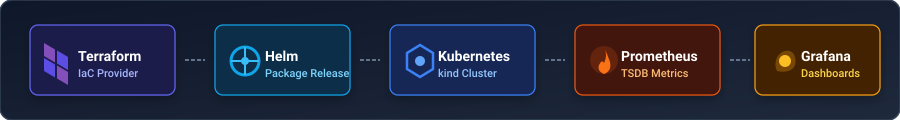
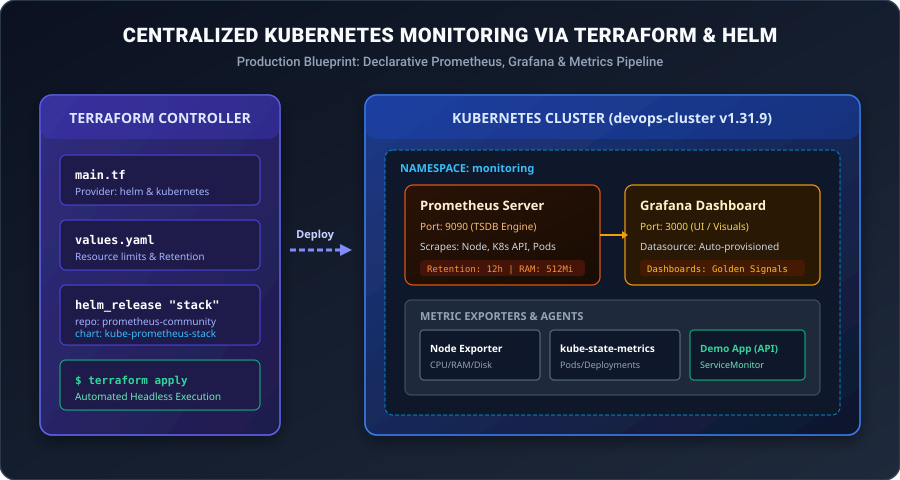
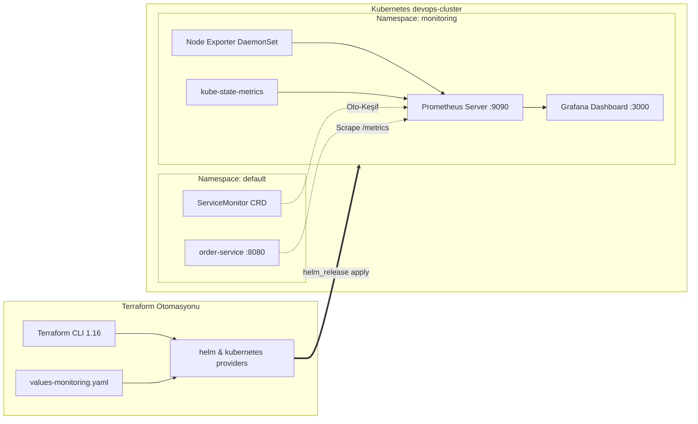

# LAB-TF-04 — Terraform ve Helm ile Merkezi Kubernetes İzleme (Centralized Monitoring)

## Metadata
- **Teknoloji:** Terraform 1.16.x, Helm v3.21.x, Kubernetes (kind v1.31.9), Prometheus, Grafana, ServiceMonitor
- **Seviye:** PRACTITIONER / ADVANCED
- **Önerilen Gün:** Gün 4 (Kubernetes & IaC Entegrasyonu)
- **Tahmini Süre:** 60 dk
- **Gerekli Profil:** `kubernetes` (~3.0 GB RAM)
- **Çalışma Dizini:** `~/labs/LAB-TF-04`

---

## 1. Lab Senaryosu

Büyüyen bir mikromimari altyapısında, her bir geliştirme ekibinin kendi izleme aracını manuel kurması operasyonel kaos ve kaynak israfı yaratmaktadır. Üretim standartlarına uygun bir DevOps yaklaşımında; izleme altyapısı (Prometheus, Grafana, Alertmanager, Node Exporter) **Altyapı Kod Olarak (Infrastructure as Code - IaC)** mantığıyla, deklaratif olarak tek bir merkezden ayağa kaldırılmalıdır.

Bu labda, **Terraform**'un resmi `helm` ve `kubernetes` sağlayıcıları (providers) kullanılarak, yerel bir Kubernetes kümesi (`kind`) üzerine **Merkezi İzleme Yığını (Centralized Monitoring Stack)** kurulacaktır. Standart bulut rehberlerinin aksine; yerel 8–16 GB RAM sınırlarını aşmayan, bellek sızıntılarını ve OOM çökmelerini engelleyen optimize bir `values-monitoring.yaml` yapılandırması uygulanacak; ardından canlı bir mikroservis `ServiceMonitor` ile otomatik olarak izlemeye alınacaktır.

---

## 2. Amaç

Bu labı tamamladığınızda aşağıdaki yetkinlikleri kazanacaksınız:
- Terraform `helm` ve `kubernetes` provider bloklarını yapılandırma ve küme kimlik doğrulamasını otomatikleştirme.
- `kube-prometheus-stack` Helm chartını Terraform `helm_release` kaynağı üzerinden deklaratif olarak yönetme.
- Yerel eğitim ve test ortamları için bellek/CPU limitleri (`resources`), metrik saklama süresi (`retention`) ve gereksiz bileşenleri devre dışı bırakma optimizasyonlarını uygulama.
- Kubernetes Custom Resource Definition (CRD) standardı olan `ServiceMonitor` ile uygulama metriklerini Prometheus'a otomatik bağlama.
- Grafana üzerinde Kubernetes Golden Signals panellerini inceleme ve PromQL sorguları çalıştırma.

---

## 3. Mimari / Akış



### Sistem Mimarisi Şeması




---

## 4. Ön Koşullar

1. `LAB-K8S-01` ve `LAB-TF-01` lablarının başarıyla tamamlanmış olması.
2. `kubernetes` servis profilinin aktif olması (`kind-devops-cluster` kümesi ayakta).
3. Host üzerinde `kubectl`, `helm` ve `terraform` CLI araçlarının kurulu olması.

Kümenin aktif olduğunu ve bağlantıyı doğrulayın:
```bash
kubectl cluster-info
kubectl get nodes
```

---

## 5. Adım Adım Uygulama (7 Güçlü Adım)

---

### Adım 1: Çalışma Alanının Hazırlanması ve Küme Kontrolü

Lab için izole çalışma dizini oluşturun:
```bash
mkdir -p ~/labs/LAB-TF-04
cd ~/labs/LAB-TF-04
```

Eğer `kind-devops-cluster` henüz başlatılmadıysa, ortam profilini başlatın:
```bash
bash ~/devops-workspace/devops-practitioner-egitim-katalogu/outputs/lab-assets/LAB-ENV-00/scripts/start-profile.sh kubernetes
```

---

### Adım 2: Terraform Provider ve Değişken Tanımlarının Oluşturulması

Kubernetes ve Helm sağlayıcılarını yerel `~/.kube/config` dosyasına bağlayan `providers.tf` dosyasını oluşturun:

```bash
cat <<'EOF' > providers.tf
terraform {
  required_version = ">= 1.5.0"
  required_providers {
    helm = {
      source  = "hashicorp/helm"
      version = "~> 2.15.0"
    }
    kubernetes = {
      source  = "hashicorp/kubernetes"
      version = "~> 2.32.0"
    }
  }
}

provider "kubernetes" {
  config_path    = var.kubeconfig_path
  config_context = var.kube_context
}

provider "helm" {
  kubernetes {
    config_path    = var.kubeconfig_path
    config_context = var.kube_context
  }
}
EOF
```

Değişken tanımlarını içeren `variables.tf` dosyasını oluşturun:
```bash
cat <<'EOF' > variables.tf
variable "kubeconfig_path" {
  type        = string
  description = "Yerel kubeconfig dosya yolu"
  default     = "~/.kube/config"
}

variable "kube_context" {
  type        = string
  description = "Hedef Kubernetes küme context bilgisi"
  default     = "kind-devops-cluster"
}

variable "monitoring_namespace" {
  type        = string
  description = "İzleme yığınının kurulacağı ad alanı"
  default     = "monitoring"
}

variable "grafana_admin_password" {
  type        = string
  description = "Grafana web paneli yönetici parolası"
  default     = "PromGrafana2026!"
  sensitive   = true
}

variable "helm_chart_version" {
  type        = string
  description = "kube-prometheus-stack Helm chart sürümü"
  default     = "65.3.1"
}
EOF
```

---

### Adım 3: Bellek Optimize Edilmiş Helm Değerlerinin (`values-monitoring.yaml`) Hazırlanması

> [!IMPORTANT]
> Standart `kube-prometheus-stack` kurulumu sınırlandırılmazsa 4–6 GB RAM tüketerek tek düğümlü geliştirme ortamlarında Linux OOM (Out of Memory) çökmesine neden olur. Aşağıdaki optimize konfigürasyon ile:
> - Prometheus bellek limiti `512Mi`, Grafana ise `256Mi` ile sınırlandırılır.
> - Metrik saklama süresi `12h` yapılarak disk şişmesi engellenir.
> - Yerel `kind` kümesinde erişilemeyen etcd, kubeControllerManager ve kubeScheduler hedefleri kapatılarak gereksiz hata logları önlenir.

Yapılandırma dosyasını oluşturun:
```bash
cat <<'EOF' > values-monitoring.yaml
prometheus:
  prometheusSpec:
    retention: 12h
    scrapeInterval: "15s"
    evaluationInterval: "15s"
    resources:
      requests:
        cpu: 100m
        memory: 256Mi
      limits:
        cpu: 500m
        memory: 512Mi
    serviceMonitorSelectorNilUsesHelmValues: false
    podMonitorSelectorNilUsesHelmValues: false

grafana:
  enabled: true
  adminPassword: "PromGrafana2026!"
  resources:
    requests:
      cpu: 50m
      memory: 128Mi
    limits:
      cpu: 250m
      memory: 256Mi
  service:
    type: ClusterIP
    port: 80

alertmanager:
  enabled: true
  alertmanagerSpec:
    resources:
      requests:
        cpu: 25m
        memory: 64Mi
      limits:
        cpu: 100m
        memory: 128Mi

nodeExporter:
  enabled: true

kubeStateMetrics:
  enabled: true

kubeEtcd:
  enabled: false

kubeControllerManager:
  enabled: false

kubeScheduler:
  enabled: false

kubeProxy:
  enabled: false
EOF
```

---

### Adım 4: Terraform Ana Manifestosunun Yazılması ve Dağıtım

Terraform'un `kubernetes_namespace` ve `helm_release` kaynaklarını barındıran `main.tf` dosyasını oluşturun:

```bash
cat <<'EOF' > main.tf
# 1. İzleme Ad Alanı (Namespace)
resource "kubernetes_namespace" "monitoring" {
  metadata {
    name = var.monitoring_namespace
    labels = {
      name        = var.monitoring_namespace
      managed-by  = "terraform"
      environment = "training"
    }
  }
}

# 2. Helm ile Merkezi İzleme Yığınının Dağıtımı
resource "helm_release" "kube_prometheus_stack" {
  name       = "kube-prometheus-stack"
  repository = "https://prometheus-community.github.io/helm-charts"
  chart      = "kube-prometheus-stack"
  version    = var.helm_chart_version
  namespace  = kubernetes_namespace.monitoring.metadata[0].name

  timeout         = 600
  wait            = true
  cleanup_on_fail = true

  values = [
    file("${path.module}/values-monitoring.yaml")
  ]

  set_sensitive {
    name  = "grafana.adminPassword"
    value = var.grafana_admin_password
  }

  depends_on = [kubernetes_namespace.monitoring]
}

# 3. Bilgilendirme Çıktıları
output "monitoring_namespace" {
  value = kubernetes_namespace.monitoring.metadata[0].name
}

output "helm_release_status" {
  value = helm_release.kube_prometheus_stack.status
}
EOF
```

Terraform projesini başlatın ve uygulayın:
```bash
terraform init
terraform plan
terraform apply -auto-approve
```

---

### Adım 5: Dağıtımın ve Pod Durumlarının Doğrulanması

Podların `Running` durumuna geldiğini kontrol edin:
```bash
kubectl get pods -n monitoring
```

Helm release durumunu sorgulayın:
```bash
helm list -n monitoring
```

---

### Adım 6: Örnek Mikroservisin Konuşlandırılması ve `ServiceMonitor` Tanımlama

Merkezi izleme sisteminin uygulamaları dinamik olarak nasıl keşfettiğini görmek için, metrik sunan bir örnek mikroservis konuşlandırın:

```bash
cat <<'EOF' > sample-app.yaml
apiVersion: apps/v1
kind: Deployment
metadata:
  name: order-service
  namespace: default
  labels:
    app: order-service
spec:
  replicas: 2
  selector:
    matchLabels:
      app: order-service
  template:
    metadata:
      labels:
        app: order-service
    spec:
      containers:
        - name: app
          image: hashicorp/http-echo:0.2.3
          args:
            - "-text=order-api-v1"
            - "-listen=:8080"
          ports:
            - name: http
              containerPort: 8080
---
apiVersion: v1
kind: Service
metadata:
  name: order-service
  namespace: default
  labels:
    app: order-service
spec:
  selector:
    app: order-service
  ports:
    - name: http
      port: 8080
      targetPort: 8080
---
apiVersion: monitoring.coreos.com/v1
kind: ServiceMonitor
metadata:
  name: order-service-monitor
  namespace: default
  labels:
    release: kube-prometheus-stack
spec:
  selector:
    matchLabels:
      app: order-service
  endpoints:
    - port: http
      interval: 10s
      path: /metrics
EOF

kubectl apply -f sample-app.yaml
```

Prometheus Operator'ın `ServiceMonitor` kaynağını algıladığını doğrulayın:
```bash
kubectl get servicemonitors -A
```

---

### Adım 7: Web Panellerine Erişim ve Metrik İnceleme

Grafana servisini host üzerindeki `3000` portuna yönlendirin:
```bash
kubectl port-forward -n monitoring svc/kube-prometheus-stack-grafana 3000:80 >/dev/null 2>&1 &
```

Prometheus servisini host üzerindeki `9090` portuna yönlendirin:
```bash
kubectl port-forward -n monitoring svc/kube-prometheus-stack-prometheus 9090:9090 >/dev/null 2>&1 &
```

HTTP erişimini uç noktalardan test edin:
```bash
curl -sf http://localhost:9090/-/healthy && echo -e "\nPrometheus is Healthy!"
curl -sf http://localhost:3000/api/health && echo -e "\nGrafana is Healthy!"
```

Tarayıcınızda açın:
- **Grafana UI:** `http://localhost:3000` (Kullanıcı: `admin`, Parola: `PromGrafana2026!`)
- **Prometheus UI:** `http://localhost:9090` -> *Status* -> *Targets* sekmesine gidin. `order-service` ve `node-exporter` hedeflerinin `UP` olduğunu gözlemleyin.

---

## 6. Beklenen Sonuç

`terraform apply` tamamlandığında:
```text
Apply complete! Resources: 2 added, 0 changed, 0 destroyed.

Outputs:

helm_release_status = "deployed"
monitoring_namespace = "monitoring"
```

`kubectl get pods -n monitoring` komutunda:
```text
NAME                                                     READY   STATUS    RESTARTS   AGE
alertmanager-kube-prometheus-stack-alertmanager-0        2/2     Running   0          2m
kube-prometheus-stack-grafana-xxxxxxxxx-xxxxx            3/3     Running   0          2m
kube-prometheus-stack-kube-state-metrics-xxxxx-xxxxx    1/1     Running   0          2m
kube-prometheus-stack-operator-xxxxxxxxx-xxxxx           1/1     Running   0          2m
kube-prometheus-stack-prometheus-node-exporter-xxxxx     1/1     Running   0          2m
prometheus-kube-prometheus-stack-prometheus-0            2/2     Running   0          2m
```

---

## 7. Doğrulama

Katalog doğrulama scriptini çalıştırın:
```bash
bash ~/devops-workspace/devops-practitioner-egitim-katalogu/outputs/lab-assets/LAB-TF-04/scripts/validate.sh
```

**Beklenen Doğrulama Çıktısı:**
```text
==========================================================
  VALIDATING CENTRALIZED MONITORING STACK (LAB-TF-04)    
==========================================================
[PASS] Namespace 'monitoring' exists and is Active.
[PASS] Helm release 'kube-prometheus-stack' is deployed.
[PASS] Prometheus StatefulSet has 1 ready replica(s).
[PASS] Grafana Deployment has 1 ready replica(s).
[PASS] ServiceMonitor CRD is successfully registered in Kubernetes.
----------------------------------------------------------
  SUMMARY: PASS=5 | FAIL=0
----------------------------------------------------------
  RESULT: CENTRALIZED MONITORING DEPLOYMENT VALIDATED
```

---

## 8. Sorun Giderme

| Sorun / Hata Mesajı | Olası Kök Neden | Çözüm Adımı |
|---|---|---|
| `context deadline exceeded` or `timeout waiting for the condition` | Host bellek yetersizliği nedeniyle imaj çekimleri uzun sürdü. | `timeout = 900` değerini artırın veya `docker pull quay.io/prometheus/prometheus:v2.54.1` gibi imajları önceden çekin. |
| Podlar `Pending` durumunda bekliyor | `kind` worker düğümlerinde bellek yetersizliği. | `kubectl describe nodes` ile MemoryPressure durumunu inceleyin; diğer Docker konteynerlerini durdurun. |
| `failed to get client config: invalid context` | Kubeconfig context adı `kind-devops-cluster` ile eşleşmiyor. | `kubectl config current-context` çıktısını kontrol edip `variables.tf` içindeki `kube_context` değişkenine verin. |
| Grafana girişinde `Invalid username or password` | `adminPassword` değişkeni set edilmemiş. | `values-monitoring.yaml` dosyasındaki şifreyi veya `set_sensitive` bloğunu kontrol edin. |

---

## 9. Temizlik / Sıfırlama

Dağıtılan izleme yığınını ve örnek uygulamayı tamamen kaldırarak belleği boşaltın:
```bash
# Otomatik temizleme scripti
bash ~/devops-workspace/devops-practitioner-egitim-katalogu/outputs/lab-assets/LAB-TF-04/scripts/cleanup.sh
```

Veya manuel olarak:
```bash
cd ~/labs/LAB-TF-04
terraform destroy -auto-approve
kubectl delete -f sample-app.yaml --ignore-not-found=true
```

---

## 10. Production Notu

- **Helm Release State Kilitlemesi:** Üretim ortamlarında Terraform state dosyası uzak bir nesne depolama alanında (S3, GCS) ve DynamoDB / Cloud Storage kilit mekanizması ile saklanmalıdır.
- **CRD Yaşam Döngüsü:** `kube-prometheus-stack` chartı CRD'leri güncellerken Helm'in `crd-install` kancaları kısıtlı olabilir. Büyük versiyon geçişlerinde CRD'lerin ayrı bir Terraform manifestosu veya kubectl ile yönetilmesi önerilir.
- **Kalıcı Depolama (PV/PVC):** Gerçek üretim kümelerinde Prometheus ve Grafana için EBS, Ceph veya Persistent Disk tabanlı `StorageClass` bağlanarak pod yeniden başlama durumlarında metrik kaybı önlenmelidir.

---

## 11. Challenge

1. **Prometheus Alertmanager Slack / Webhook Entegrasyonu:**
   `values-monitoring.yaml` içerisindeki `alertmanager.config` bloğunu düzenleyerek, Kubernetes pod çökmesi durumunda bir Discord/Slack webhook'una bildirim gönderecek kuralı ekleyin ve `terraform apply` ile güncelleyin.
2. **Kişiselleştirilmiş Dashboard Provisioning:**
   Grafana için bir ConfigMap oluşturarak NGINX veya Redis metriklerini gösteren hazır bir JSON dashboard'unu Terraform ile otomatik olarak Grafana paneline aktarın.
