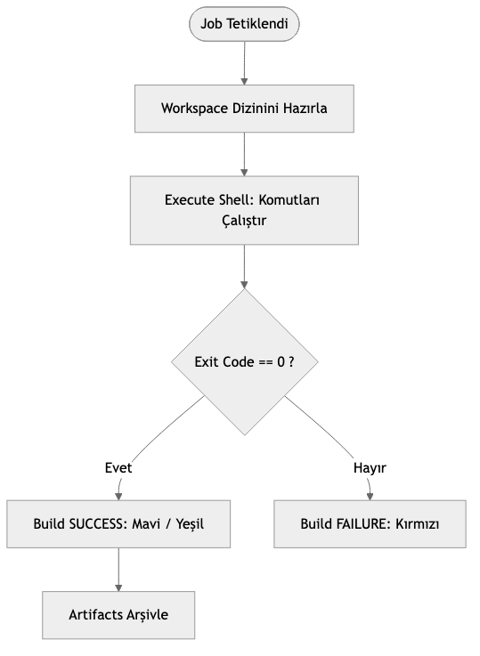

# LAB-JEN-03 — İlk Freestyle Build Job ve Workspace Temelleri

| Seviye | Tahmini Süre | Profil / Araçlar | Açık Portlar |
| --- | --- | --- | --- |
| Temel | 35 dakika | `jenkins` | `8080` |

[LAB-JEN-03.zip](/downloads/LAB-JEN-03.zip)


---

## Amaç

Bu laboratuvarın pedagojik amacı, Jenkins'in çekirdek çalışma mekanizmasını kavramaktır. **Freestyle Job**, Jenkins'in en ilkel iş türüdür ve bu lab haricinde tüm eğitim boyunca modern **Pipeline as Code (Jenkinsfile)** kullanılacaktır. Bu lab ile:

- Jenkins çalışma alanı (`workspace`) dosya sistemi mimarisini anlamak.
- Build adımları (`Execute shell`), ortam değişkenleri (`BUILD_NUMBER`, `WORKSPACE`) ve exit code mekanizmasını incelemek.
- Konsol çıktısı (Console Output) ve hata analizi (build failure) süreçlerini deneyimlemek.
- Build artifact'larının saklanması ve indirilmesi mantığını öğrenmek.

---

## Ön Koşullar

- LAB-JEN-01 ve LAB-JEN-02 tamamlanmış olmalıdır.
- Jenkins Controller çalışır durumda olmalıdır.

---

## Mimari ve Workspace Yaşam Döngüsü


---

## Adım Adım Uygulama Rehberi

### Adım 1: Yeni Bir Freestyle Proje Oluşturun

1. Jenkins ana sayfasında sol menüden **"New Item"** seçeneğine tıklayın.
2. Proje adı olarak `01-freestyle-workspace-demo` yazın.
3. **"Freestyle project"** tipini seçip **OK** butonuna tıklayın.

---

### Adım 2: Build Adımı Ekleyin (Execute Shell)

Yapılandırma sayfasında aşağı kaydırın:
1. **Build Steps** bölümünde **"Add build step"** butonuna tıklayın ve **"Execute shell"** seçeneğini belirleyin.
2. Komut alanına aşağıdaki betiği yapıştırın:

```bash
echo "=== JENKINS WORKSPACE INCELEMESI ==="
echo "Mevcut Calisma Dizini (PWD): $(pwd)"
echo "Build Numarasi: ${BUILD_NUMBER}"
echo "Isim (Job Name): ${JOB_NAME}"
echo "Jenkins Home: ${JENKINS_HOME}"

echo "=== DOSYA URETME TESTI ==="
mkdir -p build_output
date +"%Y-%m-%d %H:%M:%S" > build_output/build_info.txt
echo "Versiyon: 1.0.${BUILD_NUMBER}" >> build_output/build_info.txt
ls -la build_output/
```

---

### Adım 3: Post-Build Action ile Artifact Arşivleme

1. Sayfanın en altındaki **"Post-build Actions"** bölümünde **"Add post-build action"** butonuna tıklayın.
2. **"Archive the artifacts"** seçeneğini seçin.
3. **Files to archive** alanına `build_output/**` yazın.
4. **Save** butonuna tıklayarak yapılandırmayı kaydedin.

---

### Adım 4: Build Başlatın ve Konsol Çıktısını İzleyin

1. Sol menüden **"Build Now"** butonuna tıklayın.
2. Sol alttaki **Build History** panelinde `#1` numaralı build belirecektir.
3. `#1` üzerine tıklayın ve **"Console Output"** menüsünü açın.
4. Çıktıyı satır satır inceleyin. En altta `Finished: SUCCESS` ibaresini doğrulayın.

---

### Adım 5: Hata Durumunu (Exit Code != 0) Simüle Edin

1. Sol menüden **Configure** seçeneğine dönün.
2. Shell komutunun sonuna bilinçli olarak hata veren bir komut ekleyin:
   ```bash
   echo "Hata olusturuluyor..."
   exit 1
   ```
3. Kaydedin ve tekrar **Build Now** deyin.
4. Build `#2` kırmızı (FAILURE) olacaktır. Konsol çıktısında Jenkins'in `Build step 'Execute shell' marked build as failure` mesajını gözlemleyin.

---

## Doğal Doğrulama

Jenkins container içinden dosya sisteminde workspace dizinini doğrudan kontrol edin:

```bash
docker exec jenkins-controller ls -la /var/jenkins_home/workspace/01-freestyle-workspace-demo/build_output
docker exec jenkins-controller cat /var/jenkins_home/workspace/01-freestyle-workspace-demo/build_output/build_info.txt
```

---

## Doğal Doğrulama ve Beklenen Sonuç

| Durum | Açıklama |
| :--- | :--- |
| `SUCCESS` (Mavi/Yeşil) | Tüm shell komutları 0 döndü, artifact başarıyla arşivlendi. |
| `FAILURE` (Kırmızı) | Shell komutlarından en az biri 0 harici çıkış kodu üretti. |
| `No artifacts found` | Arşivlenecek dosya yolu workspace ile eşleşmedi (yol yazımını kontrol edin). |
