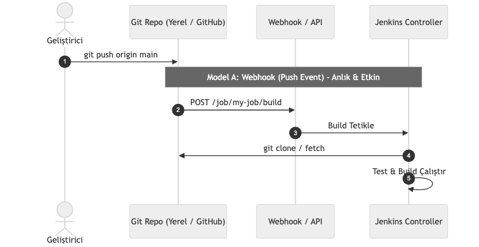

# LAB-JEN-04 — Git Repository ile Otomatik Build ve Webhook Yapılandırması

| Seviye | Tahmini Süre | Profil / Araçlar | Açık Portlar |
| --- | --- | --- | --- |
| Temel | 40 dakika | `jenkins, git` | `8080` |

[LAB-JEN-04.zip](/downloads/LAB-JEN-04.zip)


---

## Amaç

Bu laboratuvarın amacı, Jenkins Controller'ı bir Git versiyon kontrol sistemi (SCM) deposu ile entegre etmek ve kod değişikliklerinin sürekli entegrasyonu (CI) tetiklemesini sağlamaktır:

- Jenkins üzerinde Git SCM checkout mekanizmasını yapılandırmak.
- SCM Polling (Poll SCM) ve Webhook tetikleme mekanizmaları arasındaki farkları öğrenmek.
- CSRF Crumb koruması altında REST API üzerinden harici build tetikleme (Generic Webhook) gerçekleştirmek.
- Değişen commit bilgilerini (`GIT_COMMIT`, `GIT_BRANCH`) pipeline içinde yakalamak.

---

## Ön Koşullar

- LAB-JEN-01 ve LAB-JEN-02 tamamlanmış olmalıdır.
- Host üzerinde `git` aracı kurulu olmalıdır.

---

## Mimari ve Tetikleme Modelleri


---

## Adım Adım Uygulama Rehberi

### Adım 1: Test Amaçlı Yerel Git Deposu Oluşturun

Harici GitHub gereksinimi olmadan, tamamen yerel ve bağımsız bir Git deposu hazırlayalım:

```bash
mkdir -p ~/labs/LAB-JEN-04/sample-app
cd ~/labs/LAB-JEN-04/sample-app

git init -b main
git config user.name "DevOps Learner"
git config user.email "learner@devopsatolyesi.local"

cat <<'EOF' > app.py
def add(a, b):
    return a + b

if __name__ == "__main__":
    print(f"2 + 3 = {add(2, 3)}")
EOF

git add app.py
git commit -m "feat: initial python application"
```

Jenkins container'ının bu depoya erişebilmesi için yerel dizini bir bare repository haline getirelim veya volume üzerinden erişilebilir kılalım:

```bash
cd ~/labs/LAB-JEN-04
git clone --bare sample-app sample-app.git
```

---

### Adım 2: Jenkins Üzerinde Git Entegrasyonlu Job Oluşturma

1. Jenkins UI -> **New Item** -> `02-git-integrated-build` adıyla bir **Freestyle project** oluşturun.
2. **Source Code Management** bölümünde **Git** seçeneğini işaretleyin.
3. **Repository URL** alanına Jenkins container içindeki dosya yolunu veya genel bir açık GitHub repo linkini yazın:
   - Örnek: `https://github.com/jenkins-docs/simple-python-pyinstaller-app.git` (veya yerel depo).
4. **Branches to build:** `*/main` veya `*/master`.

---

### Adım 3: Harici Tetikleme İçin Authentication Token Tanımlayın

1. Job yapılandırmasında **Build Triggers** bölümüne gidin.
2. **"Trigger builds remotely (e.g., from scripts)"** seçeneğini işaretleyin.
3. **Authentication Token** alanına `my-secret-trigger-token` yazın.
4. **Build Steps** -> **Execute shell** ekleyin:
   ```bash
   echo "=== SCM CHECKOUT BASARILI ==="
   echo "Commit Hash: ${GIT_COMMIT}"
   echo "Branch: ${GIT_BRANCH}"
   ls -la
   python3 -V || true
   ```
5. **Save** ile kaydedin.

---

### Adım 4: CSRF Crumb Alarak Webhook Tetiklemesi Yapın

Modern Jenkins sürümlerinde uzaktan tetikleme yaparken CSRF koruması (Crumb) gereklidir. Terminalden crumb alarak build tetikleyin:

```bash
cd ~/labs/LAB-JEN-04

# Crumb bilgisini çekin
CRUMB=$(curl -s -u admin:${JENKINS_TOKEN}   'http://localhost:8080/crumbIssuer/api/xml?xpath=concat(//crumbRequestField,":",//crumb)')

echo "Alinan Crumb: ${CRUMB}"

# Webhook tetiklemesini gönderin
curl -X POST   -H "${CRUMB}"   -u admin:${JENKINS_TOKEN}   "http://localhost:8080/job/02-git-integrated-build/build?token=my-secret-trigger-token"
```

---

## Doğal Doğrulama

1. Jenkins UI üzerinde `02-git-integrated-build` sayfasına bakın; yeni bir build'in kuyruğa girdiğini ve çalıştığını görün.
2. Build'in konsol çıktısını açın:
   - `Started by remote host ...` veya `Started by user admin` yazdığını doğrulayın.
   - `Checking out Revision ...` satırında commit hash'inin çekildiğini teyit edin.

---

## Doğal Doğrulama ve Beklenen Sonuç

| Belirti / Hata | Çözüm |
| :--- | :--- |
| `HTTP 403 Forbidden` | API Token veya Crumb başlığını eksiksiz geçtiğinizden emin olun. |
| `Couldn't find any revision to build` | Git repo branch adının (`main` vs `master`) konfigürasyonla eşleştiğini kontrol edin. |
| `Host key verification failed` | SSH ile özel depoya bağlanılıyorsa Jenkins'e SSH Private Key credential'ı eklenmelidir. |
