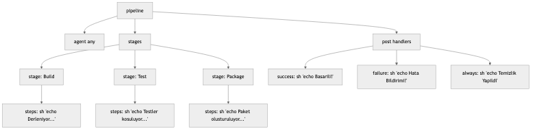

# LAB-JEN-05 — İlk Declarative Jenkins Pipeline ve Jenkinsfile Temelleri

| Seviye | Tahmini Süre | Profil / Araçlar | Açık Portlar |
| --- | --- | --- | --- |
| Temel | 45 dakika | `jenkins` | `8080` |

[LAB-JEN-05.zip](/downloads/LAB-JEN-05.zip)


---

## Amaç

Bu laboratuvar ile Jenkins dünyasının altın standardı olan **Pipeline as Code** prensibine adım atıyoruz. Declarative Pipeline sözdizimini (syntax) kullanarak tüm CI/CD yaşam döngüsünü versiyonlanabilir bir `Jenkinsfile` ile kodlamayı öğreneceksiniz:

- Declarative Pipeline blok yapısını (`pipeline`, `agent`, `stages`, `stage`, `steps`, `post`) öğrenmek.
- Farklı aşamalar (Build, Test, Deploy Simülasyonu) tanımlamak.
- `post` koşul blokları (`always`, `success`, `failure`, `cleanup`) ile bildirim ve temizlik işlemlerini otomatize etmek.
- Jenkins UI üzerinde **Blue Ocean / Stage View** ile aşama görselleştirmesini incelemek.

---

## Ön Koşullar

- LAB-JEN-01 ve LAB-JEN-02 tamamlanmış olmalıdır.
- Jenkins Pipeline eklentisi kurulu olmalıdır (kurulum sihirbazında varsayılan gelir).

---

## Declarative Pipeline Mimarisi


---

## Adım Adım Uygulama Rehberi

### Adım 1: Yeni Bir Pipeline Projesi Oluşturun

1. Jenkins UI -> **New Item** seçeneğine tıklayın.
2. İsim: `03-declarative-pipeline-foundations`
3. Proje türü olarak **"Pipeline"** seçin ve **OK** butonuna basın.

---

### Adım 2: Declarative Jenkinsfile Kodunu İnceleyin ve Yazın

Job yapılandırma sayfasının en altında **Pipeline** bölümüne gelin.
**Definition** alanında `Pipeline script` seçili olsun ve script kutusuna aşağıdaki Declarative Pipeline kodunu girin:

```groovy
pipeline {
    agent any

    options {
        timeout(time: 15, unit: 'MINUTES')
        ansiColor('xterm')
        buildDiscarder(logRotator(numToKeepStr: '10'))
    }

    stages {
        stage('Checkout & Environment') {
            steps {
                echo "==> Aşama 1: Ortam ve Çalışma Alanı Hazırlığı"
                echo "Çalışan Düğüm (Node): ${env.NODE_NAME}"
                echo "Build Numarası: ${env.BUILD_NUMBER}"
                echo "Workspace: ${env.WORKSPACE}"
                sh 'uname -a'
            }
        }

        stage('Build') {
            steps {
                echo "==> Aşama 2: Derleme ve Kod Derleme Simülasyonu"
                sh '''
                    mkdir -p output
                    echo "Build Artifact v1.0.${BUILD_NUMBER}" > output/app.bin
                    echo "Derleme tamamlandı."
                '''
            }
        }

        stage('Unit Tests') {
            steps {
                echo "==> Aşama 3: Birim Testleri Çalıştırılıyor"
                sh '''
                    echo "Test 1: Veritabanı bağlantısı... OK"
                    echo "Test 2: Kimlik doğrulama modülü... OK"
                    echo "Test 3: API Yanıt süresi < 200ms... OK"
                    echo "Tüm testler başarıyla geçti."
                '''
            }
        }

        stage('Security Preflight') {
            steps {
                echo "==> Aşama 4: Hızlı Güvenlik Kontrolü"
                sh '''
                    echo "Statik kod analizi ön kontrolü tamamlandı. 0 kritik bulgu."
                '''
            }
        }
    }

    post {
        always {
            echo "==> [POST-ALWAYS] Pipeline tamamlandı, geçici loglar toplanıyor."
        }
        success {
            echo "==> [POST-SUCCESS] Tebrikler! Build #${env.BUILD_NUMBER} başarıyla sonuçlandı."
        }
        failure {
            echo "==> [POST-FAILURE] DİKKAT: Build başarısız oldu! Slack/E-posta uyarısı tetiklendi."
        }
        cleanup {
            echo "==> [POST-CLEANUP] Çalışma alanı temizliği yapıldı."
        }
    }
}
```

**Save** butonuna tıklayarak kaydedin.

---

### Adım 3: Pipeline'ı Çalıştırın ve Stage View'ı İnceleyin

1. Sol menüden **"Build Now"** butonuna tıklayın.
2. İş bittiğinde sayfanın ortasındaki **Stage View** tablosuna bakın.
3. Her aşamanın yeşil renkte tamamlandığını, geçen sürelerin kaydedildiğini gözlemleyin:
   - `Checkout & Environment` (~1s)
   - `Build` (~1s)
   - `Unit Tests` (~1s)
   - `Security Preflight` (~1s)

---

### Adım 4: Hata Koşulu ve Post Handler Davranışını Test Edin

`Unit Tests` aşamasında hata alırsak `post` bloklarının nasıl davrandığını görelim:

1. **Configure** menüsüne tıklayın.
2. `Unit Tests` aşamasındaki betiğe `exit 1` satırını ekleyin:
   ```groovy
   stage('Unit Tests') {
       steps {
           echo "Hata simülasyonu başlatılıyor..."
           sh 'exit 1'
       }
   }
   ```
3. Kaydedin ve **Build Now** deyin.
4. Çıktıyı inceleyin:
   - `Unit Tests` aşaması kırmızı oldu.
   - Sonraki `Security Preflight` aşaması **SKIPPED** oldu.
   - `post` bloğundaki `failure`, `always` ve `cleanup` adımları çalıştı, ancak `success` adımı çalıştırılmadı!

---

## Doğal Doğrulama

Jenkins REST API üzerinden build sonucunu ve aşamalarını JSON formatında sorgulayın:

```bash
curl -s -u admin:${JENKINS_TOKEN}   http://localhost:8080/job/03-declarative-pipeline-foundations/lastBuild/api/json   | grep -o '"result":"[^"]*"'
```

Sonucun `"result":"SUCCESS"` veya `"result":"FAILURE"` olarak döndüğünü doğrulayın.

---

## Doğal Doğrulama ve Beklenen Sonuç

| Hata / Durum | Çözüm |
| :--- | :--- |
| `WorkflowScript: ... unexpected token` | Groovy sözdizimi hatası; parantez (`{}`) veya tırnak işaretlerini kontrol edin. |
| `No such DSL method 'ansiColor'` | AnsiColor eklentisi kurulu değilse `options { ansiColor(...) }` satırını kaldırın veya eklentiyi kurun. |
| Stage View görünmüyor | Pipeline en az bir kere başarılı veya başarısız çalıştırılmalıdır. |
