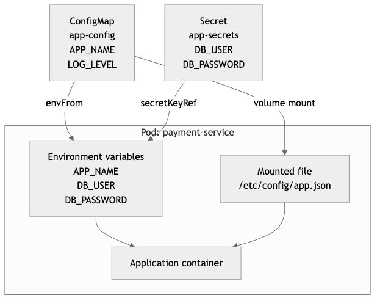

# LAB-K8S-06 — ConfigMap ve Secret ile Yapılandırma

| Seviye | Tahmini Süre | Profil / Araçlar | Açık Portlar |
| --- | --- | --- | --- |
| Orta | 40 dakika | `kubernetes` | `Küme içi` |

[LAB-K8S-06.zip](/downloads/LAB-K8S-06.zip)


---

## Amaç

- 12-Factor App prensibine uygun olarak uygulama konfigürasyonunu ve şifreleri Docker imajından tamamen ayırmak.
- **ConfigMap** oluşturarak ortam değişkeni (`envFrom`, `valueFrom`) ve dosya (`volumeMounts`) olarak Pod'a bağlamak.
- **Secret** oluşturmak, Base64 kodlamanın bir şifreleme olmadığını anlamak ve hassas verileri güvenle saklamak.
- Çalışan bir Pod içerisinde enjekte edilen konfigürasyon ve gizli anahtarları CLI ile denetlemek.

---

## Ön Koşullar

- Kind kümesi aktif olmalıdır. Kurulum için [kind Kubernetes kümesi rehberine](/setup/kind-cluster/) bakın.

---

## Konfigürasyon ve Secret Enjeksiyon Modeli



---

## Adım Adım Uygulama Rehberi

### Adım 1: Çalışma Dizinine Geçiş

```bash
mkdir -p ~/labs/LAB-K8S-06
cd ~/labs/LAB-K8S-06
```

---

### Adım 2: ConfigMap Oluşturun

Bildirimsel olarak uygulama ayarlarını içeren bir ConfigMap tanımlayın:

```bash
cat <<'EOF' > app-config.yaml
apiVersion: v1
kind: ConfigMap
metadata:
  name: app-config
data:
  APP_NAME: "Payment Gateway API"
  APP_ENV: "production"
  LOG_LEVEL: "info"
  MAX_CONNECTIONS: "100"
EOF

kubectl apply -f app-config.yaml
```

---

### Adım 3: Secret Oluşturun ve Base64 Analizi Yapın

Hassas veritabanı kimlik bilgilerini içeren Secret nesnesi oluşturun:

```bash
kubectl create secret generic app-secrets \
  --from-literal=DB_USER=pgadmin \
  --from-literal=DB_PASSWORD=MasterSecretPassword2026

# Secret içeriğini YAML olarak inceleyin
kubectl get secret app-secrets -o yaml
```

> [!IMPORTANT]
> `data` altındaki değerlerin Base64 ile encode edildiğini görün. Base64 bir **şifreleme (encryption) değildir**, sadece ikili veriyi metne çevirme formatıdır:
> ```bash
> echo "UGFzc3dvcmQ=" | base64 --decode
> ```

---

### Adım 4: ConfigMap ve Secret Tüketen Pod Manifesti Hazırlayın

Hem ortam değişkeni olarak hem de dosya sistemi mount'u olarak enjekte edelim:

```bash
cat <<'EOF' > secure-pod.yaml
apiVersion: v1
kind: Pod
metadata:
  name: secure-app
  labels:
    app: secure-app
spec:
  containers:
    - name: api
      image: alpine:3.19
      command: ["sh", "-c", "echo 'Application configured.' && sleep infinity"]
      # 1. ConfigMap'teki tüm anahtarları ortam değişkeni olarak aktarma
      envFrom:
        - configMapRef:
            name: app-config
      # 2. Secret'tan tekil hassas değerleri ortam değişkeni yapma
      env:
        - name: DATABASE_USER
          valueFrom:
            secretKeyRef:
              name: app-secrets
              key: DB_USER
        - name: DATABASE_PASS
          valueFrom:
            secretKeyRef:
              name: app-secrets
              key: DB_PASSWORD
      # 3. ConfigMap'i dosya olarak bağlama (Mount)
      volumeMounts:
        - name: config-volume
          mountPath: /etc/config
          readOnly: true
  volumes:
    - name: config-volume
      configMap:
        name: app-config
EOF

kubectl apply -f secure-pod.yaml
```

---

## Doğal Doğrulama

Pod içine girerek ortam değişkenlerinin ve bağlanan dosyaların varlığını doğrulayın:

```bash
# 1. Ortam değişkenlerini sorgulayın
kubectl exec secure-app -- env | grep -E "(APP_|DATABASE_)"

# 2. /etc/config dizinindeki dosyaları inceleyin
kubectl exec secure-app -- ls -l /etc/config
kubectl exec secure-app -- cat /etc/config/APP_NAME
```

---

## Doğal Doğrulama ve Beklenen Sonuç

- `kubectl exec secure-app -- env` komutunun `DATABASE_USER=pgadmin` değerini döndürmesi.
- `/etc/config/APP_NAME` dosyasının `Payment Gateway API` içeriğini barındırması.
